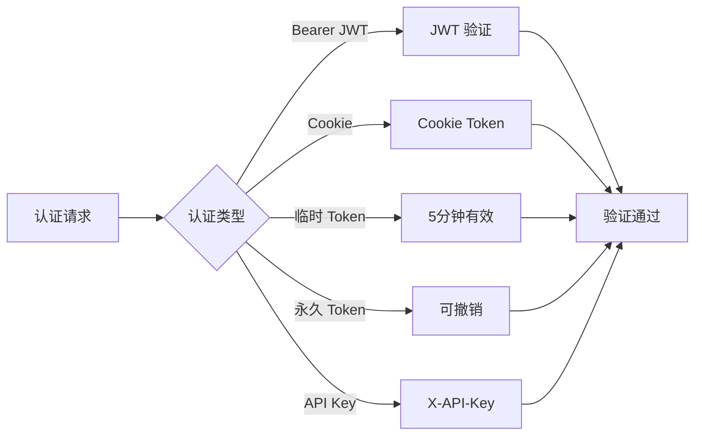

# 认证接口

## 认证方式

系统支持多种认证方式：



| 方式 | 说明 | 有效期 |
|------|------|--------|
| Bearer JWT | 常规 API 调用 | 24小时 |
| Cookie Token | 前端会话保持 | 24小时 |
| 临时 Token | 一次性登录 | 5分钟 |
| 永久 Token | 持久访问 | 可撤销 |
| API Key | X-API-Key 头 | 永久 |

## 登录

### 临时 Token 登录

```http
GET /login/token?token={token}
```

**参数**

| 参数 | 类型 | 说明 |
|------|------|------|
| token | string | 临时登录 token |

**响应**

成功后重定向到 `/`，并设置 `auth_token` Cookie。

### 验证 Token

```http
POST /api/auth/verify
```

**请求头**

```
Authorization: Bearer {jwt_token}
```

**响应**

```json
{
  "success": true,
  "data": {
    "userId": "123456789",
    "username": "用户名",
    "isAdmin": true,
    "exp": 1702656000
  }
}
```

## 登出

```http
POST /api/auth/logout
```

**响应**

```json
{
  "success": true
}
```

清除 `auth_token` Cookie。

## 刷新 Token

```http
POST /api/auth/refresh
```

**响应**

```json
{
  "success": true,
  "data": {
    "token": "new_jwt_token"
  }
}
```

## 获取当前用户

```http
GET /api/auth/me
```

**响应**

```json
{
  "success": true,
  "data": {
    "userId": "123456789",
    "username": "用户名",
    "avatar": "https://...",
    "isAdmin": true
  }
}
```

## 错误响应

### 未认证

```json
{
  "success": false,
  "error": "Unauthorized",
  "code": "AUTH_REQUIRED"
}
```

### Token 过期

```json
{
  "success": false,
  "error": "Token expired",
  "code": "TOKEN_EXPIRED"
}
```

### Token 无效

```json
{
  "success": false,
  "error": "Invalid token",
  "code": "INVALID_TOKEN"
}
```
