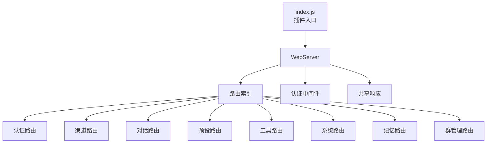
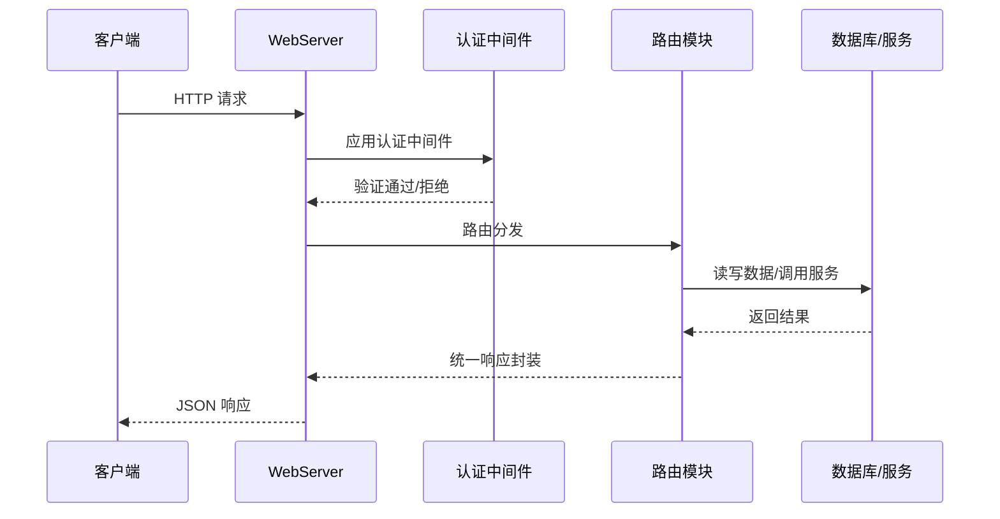

# API 概述 <Badge type="tip" text="REST API" />

ChatAI Plugin 提供 **REST API** 用于管理和扩展功能，支持 Web 面板和第三方集成。

## 基础信息 {#basic-info}

| 项目 | 值 | 说明 |
|:-----|:---|:-----|
| **Base URL** | `http://localhost:3000/api` | 端口可在配置中修改 |
| **认证方式** | JWT Token | 支持 Cookie 或 Bearer Token |
| **响应格式** | JSON | 统一 JSON 响应结构 |
| **限流** | 60 req/min | 默认限流规则 |

## 架构总览 {#architecture}



## API 模块 {#api-modules}

::: info 模块说明
每个模块提供一组相关的 API 接口，可独立使用。
:::

| 模块 | 路径 | 说明 | 文档 |
|:-----|:-----|:-----|:----:|
| **认证** | `/api/auth` | 登录、验证、Token 管理 | [查看](./auth) |
| **配置** | `/api/config` | 配置读取与更新 | [查看](./config) |
| **渠道** | `/api/channels` | 渠道 CRUD、测试、模型列表 | - |
| **对话** | `/api/conversations` | 对话历史管理 | - |
| **预设** | `/api/presets` | 预设 CRUD | - |
| **工具** | `/api/tools` | 工具管理与日志 | [查看](./tools) |
| **MCP** | `/api/mcp` | MCP 服务器管理 | [查看](./mcp) |
| **技能** | `/api/skills` | 技能代理接口 | - |
| **群管理** | `/api/group-admin` | 群组独立配置 | - |
| **系统** | `/api/system` | 系统状态与统计 | - |

## 认证 {#authentication}

### 获取登录链接 {#get-login-link}

::: tip 获取方式
在机器人中发送 `#ai管理面板` 获取临时登录链接，或 `#ai管理面板 永久` 获取永久链接。
:::

### 登录流程 {#login-flow}



### API 调用认证 {#api-auth}

::: code-group
```bash [Cookie 认证]
# 浏览器自动携带 Cookie
curl http://localhost:3000/api/config \
  -H "Cookie: auth_token=xxx"
```

```bash [Bearer Token]
# 适用于第三方调用
curl http://localhost:3000/api/config \
  -H "Authorization: Bearer xxx"
```
:::

## 响应格式 {#response-format}

::: code-group
```json [成功响应]
{
  "success": true,
  "data": { ... }
}
```

```json [错误响应]
{
  "success": false,
  "error": "Error message",
  "code": "ERROR_CODE"
}
```
:::

## 错误码 {#error-codes}

| 状态码 | 说明 | 常见原因 |
|:------:|:-----|:---------|
| `200` | 成功 | - |
| `400` | 请求参数错误 | 缺少必需参数、参数格式错误 |
| `401` | 未认证 | Token 缺失或已过期 |
| `403` | 权限不足 | 无权访问该资源 |
| `404` | 资源不存在 | 请求的资源未找到 |
| `429` | 请求过于频繁 | 超出限流限制 |
| `500` | 服务器内部错误 | 服务端异常 |

## 限流 {#rate-limit}

::: warning 限流规则
- **窗口时间**：60 秒
- **最大请求数**：60 次
- 超出限制返回 `429` 状态码
:::

## SSE 接口 {#sse}

部分接口支持 **Server-Sent Events** 实时推送：

```javascript{1,3-6}
const eventSource = new EventSource('/api/skills/sse')

eventSource.onmessage = (event) => {
  const data = JSON.parse(event.data)
  console.log('Status update:', data)
}

eventSource.onerror = (error) => {
  console.error('SSE Error:', error)
}
```

## API 详细文档 {#detailed-docs}

| 文档 | 说明 | 主要接口 |
|:-----|:-----|:---------|
| [认证接口](./auth) | 登录与验证 | `POST /auth/login`, `GET /auth/verify` |
| [配置接口](./config) | 配置管理 | `GET /config`, `PUT /config` |
| [工具接口](./tools) | 工具管理 | `GET /tools`, `POST /tools/call` |
| [MCP 接口](./mcp) | MCP 服务器 | `GET /mcp/servers`, `POST /mcp/connect` |
| [聊天接口](./chat) | 聊天功能 | `POST /chat`, `GET /conversations` |
