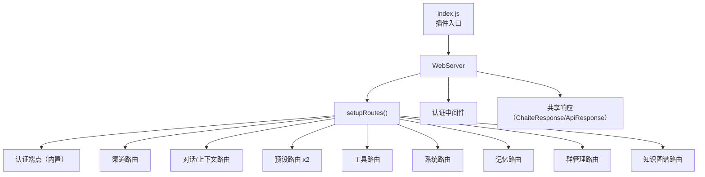
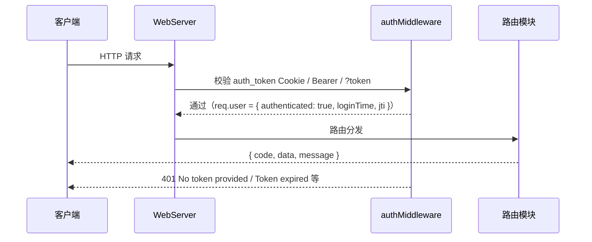

# API 概述 <Badge type="tip" text="REST API" />

ChatAI Plugin 提供 **REST API** 用于管理和扩展功能，支持 Web 面板和第三方集成。

## 基础信息 {#basic-info}

| 项目 | 值 | 说明 |
|:-----|:---|:-----|
| **Base URL** | `http://localhost:3000` | 默认端口见 `web.port` |
| **挂载路径** | `/chatai`（`web.mountPath`，可配置） | 独立端口时 API 为 `/api/*`；TRSS 共享端口时为 `/chatai/api/*` |
| **认证方式** | JWT Token | Cookie（`auth_token`）、Bearer Token 或 `?token=` 查询参数 |
| **响应格式** | `{ code, data, message }` | `code: 0` 表示成功 |

> 端口与挂载路径以 `config.get('web.port')` / `config.get('web.mountPath')` 为准；
> 下文端点均省略挂载前缀书写。

## 路由挂载总表 {#mount-table}

以下为 `src/services/webServer.js` `setupRoutes()` 中的挂载（截取 webServer.js 实际行）：

| 挂载路径 | 路由文件 | 认证 |
|:---------|:---------|:----:|
| `/api/channels` | `channelRoutes.js` | 全局 JWT |
| `/api/config` | `configRoutes.js` | 全局 JWT |
| `/api/test-panel` | `testPanelRoutes.js` | 全局 JWT |
| `/api/scope` | `scopeRoutes.js` | 全局 JWT |
| `/api/tools` | `toolsRoutes.js` | 全局 JWT |
| `/api/proxy` | `proxyRoutes.js` | 全局 JWT |
| `/api/mcp` | `mcpRoutes.js` | 全局 JWT |
| `/api/knowledge` | `knowledgeRoutes.js` | 全局 JWT |
| `/api/imagegen` | `imageRoutes.js` | 全局 JWT |
| `/api/logs` | `logsRoutes.js` | 全局 JWT |
| `/api/placeholders` | `logsRoutes.js`（placeholdersRouter） | 全局 JWT |
| `/api/memory` | `memoryRoutes.js` | 全局 JWT |
| `/api/graph` | `graphRoutes.js` | 全局 JWT |
| `/api/images` | `imageRoutes.js`（publicImageRouter） | 公开 |
| `/api/stats` | `statsRoutes.js` | 全局 JWT |
| `/mcp` | `mcpServerRoutes.js` | MCP 认证（独立） |
| `/api/group-admin` | `groupAdminRoutes.js` | 群管理会话（独立） |
| `/api/skills` | `skillsRoutes.js` | 全局 JWT |
| `/api/game-edit` | `gameRoutes.js`（createGameEditRoutes） | 编辑码登录（独立） |
| `/api/game` | `gameRoutes.js`（createGameRoutes） | 全局 JWT |
| `/api/conversations` | `conversationRoutes.js` | 全局 JWT |
| `/api/context` | `conversationRoutes.js` | 全局 JWT |
| `/api/preset` | `presetRoutes.js` | 全局 JWT |
| `/api/presets` | `presetRoutes.js` | 全局 JWT |
| `/api`（health/version/system/stats） | `systemRoutes.js` | 全局 JWT（`/health` 公开） |

webServer.js 内的内置端点：`/api/auth/login`、`/api/auth/verify-token`、
`/api/auth/status`、`/api/auth/token/generate`、`/api/auth/token/permanent`、
`/api/auth/token/status`、`/api/state`、`/api/health`、`/login/token`。

> 兜底路由：`/api` 与 `/mcp` 两个前缀在未命中任何端点时返回 `404`
> （`接口不存在: {method} {originalUrl}`）；其余路径回退到 Web UI 静态页面
> （`game-edit` / `login` / `group-admin` 独立页，缺省 `index.html`）。

## 架构总览 {#architecture}


```mermaid
graph TB
    A["index.js<br/>插件入口"] --> B["WebServer"]
    B --> C["setupRoutes()"]
    C --> D["认证端点（内置）"]
    C --> E["渠道路由"]
    C --> F["对话/上下文路由"]
    C --> G["预设路由 x2"]
    C --> H["工具路由"]
    C --> I["系统路由"]
    C --> J["记忆路由"]
    C --> K["群管理路由"]
    C --> L["知识图谱路由"]
    B --> M["认证中间件"]
    B --> N["共享响应（ChaiteResponse/ApiResponse）"]
```

## API 模块 {#api-modules}

::: info 模块说明
每个模块提供一组相关的 API 接口，可独立使用。
:::

| 模块 | 路径 | 说明 | 文档 |
|:-----|:-----|:-----|:----:|
| **认证** | `/api/auth`、`/login/token` | 登录、验证、Token 管理 | [查看](./auth) |
| **渠道** | `/api/channels` | 渠道 CRUD、连通测试、模型拉取（端点见 [config](./config#渠道独立接口)） | [查看](./config) |
| **配置** | `/api/config` | 配置读取与更新 | [查看](./config) |
| **对话** | `/api/conversations`、`/api/context` | 对话历史查看与清理、活跃上下文 | [查看](./chat) |
| **预设** | `/api/preset`、`/api/presets` | 预设 CRUD、内置预设、分类 | [查看](./presets) |
| **工具** | `/api/tools` | 工具管理、执行、日志、危险工具配置 | [查看](./tools) |
| **MCP** | `/api/mcp`、`/mcp` | MCP 服务器管理、插件对外 MCP 端点 | [查看](./mcp) |
| **技能** | `/api/skills` | Skills Agent 接口、工具分类、全局开关、SSE | [查看](./skills) |
| **群管理** | `/api/group-admin` | 群组独立配置、群管登录 | [查看](./groups) |
| **系统** | `/api/system`、`/api/health` | 健康检查、版本信息、统计数据 | [查看](./stats) |
| **测试面板** | `/api/test-panel` | 渠道模型批量测试、快速测试（SSE） | [查看](./test-panel) |
| **记忆** | `/api/memory` | 结构化用户记忆管理、分类、统计 | [查看](./memories) |
| **知识库** | `/api/knowledge` | 知识库文档 CRUD、搜索 | [查看](./knowledge) |
| **知识图谱** | `/api/graph` | 实体、关系、属性的 CRUD、可视化数据 | [查看](./graph) |
| **绘图** | `/api/imagegen`、`/api/images` | 绘图预设管理、远程预设缓存 | [查看](./image) |
| **游戏** | `/api/game`、`/api/game-edit` | Galgame 角色预设与在线编辑 | [查看](./game) |
| **日志** | `/api/logs`、`/api/placeholders` | 日志文件列表、错误日志、占位符 | [查看](./logs) |
| **代理** | `/api/proxy` | 网络代理配置管理 | [查看](./proxy-api) |
| **作用域** | `/api/scope` | 用户/群组级别独立配置管理 | [查看](./scope) |

## 认证 {#authentication}

### 获取登录链接 {#get-login-link}

在机器人中发送 `#ai管理面板` 获取临时登录链接，或 `#ai管理面板 永久` 获取永久链接。

### 登录流程 {#login-flow}


```mermaid
sequenceDiagram
    participant C as 客户端
    participant W as WebServer
    participant A as authMiddleware
    participant R as 路由模块

    C->>W: HTTP 请求
    W->>A: 校验 auth_token Cookie / Bearer / ?token
    A-->>W: 通过（req.user = { authenticated: true, loginTime, jti }）
    W->>R: 路由分发
    R-->>C: { code, data, message }
    A-->>C: 401 No token provided / Token expired 等
```

### API 调用认证 {#api-auth}

::: code-group
```bash [Cookie 认证]
# 浏览器自动携带 Cookie
curl http://localhost:3000/api/config \
  -H "Cookie: auth_token=xxx"
```

```bash [Bearer Token]
# 适用于第三方调用
curl http://localhost:3000/api/config \
  -H "Authorization: Bearer xxx"
```
:::

## 响应格式 {#response-format}

`ChaiteResponse` 与 `ApiResponse` 结构一致（`src/services/routes/shared.js`）：

```json
{
  "code": 0,
  "data": { },
  "message": "ok"
}
```

失败时 `code` 为 `-1`，`message` 为错误描述。个别端点（如 `/api/health`）直接返回
JSON 对象，不带该包装。

## 错误码 {#error-codes}

| 状态码 | 说明 | 常见原因 |
|:------:|:-----|:---------|
| `200` | 成功 | - |
| `400` | 请求参数错误 | 缺少必需参数、参数格式错误 |
| `401` | 未认证 | Token 缺失或已过期 |
| `403` | 权限不足 | 无权访问该资源 |
| `404` | 资源不存在 | 请求的资源未找到 |
| `429` | 请求过于频繁 | 超出限流限制 |
| `500` | 服务器内部错误 | 服务端异常 |

## 限流 {#rate-limit}

限流由 `webServer.js` 内建的 `createRateLimit` 实现，作用于敏感端点：

- `GET /api/auth/token/generate`：60 秒 3 次（无需登录，与 Bots 侧 `#ai管理面板` 同源，由限流兜底），超限 message 为 `Token 生成请求过于频繁，请稍后再试`
- 群管理登录 `POST /api/group-admin/login`：每 IP 60 秒 5 次（`登录尝试过于频繁，请稍后再试`）

## SSE 接口 {#sse}

部分接口支持 **Server-Sent Events** 实时推送：

```javascript
// 技能状态（/api/skills/sse）
const eventSource = new EventSource('/api/skills/sse')

// 测试面板批量测试（/api/test-panel/batch-test，POST + SSE）
// 工具测试（/api/tools/test，POST + SSE）

eventSource.onmessage = (event) => {
  const data = JSON.parse(event.data)
  console.log('更新:', data)
}
```

## API 详细文档 {#detailed-docs}

| 文档 | 说明 | 主要接口 |
|:-----|:-----|:---------|
| [认证接口](./auth) | 登录与验证 | `POST /api/auth/login`, `GET /api/auth/verify-token` |
| [配置接口](./config) | 配置管理 | `GET /api/config`, `POST /api/config` |
| [聊天接口](./chat) | 会话与上下文 | `GET /api/conversations/list`, `POST /api/context/clear` |
| [工具接口](./tools) | 工具管理 | `GET /api/tools/list`, `POST /api/tools/test` |
| [技能接口](./skills) | Skills Agent | `GET /api/skills/categories`, `POST /api/skills/categories/:key/toggle` |
| [MCP 接口](./mcp) | MCP 服务器 | `GET /api/mcp/servers`, `POST /api/mcp/servers` |
| [记忆接口](./memories) | 用户记忆 | `GET /api/memory/users`, `POST /api/memory/user/:userId` |
| [知识库接口](./knowledge) | 知识库文档 | `GET /api/knowledge`, `GET /api/knowledge/search` |
| [知识图谱接口](./graph) | 实体与关系 | `GET /api/graph/entities`, `POST /api/graph/relationships` |
| [绘图接口](./image) | 绘图预设 | `GET /api/imagegen/presets`, `PUT /api/imagegen/config` |
| [游戏接口](./game) | Galgame | `GET /api/game/presets`, `POST /api/game/presets` |
| [日志接口](./logs) | 日志查看 | `GET /api/logs`, `GET /api/logs/recent` |
| [代理接口](./proxy-api) | 网络代理 | `GET /api/proxy`, `PUT /api/proxy/scopes/:scope` |
| [作用域接口](./scope) | 粒度配置 | `GET /api/scope/users`, `PUT /api/scope/group/:groupId` |