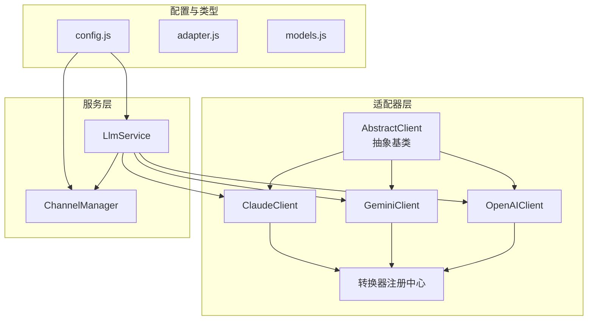
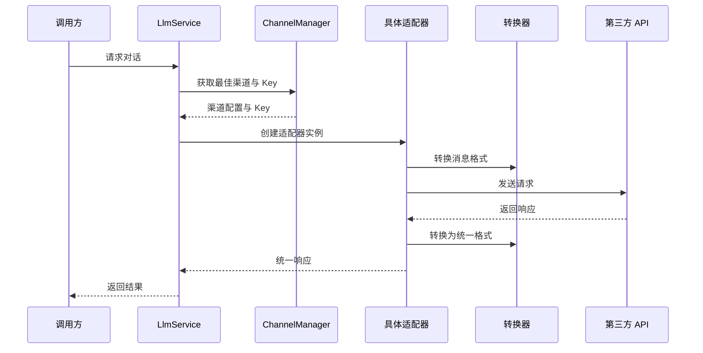
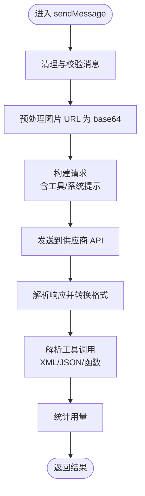
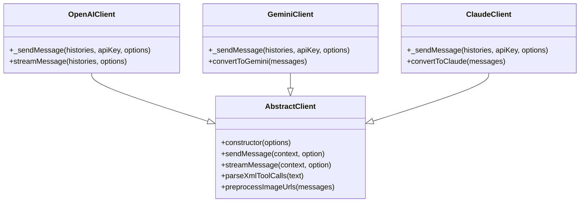

# LLM 适配器

LLM 适配器采用适配器模式统一接入多家 AI 模型供应商（OpenAI、Claude、Gemini），通过抽象层屏蔽不同供应商的 API 差异。

## 适配器架构



## 核心特性

- **统一接口** - 所有适配器提供一致的请求/响应接口
- **工具调用解析** - 支持多种格式（XML/JSON/函数调用）
- **流式响应** - 支持流式输出
- **多渠道管理** - 多 API Key 轮询、故障转移、健康检查
- **模型映射** - 模型重定向与请求头注入
- **图片预处理** - URL 转 base64

## AbstractClient

所有适配器的抽象基类，位于 `src/core/adapters/AbstractClient.js`：

```javascript
// 核心功能
export class AbstractClient {
  constructor(options) {
    this.options = options
    this.historyManager = options.historyManager || new DefaultHistoryManager()
  }
  
  // 发送消息（子类实现）
  async sendMessage(context, option) {
    throw new Error('Not implemented')
  }
  
  // 流式响应
  async *streamResponse(context, option) {
    throw new Error('Not implemented')
  }
}

// 工具调用解析（支持多种格式）
export function parseXmlToolCalls(text) {
  // 支持 <tools>、<tool_call>、JSON 等多种格式
  // 自动修复格式错误的 JSON
}
```

## OpenAIClient

支持 OpenAI API 及所有兼容接口：

```javascript
// src/core/adapters/openai/OpenAIClient.js
import OpenAI from 'openai'
import { AbstractClient } from '../AbstractClient.js'

export class OpenAIClient extends AbstractClient {
  constructor(options) {
    super(options)
    this.client = new OpenAI({
      apiKey: options.apiKey,
      baseURL: options.baseUrl
    })
  }
  
  async sendMessage(context, option) {
    // 转换消息格式
    const messages = this.convertMessages(context.history)
    
    // 调用 API
    const response = await this.client.chat.completions.create({
      model: option.model,
      messages,
      tools: option.tools,
      stream: option.stream
    })
    
    return this.parseResponse(response)
  }
}
```

## ClaudeClient

支持 Anthropic Claude API：

```javascript
// src/core/adapters/claude/ClaudeClient.js
import Anthropic from '@anthropic-ai/sdk'
import { AbstractClient } from '../AbstractClient.js'

export class ClaudeClient extends AbstractClient {
  constructor(options) {
    super(options)
    this.client = new Anthropic({
      apiKey: options.apiKey
    })
  }
  
  async sendMessage(context, option) {
    // Claude 使用不同的消息格式
    const { system, messages } = this.convertToClaude(context.history)
    
    const response = await this.client.messages.create({
      model: option.model,
      max_tokens: option.maxTokens || 4096,
      system,
      messages,
      tools: this.convertTools(option.tools)
    })
    
    return this.parseClaudeResponse(response)
  }
}
```

## GeminiClient

支持 Google Gemini API：

```javascript
// src/core/adapters/gemini/GeminiClient.js
import { GoogleGenerativeAI } from '@google/generative-ai'
import { AbstractClient } from '../AbstractClient.js'

export class GeminiClient extends AbstractClient {
  constructor(options) {
    super(options)
    this.genAI = new GoogleGenerativeAI(options.apiKey)
  }
  
  async sendMessage(context, option) {
    const model = this.genAI.getGenerativeModel({
      model: option.model
    })
    
    const chat = model.startChat({
      history: this.convertToGemini(context.history)
    })
    
    const result = await chat.sendMessage(context.lastMessage)
    return this.parseGeminiResponse(result)
  }
}
```

## 消息格式转换

插件使用统一的内部格式（Chaite 格式），通过 Converter 系统在不同 API 格式间转换：

```javascript
// src/core/utils/converter.js

// 注册转换器
registerFromChaiteConverter('openai', chaiteToOpenAI)
registerIntoChaiteConverter('openai', openAIToChaite)

// 使用转换器
const openaiMessages = getFromChaiteConverter('openai')(chaiteMessages)
const chaiteMessages = getIntoChaiteConverter('openai')(openaiMessages)
```

## 导出接口

```javascript
// src/core/adapters/index.js
export { AbstractClient, parseXmlToolCalls } from './AbstractClient.js'
export { OpenAIClient } from './openai/OpenAIClient.js'
export { GeminiClient } from './gemini/GeminiClient.js'
export { ClaudeClient } from './claude/ClaudeClient.js'

// 转换器注册
export {
  registerFromChaiteConverter,
  registerIntoChaiteConverter,
  getFromChaiteConverter,
  getIntoChaiteConverter
} from '../utils/converter.js'
```

## 调用流程



## 消息处理流程



## 类继承关系



## 工具调用解析

`parseXmlToolCalls` 函数支持多种工具调用格式：

- `<tools>JSON</tools>` - XML 包裹的 JSON
- `<tool_call>...</tool_call>` - XML 格式
- `{"tool_calls": [...]}` - 裸 JSON
- 函数调用风格 `funcName({...})`
- 自动修复格式错误的 JSON

## 扩展适配器

添加新的 LLM 适配器：

```javascript
// 1. 继承 AbstractClient
import { AbstractClient } from './AbstractClient.js'

export class MyClient extends AbstractClient {
  async sendMessage(context, option) {
    // 实现聊天逻辑
  }
}

// 2. 注册消息转换器
import './my-converter.js'  // 注册 Chaite <-> MyAPI 转换

// 3. 在 index.js 中导出
export { MyClient } from './my/MyClient.js'
```

## 下一步

- [聊天服务](./chat-service) - 聊天服务实现
- [存储系统](./storage) - 数据持久化
