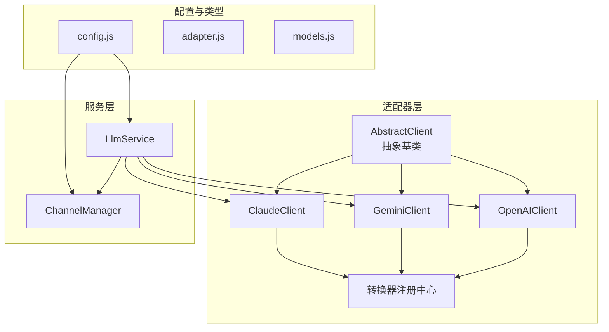
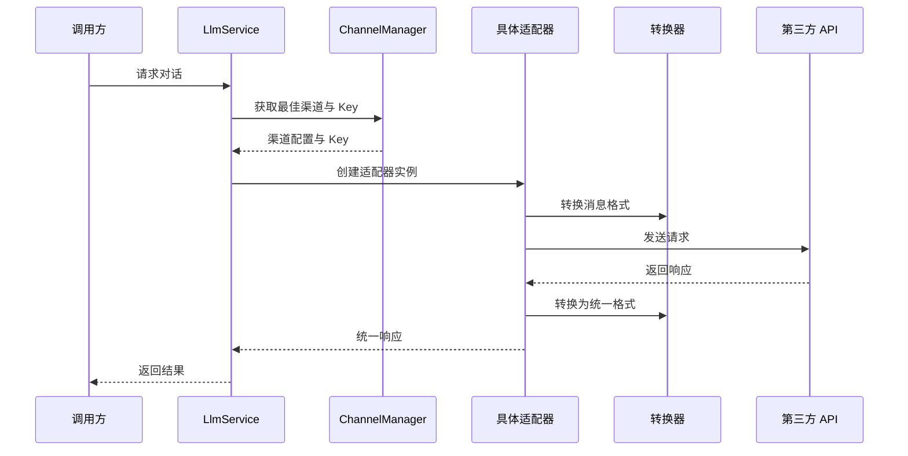
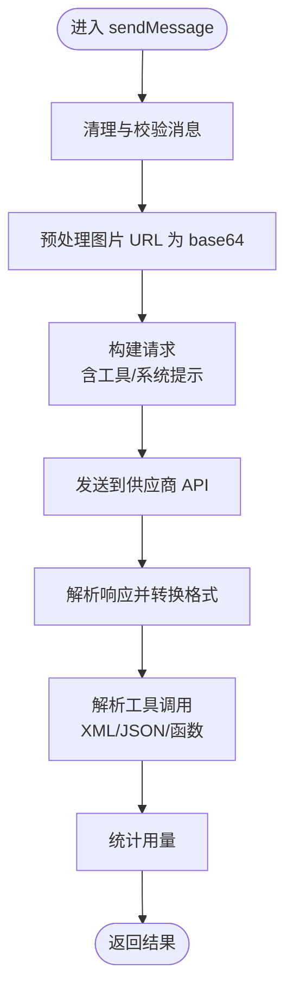
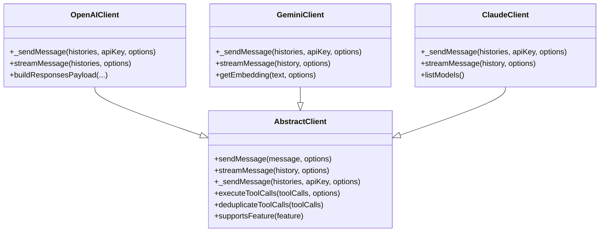

# LLM 适配器

LLM 适配器采用适配器模式统一接入多家 AI 模型供应商（OpenAI、Claude、Gemini），通过抽象层屏蔽不同供应商的 API 差异。

## 适配器架构


```mermaid
graph TB
    subgraph "适配器层"
        AC["AbstractClient<br/>抽象基类"]
        OA["OpenAIClient"]
        GA["GeminiClient"]
        CA["ClaudeClient"]
        CV["转换器注册中心"]
    end
    
    subgraph "服务层"
        LLM["LlmService"]
        CM["ChannelManager"]
    end
    
    subgraph "配置与类型"
        CFG["config.js"]
        TAD["adapter.js"]
        TMD["models.js"]
    end
    
    LLM --> CM
    LLM --> OA
    LLM --> GA
    LLM --> CA
    OA --> CV
    GA --> CV
    CA --> CV
    AC --> OA
    AC --> GA
    AC --> CA
    CFG --> LLM
    CFG --> CM
```

## 核心特性

- **统一接口** - 所有适配器提供一致的请求/响应接口，内部使用统一的 Chaite 消息格式
- **工具调用解析** - 原生工具调用 + `parseXmlToolCalls` 文本回退解析（支持 `<tools>`/`<tool_call>`/`<function_call>`/`<invoke>`/```json 代码块/裸 JSON 等多种格式，自动修复错误 JSON）
- **流式响应** - 三家适配器均实现 `streamMessage`
- **工具调用循环** - `sendMessage` 内置工具调用递归执行、去重（`deduplicateToolCalls`）、并行/串行分流与审批预检
- **thinking/reasoning** - 三家均支持推理模式（机制不同，见下表）
- **图片预处理** - `preprocessImageUrls` 将媒体 URL 转 base64（Gemini 模型强制预处理）
- **多渠道管理** - 多 API Key 轮询、故障转移、健康检查（由 `ChannelManager` 负责）

## AbstractClient

所有适配器的抽象基类，位于 `src/core/adapters/AbstractClient.js`。

### 构造函数关键 options

`constructor(options, context)` 先经 `BaseClientOptions.create(options)` 规范化，读取字段包括：

- `baseUrl` / `chatPath` / `modelsPath` / `responsePath`（Responses API 路径）/ `endpoints`（`{ chat, models, embeddings, images }`）
- `apiKey`、`multipleKeyStrategy`（默认 `MultipleKeyStrategyChoice.RANDOM`）
- `features`、`tools`、`historyManager`、`logger`
- `toolCallLimitConfig`（默认 `DEFAULT_TOOL_CALL_LIMIT`）、`onMessageWithToolCall`（工具调用中间消息回调）

### 主要方法

| 方法 | 说明 |
|---|---|
| `sendMessage(message, options)` | 主入口，含工具调用递归循环 |
| `_sendMessage(histories, apiKey, options)` | 抽象方法，由子类实现具体请求 |
| `sendMessageWithHistory(history, options)` | 带历史的发送 |
| `streamMessage(history, options)` | 流式消息（基类抛未实现，子类覆盖） |
| `getEmbedding(text, options)` | 文本嵌入（基类抛异常） |
| `listModels()` / `getModelInfo(modelId)` | 模型列表与信息 |
| `supportsFeature(feature)` | 基于 `features` 判断能力 |
| `executeToolCalls(toolCalls, options)` | 工具调用执行（并行/串行分流、审批预检） |
| `deduplicateToolCalls(toolCalls)` | 工具调用去重 |

### 模块级导出函数

- `parseXmlToolCalls(text)` - 多格式工具调用文本解析器（含去重与 `MAX_TOOL_CALLS = 15` 限制）
- `preprocessMediaToBase64(histories, options)` / `preprocessImageUrls(histories)` - 媒体转 base64
- `needsBase64Preprocess(model)` / `needsImageBase64Preprocess(model)` - 模型名含 `gemini` 时返回 true

## OpenAIClient

`class OpenAIClient extends AbstractClient`（`this.name = 'openai'`），基于 `openai` SDK，支持 OpenAI API 及所有兼容接口。

### Chat Completions 与 Responses 双模式

接口模式由 `getOpenAIInterfaceMode` 读取 `apiInterface`（默认 `'chat'`）决定：

- **Chat Completions**（默认）：`client.chat.completions.create`，支持流式增量聚合（content / reasoning_content / tool_calls，含 `<think>` 标签剥离）
- **Responses API**：`shouldUseOpenAIResponses` 判定模式为 `'responses'`/`'response'` 时启用，完整管线含 `buildResponsesPayload`、`responsesOutputToChatCompletion`、流式事件状态机 `applyResponsesStreamEvent`（覆盖 text/reasoning/function_call/mcp/code_interpreter/web_search/image_generation 等事件）
- **实验性 WebSocket Responses**：`createResponsesViaSdkWebSocket` 通过动态加载 `ResponsesWS` 实现，由 `shouldUseExperimentalOpenAIWs` 判定，失败自动回退 HTTP

### reasoning/thinking

`mergeOpenAIReasoningOptions` 读取 `enableReasoning`、`reasoningEffort`（默认 `'low'`）、`thinkingVendorControl`（默认 `'auto'`）。合法 effort 集合：`none/minimal/low/medium/high/xhigh`。

- Chat 模式写入 `reasoning_effort` 与 `max_completion_tokens`
- Responses 模式写入 `reasoning.effort`
- 厂商 thinking（智谱/GLM/BigModel）：`applyVendorThinkingPayload` 在 baseUrl 命中 `bigmodel/zhipu/glm/maas` 或 `thinkingVendorControl==='glm'` 时写入 `thinking = { type: 'enabled'|'disabled' }`

## ClaudeClient

`class ClaudeClient extends AbstractClient`（`this.name = 'claude'`），基于 `@anthropic-ai/sdk`。

- **端点**：`buildClaudeClientOptions` + `normalizeClaudeEndpointPath`（自动补 `/v1` 前缀）
- **thinking**：`getClaudeThinkingConfig` 在 `enableReasoning` 且 `maxTokens > 1024` 时返回 `{ type: 'enabled', budget_tokens }`（`budget_tokens` 取 `reasoningBudgetTokens`，默认为 `maxTokens/2`，并夹在 `[1024, maxTokens-1]`）
- **streaming**：`streamMessage` 设 `stream = true`，处理 `content_block_start`(tool_use)、`content_block_delta`(text_delta/input_json_delta)
- **tool calling**：`getFromChaiteToolConverter('claude')` + `resolveToolChoice(..., 'claude')`，文本回退 `parseXmlToolCalls`
- **嵌入**：`getEmbedding` 明确不支持（抛异常）
- **模型列表**：`listModels`/`getModelInfo` API 失败时回退内置列表

## GeminiClient

`class GeminiClient extends AbstractClient`（`this.name = 'gemini'`），基于 `@google/generative-ai`。

- **安全设置**：四类 `HarmCategory` 全部 `BLOCK_NONE`
- **thinking**：`getGeminiThinkingConfig` 在 `enableReasoning` 时按 effort 映射预算（`minimal:256 / low:1024 / medium:4096 / high:8192 / xhigh:16384`），写入 `generationConfig.thinkingConfig.thinkingBudget`；用量统计读取 `thoughtsTokenCount`
- **streaming**：`streamMessage` 用 `generateContentStream`，逐 chunk `chunk.text()`，聚合 `chunk.functionCalls()`
- **tool calling**：以 `[{ functionDeclarations: tools }]` 形式传入，`normalizeGeminiToolConfig` 映射 `functionCallingConfig.mode`（AUTO/ANY/NONE）；文本回退 `parseXmlToolCalls`
- **嵌入**：`getEmbedding` **支持**（默认模型 `text-embedding-004`）

## thinking / reasoning 机制对比

| 适配器 | 开关字段 | 预算/强度参数 | 底层字段 |
|---|---|---|---|
| OpenAI | `enableReasoning` | `reasoningEffort`（none~xhigh） | `reasoning_effort` / `reasoning.effort`；厂商 `thinking.type` |
| Claude | `enableReasoning` | `reasoningBudgetTokens`（默认 maxTokens/2） | `thinking.budget_tokens` |
| Gemini | `enableReasoning` | effort→预算映射 或 `reasoningBudgetTokens` | `thinkingConfig.thinkingBudget` |

## 消息格式转换

插件使用统一的内部格式（Chaite 格式），通过 Converter 系统在不同 API 格式间转换：

```javascript
// src/core/utils/converter.js

// 注册转换器
registerFromChaiteConverter('openai', chaiteToOpenAI)
registerIntoChaiteConverter('openai', openAIToChaite)

// 使用转换器
const openaiMessages = getFromChaiteConverter('openai')(chaiteMessages)
const chaiteMessages = getIntoChaiteConverter('openai')(openaiMessages)
```

## 导出接口

```javascript
// src/core/adapters/index.js
// 从 AbstractClient.js 重导出
export {
  AbstractClient,
  parseXmlToolCalls,
  preprocessMediaToBase64,
  preprocessImageUrls,
  needsBase64Preprocess,
  needsImageBase64Preprocess
} from './AbstractClient.js'

// 三个适配器类
export { OpenAIClient } from './openai/OpenAIClient.js'
export { GeminiClient } from './gemini/GeminiClient.js'
export { ClaudeClient } from './claude/ClaudeClient.js'

// 导入 converter.js 触发转换器注册（副作用）
import './openai/converter.js'
import './gemini/converter.js'
import './claude/converter.js'

// 从 utils/converter.js 重导出转换器注册/获取函数
export {
  registerFromChaiteConverter,
  registerFromChaiteToolConverter,
  registerIntoChaiteConverter,
  getFromChaiteConverter,
  getFromChaiteToolConverter,
  getIntoChaiteConverter
} from '../utils/converter.js'
```

> `tooling.js` 提供跨供应商的工具定义与 tool_choice 归一化（`resolveToolChoice`、`toOpenAIChatTool`/`toClaudeTool`/`toGeminiTool`、`attachToolMetadata` 等），由各适配器直接 import，不经 `index.js` 导出。

## 调用流程


```mermaid
sequenceDiagram
    participant Caller as 调用方
    participant LLM as LlmService
    participant CM as ChannelManager
    participant Client as 具体适配器
    participant Conv as 转换器
    participant API as 第三方 API

    Caller->>LLM: 请求对话
    LLM->>CM: 获取最佳渠道与 Key
    CM-->>LLM: 渠道配置与 Key
    LLM->>Client: 创建适配器实例
    Client->>Conv: 转换消息格式
    Client->>API: 发送请求
    API-->>Client: 返回响应
    Client->>Conv: 转换为统一格式
    Client-->>LLM: 统一响应
    LLM-->>Caller: 返回结果
```

## 消息处理流程


```mermaid
flowchart TD
    Start(["进入 sendMessage"]) --> Clean["清理与校验消息"]
    Clean --> PreImg["预处理图片 URL 为 base64"]
    PreImg --> BuildReq["构建请求<br/>含工具/系统提示"]
    BuildReq --> Send["发送到供应商 API"]
    Send --> Parse["解析响应并转换格式"]
    Parse --> ToolParse["解析工具调用<br/>XML/JSON/函数"]
    ToolParse --> Usage["统计用量"]
    Usage --> End(["返回结果"])
```

## 类继承关系


```mermaid
classDiagram
    class AbstractClient {
        +sendMessage(message, options)
        +streamMessage(history, options)
        +_sendMessage(histories, apiKey, options)
        +executeToolCalls(toolCalls, options)
        +deduplicateToolCalls(toolCalls)
        +supportsFeature(feature)
    }
    
    class OpenAIClient {
        +_sendMessage(histories, apiKey, options)
        +streamMessage(histories, options)
        +buildResponsesPayload(...)
    }
    
    class GeminiClient {
        +_sendMessage(histories, apiKey, options)
        +streamMessage(history, options)
        +getEmbedding(text, options)
    }
    
    class ClaudeClient {
        +_sendMessage(histories, apiKey, options)
        +streamMessage(history, options)
        +listModels()
    }
    
    OpenAIClient --|> AbstractClient
    GeminiClient --|> AbstractClient
    ClaudeClient --|> AbstractClient
```

## 工具调用解析

`parseXmlToolCalls` 函数支持多种工具调用格式：

- `<tools>JSON</tools>` - XML 包裹的 JSON
- `<tool_call>...</tool_call>` - XML 格式
- `{"tool_calls": [...]}` - 裸 JSON
- 函数调用风格 `funcName({...})`
- 自动修复格式错误的 JSON

### 工具调用 ID 规则与去重

- **回退 ID**：解析出的工具调用缺少 `id` 时，用 `generateToolId(prefix)`
  （`prefix_<时间戳>_<随机串>`）补一个随机串 ID（各解析分支前缀为
  `xml` / `invoke` / `block` / `json` / `single` / `escaped` / `extract` /
  `fuzzy` / `funcall` / `recover` 等，共 16 处）。
- **ID 归一化**：任何来源的工具调用 ID 写入结果/历史前统一为字符串
  （`normalizeAnyToolCallId`，位于 `tooling.js`），assistant 侧 `id` 与 tool 侧
  `tool_call_id` 口径一致；空值兜底为随机 UUID 字符串。
- **保存前确定性去重**：历史保存前只去除「确定性重复」的调用
  （`modelResponse.toolCalls` 按内容/ID 去重），并为去除的工具调用生成同
  `tool_call_id` 的错误结果供模型自纠。

## 扩展适配器

添加新的 LLM 适配器：

```javascript
// 1. 继承 AbstractClient
import { AbstractClient } from './AbstractClient.js'

export class MyClient extends AbstractClient {
  async sendMessage(context, option) {
    // 实现聊天逻辑
  }
}

// 2. 注册消息转换器
import './my-converter.js'  // 注册 Chaite <-> MyAPI 转换

// 3. 在 index.js 中导出
export { MyClient } from './my/MyClient.js'
```

## 下一步

- [聊天服务](./chat-service) - 聊天服务实现
- [存储系统](./storage) - 数据持久化

> 补充：适配器三件套（`OpenAIClient` / `ClaudeClient` / `GeminiClient`）所依赖的
> 工具调用 ID 口径见上文[工具调用 ID 规则](#工具调用-id-规则与去重)——回退 ID 为
> `prefix_<时间戳>_<随机串>`，跨来源结果统一经 `normalizeAnyToolCallId` 字符串化，
> 保证 assistant 侧 `id` 与 tool 侧 `tool_call_id` 一致。
