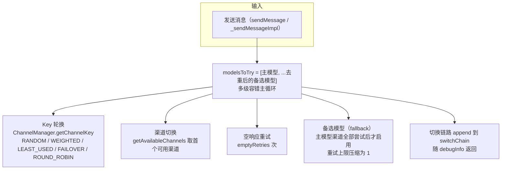
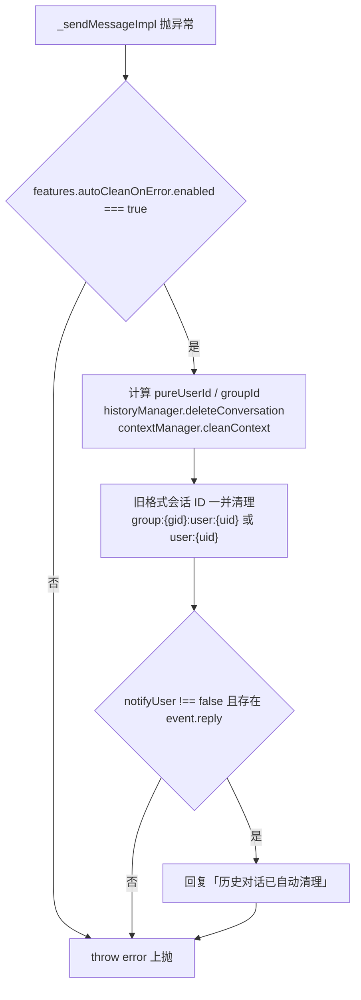
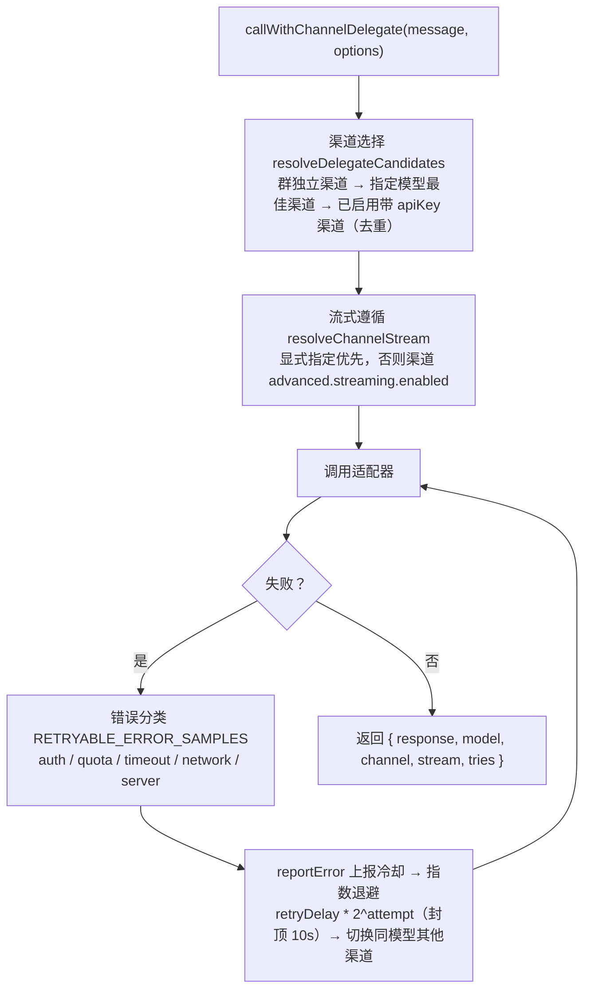
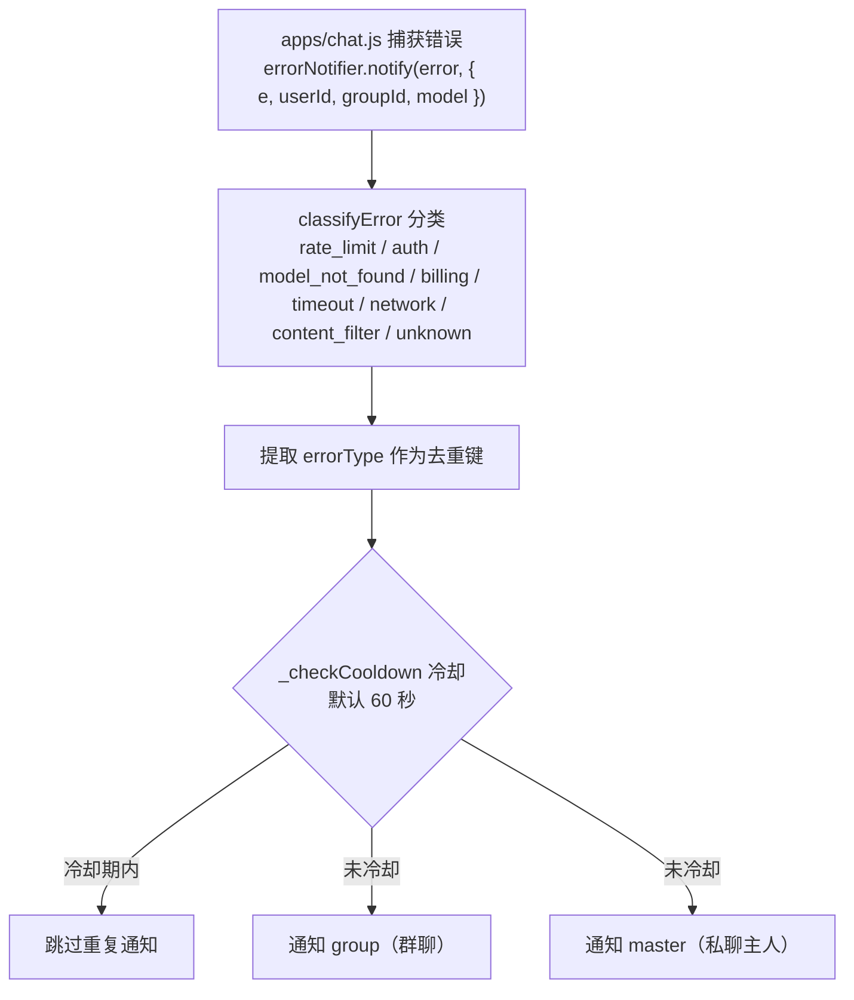

# 聊天服务

`ChatService`（`src/services/llm/ChatService.js`）是处理 AI 对话的核心服务，负责渠道选择、容错重试、工具调用与结果组装。

## 职责

- 管理对话上下文与历史
- 通过 `ChannelManager` 选择渠道与 API Key
- 主模型/备选模型、Key 轮换、渠道切换等多级容错
- 工具调用循环（委托适配器执行）
- 空响应重试、错误分类与自动清理
- 组装 `debugInfo` 与用量统计

## 主要方法

| 方法 | 说明 |
|---|---|
| `sendMessage(options)` | 对外入口，外层 `catch` 内含 `autoCleanOnError` 兜底 |
| `_sendMessageImpl(options)` | 实际实现，容错主循环所在 |
| `sendVoiceReply(event, text, voiceConfig)` | 语音回复 |
| `getHistory(userId, limit, groupId)` | 读取历史 |
| `clearHistory(userId, groupId)` | 清空历史 |
| `exportHistory(userId, format, groupId)` | 导出历史 |

`sendMessage` 返回结构：

```javascript
{
  conversationId,
  response,
  usage,
  model,          // 实际使用的模型（可能为备选模型）
  requestedModel, // 用户请求的原始模型
  toolCallLogs,
  debugInfo,      // 仅 debugMode 时非 null
  autoEndInfo
}
```

## 容错机制



`_sendMessageImpl` 构建 `modelsToTry = [主模型, ...去重后的备选模型]`，在其上运行多级容错主循环。相关配置读取自 `llm.fallback`：

```javascript
// llm.fallback 配置字段（含默认值）
{
  enabled: true,          // 是否启用备选/容错
  models: [],             // 备选模型列表
  maxRetries: 3,          // 主模型最大重试次数
  retryDelay: 500,        // 重试延迟（ms）
  notifyOnFallback: ...,  // 切换备选模型时是否提示用户
  enableChannelSwitch: true,  // 允许渠道切换
  enableKeyRotation: true,    // 允许 Key 轮换
  emptyRetries: 2         // 空响应重试次数
}
```

### 备选模型（fallback）

备选模型**不会立即切换**：仅当主模型的所有渠道均已尝试（`retryStats.mainModelExhausted === true`）后，才启用备选模型。备选模型的重试上限被压缩为 1 次。切换成功且 `notifyOnFallback` 为真时，向用户回复 `[已切换至备选模型: xxx]`。

### Key 轮换

由 `ChannelManager.getChannelKey` 按策略选 Key，支持 `RANDOM` / `WEIGHTED` / `LEAST_USED` / `FAILOVER` / `ROUND_ROBIN`（默认）。活跃 Key 过滤条件为 `enabled !== false && errorCount < 10`（错误满 10 次自动禁用该 Key）。

`getNextAvailableKey(channelId, currentKeyIndex)` 排除当前失败 Key，在剩余活跃 Key 中取 `errorCount` 最小者。ChatService 在两种情况触发换 Key：空响应耗尽后（`reason: 'empty'`）、请求异常后（认证错误优先换 Key）。换 Key 成功后 `continue` 且**不增加** retryCount。

### 渠道切换

条件为 `enableChannelSwitch && isMainModel`。通过 `getAvailableChannels(currentModel, { excludeChannelId })` 取候选渠道并排除已尝试渠道，取首个重建 client。`getAvailableChannels` 会过滤禁用/模型不匹配/`ERROR`/`QUOTA_EXCEEDED` 状态的渠道，并按错误次数施加动态冷却（errorCount=1→30s、=2→60s、≥3→5min），最终按 `priority → errorCount → lastUsed` 排序。

错误后切换仅在 `errorType ∈ {auth, quota, timeout, network, server}` 且 Key 切换失败后进行。

### 空响应重试

主模型循环内对空响应做 `emptyRetries` 次重试，耗尽后依次尝试换 Key、切换渠道。

### 切换链路记录

所有切换动作追加到 `switchChain`（如 `{ type: 'fallback', reason: 'main_model_exhausted' }`、`{ type: 'channel', reason: 'empty' }`、`{ type: 'key', reason: errorType }`），随 `debugInfo` 返回。

## autoCleanOnError



位于 `sendMessage` 外层 `catch`。当 `_sendMessageImpl` 抛异常且 `features.autoCleanOnError.enabled === true` 时触发：

1. 计算 `pureUserId` / `groupId`，调用 `historyManager.deleteConversation` + `contextManager.cleanContext` 清理当前对话
2. 对旧格式会话 ID（`group:{gid}:user:{uid}` 或 `user:{uid}`）若不同则一并清理
3. 若 `notifyUser !== false` 且存在 `event.reply`，回复「历史对话已自动清理」
4. 最终 `throw error` 继续上抛

## 旁路调用助手：LlmDelegate

`src/services/llm/LlmDelegate.js` 为记忆、知识图谱、总结等**绕过 ChatService** 直接
调用适配器的子模块提供统一契约（`callWithChannelDelegate(message, options)`）：



- **渠道选择**：`resolveDelegateCandidates` 优先群独立渠道（含 `groupId` 时），
  其次指定模型的最佳渠道，最后是所有已启用且带 apiKey 的渠道（去重）。
- **流式遵循**：`resolveChannelStream(channel, explicitStream)`——显式指定时以参数
  为准，否则跟随渠道 `advanced.streaming.enabled`。
- **失败重试**：错误分类（`RETRYABLE_ERROR_SAMPLES`：auth/quota/timeout/network/
  server 五类）→ `channelManager.reportError` 上报冷却 → 指数退避
  （`retryDelay * 2^attempt`，封顶 10s）→ 切换同模型其他渠道；`llm.fallback`
  的 `maxRetries`（默认 3）/`retryDelay`（默认 500ms）/`enableChannelSwitch`
  控制整体行为，全部失败后抛出。
- **返回**：`{ response, model, channel, stream, tries }` 渠道元信息供调用方回填统计。
- 纯函数式组合、无单例状态。

## ErrorNotifier 集成

错误通知由 `errorNotifier`（`src/services/ErrorNotifier.js`）单例提供，在
`apps/chat.js` 的错误处理链路中调用 `errorNotifier.notify(error, { e, userId, groupId, model })`：



- **错误分类**：`classifyError` 从错误消息提取类型键：`rate_limit` / `auth` /
  `model_not_found` / `billing` / `timeout` / `network` / `content_filter` /
  `unknown`。
- **通知目标**：支持 `group`（群聊）与 `master`（私聊主人，主人来源为
  `admin.masterQQ` 及 Bot 配置的 master，保留协议端原始标识，QQBot OpenID 不转数字）。
- **冷却去重**：内部 `cooldownMap` 按错误类型键控，`_checkCooldown` 在冷却期
  （默认 60 秒）内跳过重复通知。
- **错误类型提取**：从错误消息中归一化出 `errorType` 作为去重键。

> 说明：ChatService 本身的错误上报走 `channelManager.reportError`（渠道级降级）与
> `statsService.recordApiCall`（统计），ErrorNotifier 由 `apps/chat.js` 层集成。

## Debug 信息保留

`debugInfo` 仅在 `debugMode === true` 时为对象。抛出异常前（`!response && lastError`），会先同步写入 `totalRetryCount`、`switchChain`、`channelSwitched` 等字段再抛出，避免 API 错误时 debug 信息丢失。正常返回路径通过返回值的 `debugInfo` 字段携带完整 `switchChain`/`retryStats`。

## 下一步

- [Web 服务](./web-server) - HTTP API 服务
- [存储系统](./storage) - 数据持久化
- [渲染服务](./canvas-renderer) - Markdown/公式转图片
