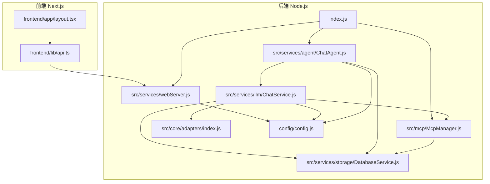
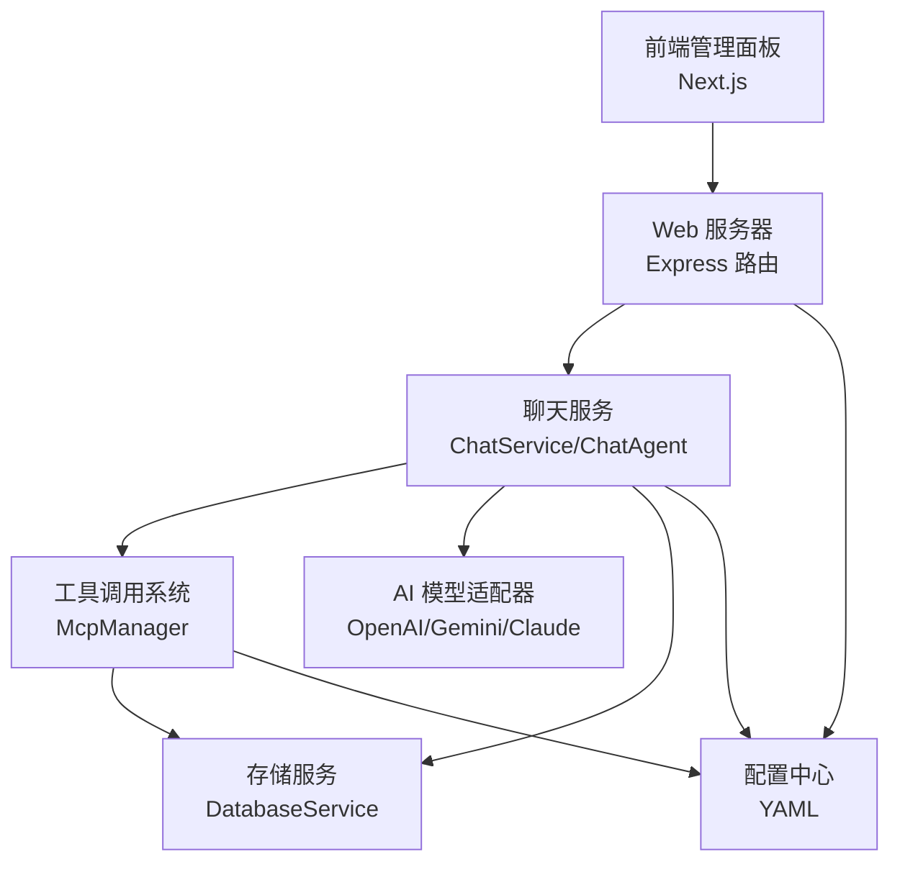
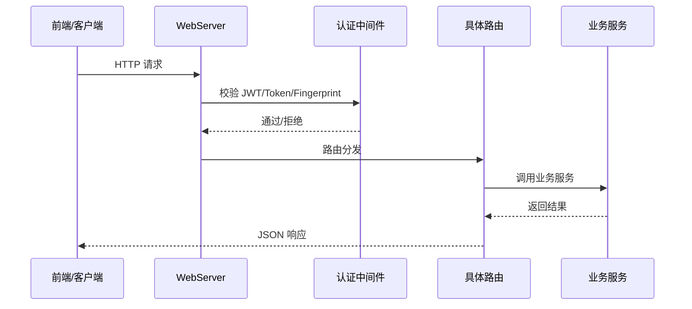
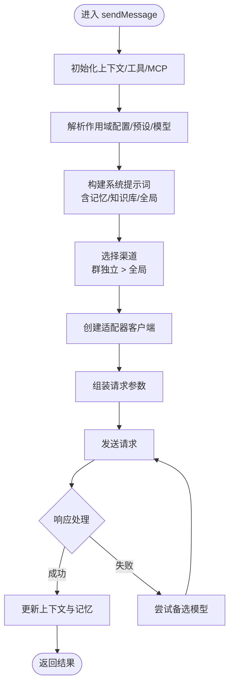

# 核心架构详解

本文档详细阐述 ChatAI 插件的整体设计与实现方式。

## 项目结构

项目采用前后端分离与模块化组织相结合的结构：

- **后端核心** - `src` 目录，按领域拆分为服务层、适配器层、工具与 MCP 管理、存储与配置等子模块
- **前端应用** - `frontend` 目录，基于 Next.js 14，提供管理面板界面与 API 客户端封装
- **配置中心** - `config` 目录，使用 YAML 管理运行时参数
- **插件入口** - `index.js` 负责初始化、并发启动与全局暴露能力

## 核心组件

### 插件入口与初始化

- 并发初始化 Segment、Web 服务器、遥测、技能代理、应用模块等
- 统一输出加载统计与公告
- 暴露 `skills` 与 `apps` 能力，支持动态技能执行与工具管理

### Web 服务器

- 基于 Express，提供认证、CORS、静态资源托管、路由注册与健康检查
- 支持 TRSS 环境共享端口与挂载路径
- 具备登录链接生成与重载能力

### 聊天服务

- **ChatService** - 统一消息处理流程，负责上下文构建、预设与系统提示词、工具调用、渠道选择、错误清理
- **ChatAgent** - 面向业务的代理封装，提供便捷的聊天与消息发送接口，支持备选模型回退

### AI 模型适配器

- 适配器抽象与多厂商适配（OpenAI、Gemini、Claude）
- 统一转换器与类型定义

### 工具调用系统

- **McpManager** - 统一管理内置工具、自定义 JS 工具、外部 MCP 服务器
- 提供工具发现、调用、缓存与日志

### 存储与配置

- **DatabaseService** - SQLite 存储消息、记忆、键值等，提供去重、索引与统计
- **Config** - YAML 配置中心，支持深合并、默认值与运行时更新

## 架构总览

系统采用"前端管理面板 + 后端服务层"的双层架构：

## Web 服务器详解

### 职责

- 提供认证与授权（JWT、Token、指纹绑定）、CORS、静态资源托管
- 注册各类 API 路由（系统、配置、工具、MCP、知识库、图像、日志、内存、群管、技能等）
- 支持 TRSS 环境共享端口与挂载路径，生成登录链接，健康检查与重载

### 关键特性

- 请求签名验证、时间戳校验、防重放
- 登录态管理：一次性临时 Token、永久 Token、指纹绑定
- 地址探测：本地/公网 IPv4/IPv6 地址自动识别

### 请求流程

## 聊天服务详解

### 职责

- 统一处理用户消息，构建系统提示词与上下文
- 选择渠道与模型，执行工具调用
- 记录统计与错误清理
- 支持群聊共享上下文、私聊隔离、记忆与知识库增强

### 处理流程

## 可扩展点

| 扩展点 | 位置 | 说明 |
|--------|------|------|
| 新增路由 | `routes/index.js` | WebServer 统一挂载 |
| 认证扩展 | 认证中间件 | 可替换鉴权策略或引入第三方认证 |
| 新增模型 | 适配器层 | 扩展注册转换器与类型 |
| 新增工具 | McpManager | 支持内置、自定义 JS 与外部 MCP |

## 下一步

- [LLM 适配器](./adapters) - 模型适配器详解
- [数据流](./data-flow) - 完整数据流程
