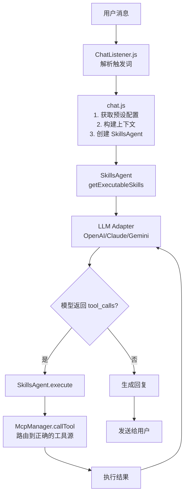
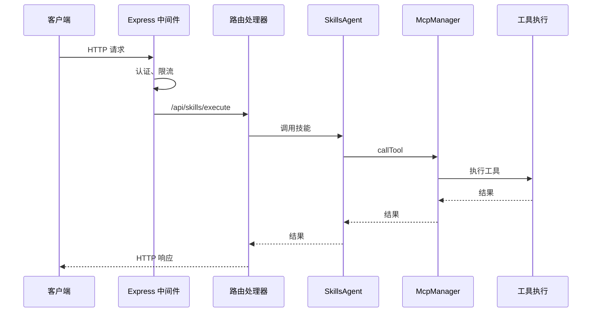

# 数据流

本文档描述 ChatAI Plugin 中消息的完整处理流程。

## 消息处理流程



## 详细流程

### 1. 消息接收

```javascript
// ChatListener.js
async accept(e) {
  // 检查是否应该触发
  if (!this.shouldTrigger(e)) {
    return false
  }
  
  // 解析消息内容
  const content = this.parseMessage(e)
  
  // 交给 chat.js 处理
  return await handleChat(e, content)
}
```

### 2. 触发判断

```javascript
shouldTrigger(e) {
  // @机器人
  if (e.atBot) return true
  
  // 前缀匹配
  if (e.msg.startsWith(config.prefix)) return true
  
  // 关键词匹配
  if (this.matchKeywords(e.msg)) return true
  
  // 随机触发
  if (Math.random() * 100 < config.randomRate) return true
  
  return false
}
```

### 3. 上下文构建

```javascript
// chat.js
async function handleChat(e, content) {
  // 获取预设
  const preset = await getPreset(e)
  
  // 获取历史消息
  const history = await getHistory(e.user_id, e.group_id)
  
  // 构建消息列表
  const messages = [
    { role: 'system', content: preset.systemPrompt },
    ...history,
    { role: 'user', content }
  ]
  
  // 创建技能代理
  const agent = await createSkillsAgent({ event: e, presetId: preset.id })
  
  // 获取可用工具
  const tools = agent.getToolDefinitions()
  
  // 调用 AI
  return await callAI(messages, tools, agent)
}
```

### 4. AI 调用

```javascript
async function callAI(messages, tools, agent) {
  // 获取适配器
  const adapter = getAdapter(config.channel)
  
  // 发送请求
  let response = await adapter.chat({
    messages,
    tools,
    stream: true
  })
  
  // 处理工具调用
  while (response.toolCalls?.length > 0) {
    // 执行工具
    const results = await executeToolCalls(response.toolCalls, agent)
    
    // 将结果加入消息
    messages.push({ role: 'assistant', tool_calls: response.toolCalls })
    messages.push(...results.map(r => ({
      role: 'tool',
      tool_call_id: r.id,
      content: JSON.stringify(r.result)
    })))
    
    // 继续对话
    response = await adapter.chat({ messages, tools })
  }
  
  return response.content
}
```

### 5. 工具执行

```javascript
async function executeToolCalls(toolCalls, agent) {
  const results = []
  
  for (const call of toolCalls) {
    try {
      const result = await agent.execute(call.function.name, call.function.arguments)
      results.push({ id: call.id, result })
    } catch (error) {
      results.push({ id: call.id, error: error.message })
    }
  }
  
  return results
}
```

### 6. 响应发送

```javascript
// 格式化响应
const reply = formatReply(response)

// 发送消息
await e.reply(reply)

// 保存历史
await saveHistory(e.user_id, e.group_id, content, response)
```

## API 请求流程



## API 路由结构

```mermaid
graph LR
    API[/api] --> AUTH[/auth]
    API --> CONFIG[/config]
    API --> SKILLS[/skills]
    API --> MCP[/mcp]
    API --> TOOLS[/tools]
    
    AUTH --> AUTH1[/login]
    AUTH --> AUTH2[/verify]
    
    CONFIG --> CFG1[/get]
    CONFIG --> CFG2[/update]
    
    SKILLS --> SK1[/status]
    SKILLS --> SK2[/tools]
    SKILLS --> SK3[/execute]
    SKILLS --> SK4[/mcp/servers]
    
    MCP --> MCP1[/servers]
    MCP --> MCP2[/resources]
    MCP --> MCP3[/prompts]
    
    TOOLS --> T1[/builtin]
    TOOLS --> T2[/custom]
    TOOLS --> T3[/logs]
```

## 流式响应

```javascript
// 流式处理
async function streamChat(messages, tools, onChunk) {
  const stream = await adapter.stream({ messages, tools })
  
  let fullContent = ''
  let toolCalls = []
  
  for await (const chunk of stream) {
    if (chunk.content) {
      fullContent += chunk.content
      onChunk({ type: 'content', data: chunk.content })
    }
    
    if (chunk.tool_calls) {
      toolCalls = chunk.tool_calls
    }
  }
  
  if (toolCalls.length > 0) {
    onChunk({ type: 'tool_calls', data: toolCalls })
  }
  
  return { content: fullContent, toolCalls }
}
```

## 错误处理

```javascript
try {
  const result = await handleChat(e, content)
  await e.reply(result)
} catch (error) {
  if (error instanceof RateLimitError) {
    await e.reply('请求过于频繁，请稍后再试')
  } else if (error instanceof AuthError) {
    await e.reply('API 认证失败，请检查配置')
  } else {
    logger.error('Chat error:', error)
    await e.reply('处理消息时出错，请稍后重试')
  }
}
```

## 下一步

- [LLM 适配器](./adapters) - 模型适配器实现
- [存储系统](./storage) - 数据持久化
