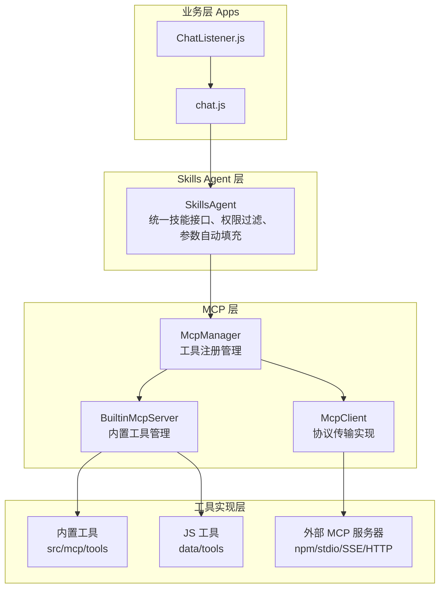

# 架构概述 <Badge type="info" text="Developer" />

ChatAI Plugin 采用**模块化分层架构**设计，基于 MCP 标准实现工具调用系统。

::: tip 阅读本文档前
建议先了解 [MCP (Model Context Protocol)](https://modelcontextprotocol.io/) 协议基础知识。
:::

## 架构图 {#architecture-diagram}



## 核心概念 {#core-concepts}

### 三层架构 {#three-layers}

::: info 分层设计原则
每层只依赖下层，不依赖上层，保证模块解耦和可测试性。
:::

| 层级 | 说明 | 主要模块 | 职责 |
|:-----|:-----|:---------|:-----|
| **应用层** | 消息处理、命令响应 | `apps/`, `ChatListener` | 接收 Yunzai 消息事件，路由到对应处理器 |
| **服务层** | 业务逻辑、API 服务 | `services/`, `agent/` | LLM 调用、上下文管理、工具编排 |
| **核心层** | 基础设施、适配器 | `core/`, `mcp/` | 多模型适配、MCP 协议实现、缓存存储 |

### MCP 系统 {#mcp-system}

::: tip MCP 协议
**MCP (Model Context Protocol)** 是 Anthropic 提出的开放标准，用于定义 AI 与工具的交互方式。
:::

| 组件 | 文件 | 职责 |
|:-----|:-----|:-----|
| **McpManager** | `src/mcp/McpManager.js` | 统一管理所有工具来源，提供工具注册、查询、调用接口 |
| **McpClient** | `src/mcp/McpClient.js` | MCP 协议客户端，支持 stdio/npm/SSE/HTTP 多种传输 |
| **BuiltinMcpServer** | `src/mcp/BuiltinMcpServer.js` | 内置工具服务器，管理 22 个类别的工具和自定义 JS 工具 |

### Skills Agent {#skills-agent}

**Skills Agent** 是 MCP 之上的业务抽象层，定义于 `src/services/agent/SkillsAgent.js`：

| 功能 | 说明 |
|:-----|:-----|
| **统一技能接口** | 整合所有工具来源为统一的"技能"概念 |
| **权限过滤** | 根据用户/群组权限过滤可用工具 |
| **参数自动填充** | 自动注入 user_id、group_id 等上下文参数 |
| **预设级控制** | 支持预设级别的工具白名单/黑名单 |

## 目录结构 {#directory-structure}

::: details 完整目录结构（点击展开）
```
chatgpt-plugin/
├── apps/                    # 应用模块（Yunzai 插件入口）
│   ├── chat.js              # 主聊天处理
│   ├── Commands.js          # 命令处理
│   ├── Management.js        # 管理命令
│   └── ...                  # 其他功能模块
├── config/                  # 配置管理
├── data/                    # 运行时数据
│   ├── presets/             # 预设文件
│   ├── tools/               # 自定义 JS 工具
│   ├── mcp-servers.json     # MCP 服务器配置
│   └── chatai.db            # SQLite 数据库
├── src/
│   ├── core/                # 核心层
│   │   ├── adapters/        # LLM 适配器
│   │   │   ├── AbstractClient.js  # 抽象基类
│   │   │   ├── openai/      # OpenAI 客户端
│   │   │   ├── claude/      # Claude 客户端
│   │   │   └── gemini/      # Gemini 客户端
│   │   ├── types/           # 类型定义
│   │   └── utils/           # 工具函数
│   ├── mcp/                 # MCP 系统
│   │   ├── McpManager.js    # MCP 管理器
│   │   ├── McpClient.js     # MCP 客户端
│   │   ├── BuiltinMcpServer.js  # 内置工具服务器
│   │   └── tools/           # 内置工具（22个类别）
│   └── services/            # 服务层
│       ├── agent/           # Skills Agent
│       ├── llm/             # LLM 服务
│       ├── storage/         # 存储服务
│       ├── routes/          # API 路由
│       └── webServer.js     # Web 服务
└── index.js                 # 插件入口
```
:::

**核心目录说明：**

| 目录 | 说明 | 重要文件 |
|:-----|:-----|:---------|
| `apps/` | Yunzai 插件入口 | `chat.js` 主聊天处理 |
| `src/core/adapters/` | LLM 适配器 | `AbstractClient.js` 抽象基类 |
| `src/mcp/` | MCP 系统 | `McpManager.js` 工具管理 |
| `src/services/` | 服务层 | `llm/`, `agent/`, `storage/` |
| `data/tools/` | 自定义工具 | 用户 JS 工具脚本 |

## 核心组件 {#core-components}

::: info 组件依赖关系
组件按依赖顺序排列，上层组件依赖下层组件。
:::

| 组件 | 文件 | 职责 | 层级 |
|:-----|:-----|:-----|:----:|
| **AbstractClient** | `src/core/adapters/AbstractClient.js` | LLM 适配器抽象基类，工具调用解析 | 核心 |
| **OpenAIClient** | `src/core/adapters/openai/OpenAIClient.js` | OpenAI/兼容 API 客户端 | 核心 |
| **McpManager** | `src/mcp/McpManager.js` | 工具注册、查询、调用管理 | 核心 |
| **McpClient** | `src/mcp/McpClient.js` | MCP 协议客户端（stdio/npm/SSE/HTTP） | 核心 |
| **BuiltinMcpServer** | `src/mcp/BuiltinMcpServer.js` | 内置工具服务器、上下文管理、热重载 | 核心 |
| **SkillsAgent** | `src/services/agent/SkillsAgent.js` | 技能代理、权限控制、参数填充 | 服务 |
| **ToolFilterService** | `src/services/tools/ToolFilterService.js` | 工具过滤、黑白名单 | 服务 |

## 设计原则 {#design-principles}

| 原则 | 说明 | 实现方式 |
|:-----|:-----|:---------|
| 🧩 **模块化** | 功能解耦，独立维护 | 每个模块单独目录，明确导出接口 |
| 🔌 **可扩展** | 支持自定义工具和适配器 | 抽象基类 + 插件机制 |
| 📋 **标准化** | 遵循 MCP 协议规范 | 实现 MCP 标准接口 |
| 🔒 **安全性** | 完善的权限控制机制 | 多层权限过滤、危险命令拦截 |

## 详细文档 {#detailed-docs}

::: tip 📚 深入了解各模块
:::

| 文档 | 内容 | 推荐阅读 |
|:-----|:-----|:--------:|
| [分层架构](./layers) | 详细的层次结构说明 | ⭐⭐ |
| [MCP 系统](./mcp) | MCP 协议实现详解 | ⭐⭐⭐ |
| [Skills Agent](./skills-agent) | 技能代理系统 | ⭐⭐ |
| [数据流](./data-flow) | 请求处理流程 | ⭐⭐⭐ |
| [LLM 适配器](./adapters) | 多模型适配实现 | ⭐⭐⭐ |
| [存储系统](./storage) | 数据持久化方案 | ⭐⭐ |
