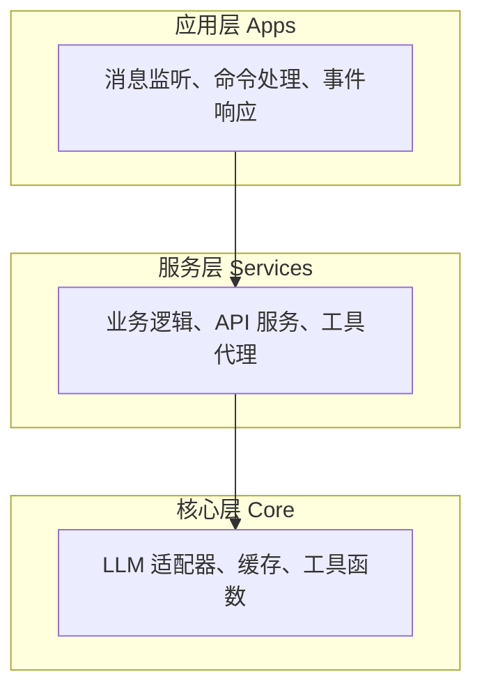
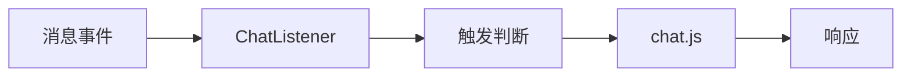
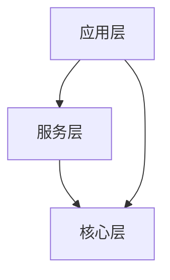
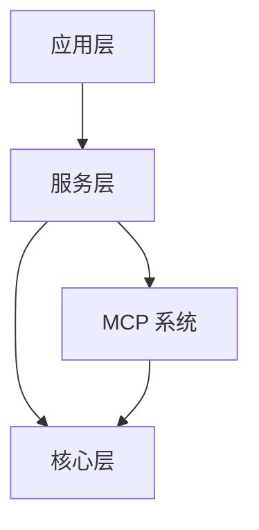

# 分层架构

ChatAI Plugin 采用三层架构设计：应用层、服务层、核心层。

## 层次图



## 应用层 (Apps)

应用层处理用户交互，包括消息监听和命令响应。

### 主要模块

| 模块 | 文件 | 职责 |
|------|------|------|
| chat | `apps/chat.js` | 聊天消息处理 |
| ChatListener | `apps/ChatListener.js` | 消息监听与触发判断 |
| Management | `apps/Management.js` | 管理命令处理 |

### 处理流程



### 代码示例

```javascript
// apps/ChatListener.js
export class ChatListener extends plugin {
  constructor() {
    super({
      name: 'ChatAI-Listener',
      event: 'message',
      priority: 100
    })
  }

  async accept(e) {
    // 触发条件检查
    if (!this.shouldTrigger(e)) return false
    
    // 调用聊天处理
    return await handleChat(e)
  }
}
```

## 服务层 (Services)

服务层封装业务逻辑，提供统一的服务接口。

### 主要服务

| 服务 | 目录 | 职责 |
|------|------|------|
| LLM 服务 | `services/llm/` | AI 模型调用 |
| Agent 服务 | `services/agent/` | 技能代理 |
| 存储服务 | `services/storage/` | 数据持久化 |
| Web 服务 | `services/webServer.js` | HTTP API |
| 路由 | `services/routes/` | API 路由定义 |

### ChatService

```javascript
// services/llm/ChatService.js
export class ChatService {
  async chat(options) {
    const { messages, model, tools } = options
    
    // 1. 获取适配器
    const adapter = this.getAdapter(model)
    
    // 2. 构建请求
    const request = this.buildRequest(messages, tools)
    
    // 3. 发送请求
    const response = await adapter.chat(request)
    
    // 4. 处理工具调用
    if (response.toolCalls) {
      return await this.handleToolCalls(response)
    }
    
    return response
  }
}
```

### SkillsAgent

```javascript
// services/agent/SkillsAgent.js
export class SkillsAgent {
  // 获取可执行技能
  getExecutableSkills() {
    // 应用权限过滤
    return this.filterByPermission(this.allTools)
  }
  
  // 执行技能
  async execute(skillName, args) {
    // 权限检查
    this.checkPermission(skillName)
    
    // 参数填充
    args = this.fillAutoParams(args)
    
    // 调用 MCP
    return await McpManager.callTool(skillName, args)
  }
}
```

## 核心层 (Core)

核心层提供基础设施和通用能力。

### 主要模块

| 模块 | 目录 | 职责 |
|------|------|------|
| 适配器 | `core/adapters/` | LLM API 适配 |
| 缓存 | `core/cache/` | Redis/内存缓存 |
| 工具 | `core/utils/` | 通用工具函数 |

### 适配器模式

```javascript
// core/adapters/BaseAdapter.js
export class BaseAdapter {
  async chat(request) {
    throw new Error('Not implemented')
  }
  
  async stream(request, callback) {
    throw new Error('Not implemented')
  }
}

// core/adapters/OpenAIAdapter.js
export class OpenAIAdapter extends BaseAdapter {
  async chat(request) {
    return await this.client.chat.completions.create(request)
  }
}
```

## 层间通信

### 依赖规则



- 上层可以依赖下层
- 下层不能依赖上层
- 同层之间通过接口通信

### 事件机制

层间可以通过事件进行解耦通信：

```javascript
// 发布事件
EventEmitter.emit('tool:executed', { name, result })

// 订阅事件
EventEmitter.on('tool:executed', (data) => {
  // 记录日志
})
```

## 模块依赖



## 扩展点

| 扩展点 | 位置 | 说明 |
|--------|------|------|
| LLM 适配器 | `core/adapters/` | 支持新的 AI 模型 |
| 内置工具 | `src/mcp/tools/` | 添加新的工具类别 |
| 自定义工具 | `data/tools/` | 用户自定义工具 |
| API 路由 | `services/routes/` | 扩展 API 接口 |

## 下一步

- [MCP 系统](./mcp) - MCP 协议实现
- [Skills Agent](./skills-agent) - 技能代理详解
