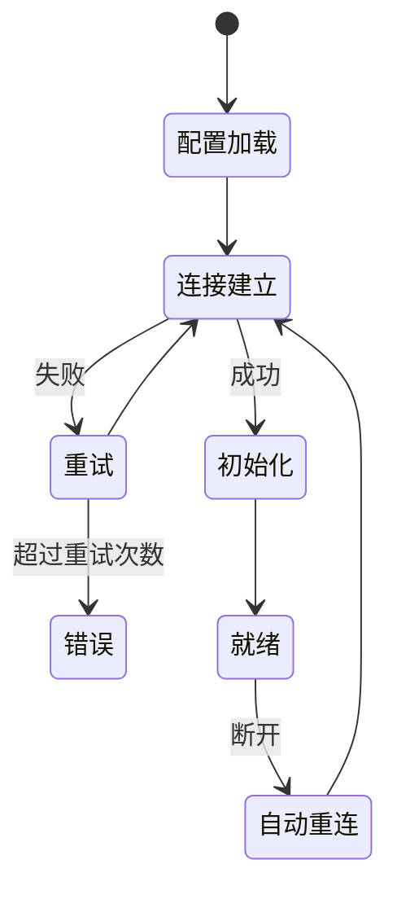
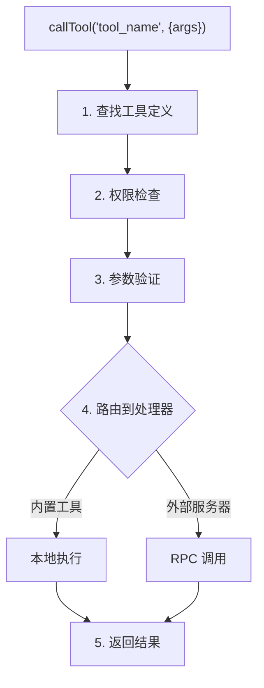

# MCP 系统

MCP (Model Context Protocol) 是 Anthropic 提出的标准化协议，用于定义 AI 模型与外部工具的交互方式。

## 核心组件

| 组件 | 文件 | 职责 |
|------|------|------|
| McpManager | `src/mcp/McpManager.js` | 统一管理所有工具来源 |
| McpClient | `src/mcp/McpClient.js` | MCP 客户端，支持多种传输 |
| BuiltinMcpServer | `src/mcp/BuiltinMcpServer.js` | 内置工具服务器 |

## McpManager

McpManager 是工具系统的核心，负责：
- 工具注册与发现
- 服务器连接管理
- 工具调用路由
- 结果缓存

```javascript
class McpManager {
  // 工具注册表
  tools = new Map()      // name -> tool definition
  servers = new Map()    // name -> server info
  
  // 初始化
  async init() {
    await this.initBuiltinServer()     // 内置工具
    await this.initCustomToolsServer() // JS 工具
    await this.loadServers()           // 外部服务器
  }
  
  // 统一调用接口
  async callTool(name, args, options) {
    // 1. 查找工具
    const tool = this.tools.get(name)
    if (!tool) throw new Error(`Tool not found: ${name}`)
    
    // 2. 权限检查
    this.checkPermission(tool, options)
    
    // 3. 调用执行
    const result = await this.executeTool(tool, args)
    
    // 4. 记录日志
    this.logExecution(name, args, result)
    
    return result
  }
}
```

## McpClient

McpClient 实现 MCP 协议的客户端，支持四种传输类型。

### stdio - 标准输入输出

用于本地进程通信：

```javascript
// 配置
{
  type: 'stdio',
  command: 'node',
  args: ['server.js'],
  env: { DEBUG: 'true' }
}
```

工作流程：
1. 启动子进程
2. 通过 stdin/stdout 通信
3. 使用 JSON-RPC 协议

### npm - npm 包

自动安装并运行 npm 包形式的 MCP 服务器：

```javascript
// 配置
{
  type: 'npm',
  package: '@anthropic/mcp-server-filesystem',
  args: ['/home/user/documents']
}
```

支持的热门 npm 包：
- `@anthropic/mcp-server-filesystem` - 文件系统访问
- `@modelcontextprotocol/server-memory` - 知识图谱
- `@anthropic/mcp-server-brave-search` - Brave 搜索

### SSE - Server-Sent Events

用于远程服务的实时连接：

```javascript
// 配置
{
  type: 'sse',
  url: 'https://mcp.example.com/sse',
  headers: {
    'Authorization': 'Bearer xxx'
  }
}
```

工作流程：
1. 连接 SSE 端点
2. 接收 `endpoint` 事件获取消息端点
3. POST 请求发送到消息端点
4. 通过 SSE 流接收响应

### HTTP - Streamable HTTP

用于无状态的 HTTP API：

```javascript
// 配置
{
  type: 'http',
  url: 'https://api.example.com/mcp',
  headers: {
    'Authorization': 'Bearer xxx'
  }
}
```

## BuiltinMcpServer

管理内置工具和自定义 JS 工具：

```javascript
class BuiltinMcpServer {
  // 模块化工具
  modularTools = []
  toolCategories = {}
  
  // JS 文件工具
  jsTools = new Map()
  
  // 文件监听器
  fileWatchers = []
  
  // 加载模块化工具
  async loadModularTools() {
    const categories = ['basic', 'user', 'group', 'message', 'media', 'web']
    
    for (const category of categories) {
      const tools = await import(`./tools/${category}/index.js`)
      this.registerCategory(category, tools)
    }
  }
  
  // 加载 JS 工具
  async loadJsTools() {
    const toolsDir = 'data/tools'
    const files = await fs.readdir(toolsDir)
    
    for (const file of files) {
      if (file.endsWith('.js')) {
        await this.loadJsTool(path.join(toolsDir, file))
      }
    }
  }
}
```

## 工具定义格式

```javascript
{
  name: 'get_time',
  description: '获取当前时间',
  category: 'basic',
  
  parameters: {
    type: 'object',
    properties: {
      timezone: {
        type: 'string',
        description: '时区，如 Asia/Shanghai'
      }
    },
    required: []
  },
  
  async execute(args, context) {
    const tz = args.timezone || 'Asia/Shanghai'
    return new Date().toLocaleString('zh-CN', { timeZone: tz })
  }
}
```

## 连接生命周期



## 工具执行流程



## 下一步

- [Skills Agent](./skills-agent) - 技能代理系统
- [数据流](./data-flow) - 完整数据流程
