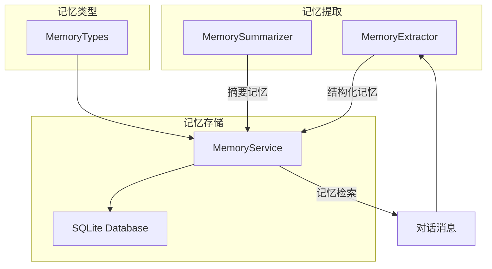
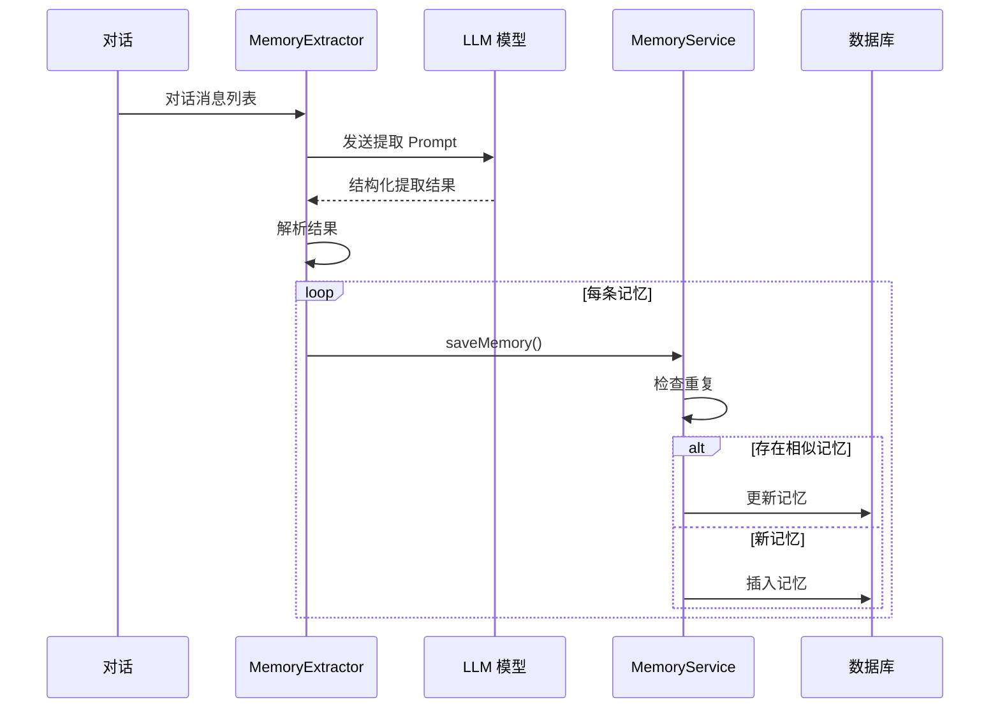
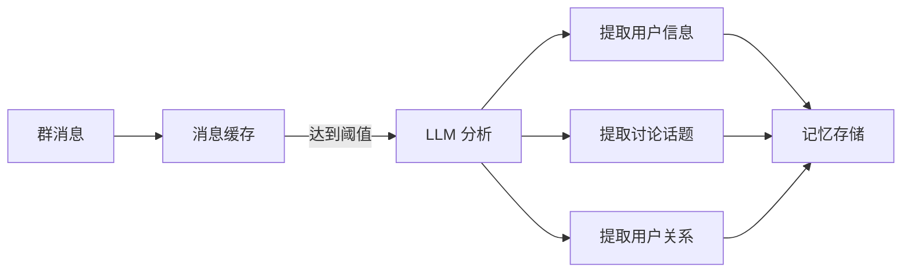

# 记忆系统架构 <Badge type="info" text="Architecture" />

长期记忆系统让 AI 跨对话记住用户信息，提供更个性化的体验。

::: tip 📚 相关文档
- **用户指南**: [记忆系统指南](/guide/memory) - 如何使用记忆功能
- **配置参考**: [记忆配置](/config/memory) - 配置选项详解
:::

## 架构概览 {#overview}



## 核心组件

### MemoryService

统一管理所有记忆操作的服务类。

```javascript
import { memoryService } from './services/memory/MemoryService.js'

// 保存记忆
await memoryService.saveMemory({
  userId: '123456',
  groupId: '789',           // 可选
  category: 'profile',      // 分类
  subType: 'name',          // 子类型
  content: '用户叫小明',
  confidence: 0.9,          // 可信度 0-1
  source: 'auto'            // 来源
})

// 查询记忆
const memories = await memoryService.getMemories('123456', {
  category: 'profile',
  limit: 10
})

// 搜索记忆
const results = await memoryService.searchMemories('123456', '喜欢')
```

### MemoryExtractor

从对话中自动提取用户信息。

```javascript
import { memoryExtractor } from './services/memory/MemoryExtractor.js'

// 设置 LLM 客户端
memoryExtractor.setLLMClient(llmClient)

// 提取记忆
const extracted = await memoryExtractor.extract('123456', messages)
// 返回: [{ category, subType, content, confidence }, ...]
```

### MemorySummarizer

定期生成对话摘要。

```javascript
import { memorySummarizer } from './services/memory/MemorySummarizer.js'

// 生成群聊摘要
const summary = await memorySummarizer.summarizeGroupChat(groupId, messages)
```

## 记忆分类

系统使用结构化分类管理记忆：

| 分类 | 标识 | 说明 | 子类型 |
|:-----|:-----|:-----|:-------|
| **基本信息** | `profile` | 用户个人信息 | name, age, gender, location, occupation, education, contact |
| **偏好习惯** | `preference` | 喜好和习惯 | like, dislike, hobby, habit, food, style |
| **重要事件** | `event` | 日期和计划 | birthday, anniversary, plan, milestone, schedule |
| **人际关系** | `relation` | 社交关系 | family, friend, colleague, partner, pet |
| **话题兴趣** | `topic` | 讨论话题 | interest, discussed, knowledge |
| **自定义** | `custom` | 扩展类型 | - |

### 分类定义

```javascript
import { 
  MemoryCategory,
  ProfileSubType,
  PreferenceSubType,
  getCategoryLabel,
  getSubTypeLabel
} from './services/memory/MemoryTypes.js'

// 使用分类
const memory = {
  category: MemoryCategory.PROFILE,
  subType: ProfileSubType.NAME,
  content: '用户叫小明'
}

// 获取中文标签
getCategoryLabel('profile')  // '基本信息'
getSubTypeLabel('name')      // '姓名'
```

## 数据存储

### 数据库表结构

```sql
CREATE TABLE structured_memories (
  id INTEGER PRIMARY KEY AUTOINCREMENT,
  user_id TEXT NOT NULL,
  group_id TEXT,
  category TEXT NOT NULL,
  sub_type TEXT,
  content TEXT NOT NULL,
  confidence REAL DEFAULT 0.8,
  source TEXT DEFAULT 'auto',
  metadata TEXT,
  created_at INTEGER NOT NULL,
  updated_at INTEGER NOT NULL
);

CREATE INDEX idx_memories_user ON structured_memories(user_id);
CREATE INDEX idx_memories_category ON structured_memories(category);
```

### 记忆对象结构

```typescript
interface Memory {
  id: number
  userId: string
  groupId?: string
  category: string      // profile | preference | event | relation | topic | custom
  subType?: string      // 子类型
  content: string       // 记忆内容
  confidence: number    // 可信度 0-1
  source: string        // auto | manual | import | summary | migration
  metadata?: object     // 额外元数据
  createdAt: number     // 创建时间戳
  updatedAt: number     // 更新时间戳
}
```

## 提取流程



### 提取 Prompt

系统使用专门的 Prompt 指导 LLM 提取记忆：

```
你是一个记忆提取助手，负责从对话中提取用户的关键信息。

【任务】分析对话内容，提取用户个人信息并分类。

【输出格式】每行一条记忆，格式：[分类:子类型] 内容

【示例输出】
[profile:name] 用户叫小明
[profile:age] 25岁
[preference:like] 喜欢打游戏
[event:birthday] 生日是3月15日
```

## 去重机制

保存记忆时自动检测相似内容：

```javascript
// MemoryService.saveMemory() 内部逻辑
const existing = this.findSimilarMemory(userId, category, content, groupId)
if (existing) {
  // 更新现有记忆，取更高可信度
  return this.updateMemory(existing.id, {
    content,
    confidence: Math.max(existing.confidence, confidence),
    updatedAt: now
  })
}
// 插入新记忆
```

## 记忆检索

### 基础查询

```javascript
// 按分类查询
const profiles = await memoryService.getMemories(userId, {
  category: 'profile'
})

// 按子类型查询
const likes = await memoryService.getMemories(userId, {
  category: 'preference',
  subType: 'like'
})

// 分页查询
const memories = await memoryService.getMemories(userId, {
  limit: 20,
  offset: 0
})
```

### 搜索

```javascript
// 关键词搜索
const results = await memoryService.searchMemories(userId, '游戏')

// 带分类过滤
const hobbies = await memoryService.searchMemories(userId, '游戏', {
  category: 'preference'
})
```

## 注入对话

记忆通过 System Prompt 注入 AI 对话：

```javascript
// 构建记忆上下文
const memories = await memoryService.getMemories(userId, { limit: 20 })
const memoryText = memories.map(m => `- ${m.content}`).join('\n')

const systemPrompt = `
你正在与用户对话。以下是关于该用户的记忆：

${memoryText}

请根据这些信息提供个性化回复。
`
```

## 群聊上下文

群聊记忆收集系统：



### 配置

```yaml
memory:
  groupContext:
    enabled: true
    collectInterval: 10       # 收集间隔（分钟）
    maxMessagesPerCollect: 50 # 每次最大消息数
    analyzeThreshold: 20      # 触发分析的消息数
    extractUserInfo: true     # 提取用户信息
    extractTopics: true       # 提取话题
    extractRelations: true    # 提取关系
```

## 迁移支持

从旧格式迁移记忆：

```javascript
import { migrateMemories } from './services/memory/migration.js'

// 迁移用户记忆
await migrateMemories(userId)
```

## API 接口

### REST API

| 接口 | 方法 | 说明 |
|:-----|:-----|:-----|
| `/api/memory/:userId` | GET | 获取用户记忆 |
| `/api/memory/:userId` | POST | 添加记忆 |
| `/api/memory/:userId/:id` | PUT | 更新记忆 |
| `/api/memory/:userId/:id` | DELETE | 删除记忆 |
| `/api/memory/:userId/search` | GET | 搜索记忆 |
| `/api/memory/:userId/tree` | GET | 获取树状结构 |

### 示例请求

```bash
# 获取用户记忆
curl http://localhost:3000/api/memory/123456?category=profile

# 添加记忆
curl -X POST http://localhost:3000/api/memory/123456 \
  -H "Content-Type: application/json" \
  -d '{
    "category": "preference",
    "subType": "like",
    "content": "喜欢编程"
  }'
```

## 下一步

- [存储系统](./storage) - 数据库服务
- [数据流](./data-flow) - 完整请求流程
- [记忆配置](/config/memory) - 配置选项
