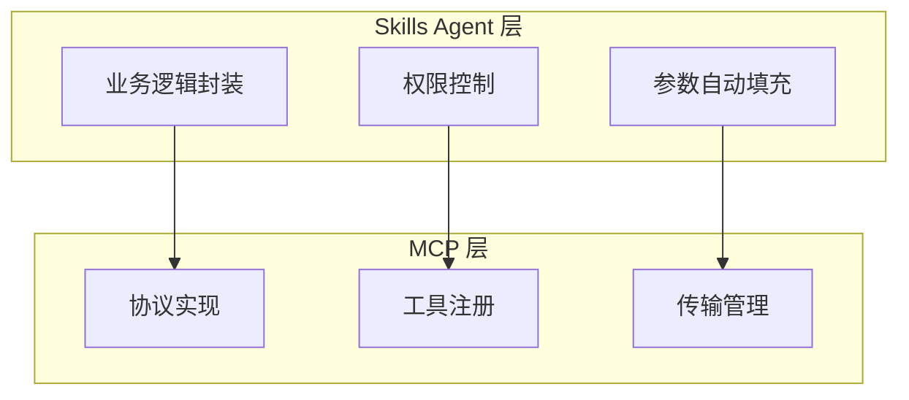
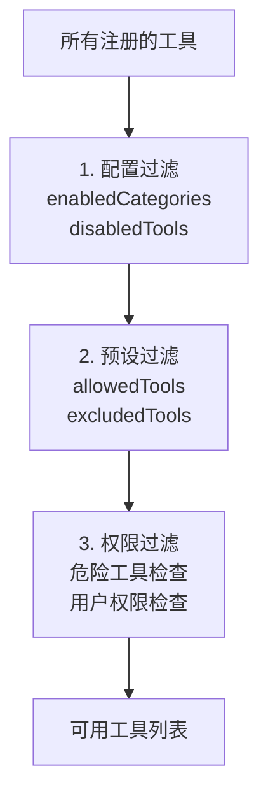

# Skills Agent

Skills Agent 是在 MCP 之上的高层抽象，为业务层提供更友好的接口。

## 概念

Skills Agent 将底层的"工具"概念封装为业务层的"技能"，提供：

- 统一的技能调用接口
- 权限过滤机制
- 参数自动填充
- 执行日志记录

## 与 MCP 的关系



## 核心功能

### 创建代理

```javascript
// 方式 1: 工厂函数
const agent = await createSkillsAgent({
  event: e,              // 消息事件
  presetId: 'default',   // 预设ID
  includeMcpTools: true,
  includeBuiltinTools: true
})

// 方式 2: 类构造
const agent = new SkillsAgent({
  userId: '123456',
  groupId: '789',
  userPermission: 'admin'
})
await agent.init()
```

### 获取可用技能

```javascript
// 获取所有可执行技能
const skills = agent.getExecutableSkills()

// 按类别获取
const basicSkills = agent.getSkillsByCategory('basic')

// 获取技能定义（用于 AI 调用）
const toolDefinitions = agent.getToolDefinitions()
```

### 执行技能

```javascript
// 执行单个技能
const result = await agent.execute('get_time', { timezone: 'Asia/Shanghai' })

// 并行执行多个技能
const results = await agent.executeParallel([
  { name: 'get_time', args: {} },
  { name: 'get_weather', args: { city: '北京' } }
])
```

## 权限过滤

Skills Agent 实现多层权限过滤：



### 配置过滤

```yaml
builtinTools:
  enabledCategories:
    - basic
    - user
  disabledTools:
    - execute_command
```

### 预设过滤

```yaml
# 预设文件
tools:
  allowedTools:
    - get_time
    - get_weather
  excludedTools: []
```

### 权限过滤

```javascript
// 危险工具检查
if (tool.dangerous && !options.allowDangerous) {
  throw new PermissionError('Dangerous tool not allowed')
}

// 管理员工具检查
if (tool.adminOnly && !context.isAdmin) {
  throw new PermissionError('Admin permission required')
}
```

## 参数自动填充

Skills Agent 可以自动填充上下文参数：

```javascript
// 工具定义
{
  name: 'send_message',
  parameters: {
    properties: {
      userId: { type: 'string', autoFill: 'context.userId' },
      groupId: { type: 'string', autoFill: 'context.groupId' }
    }
  }
}

// 调用时自动填充
agent.execute('send_message', { text: 'Hello' })
// 实际参数: { text: 'Hello', userId: '123', groupId: '456' }
```

## 静态方法 vs 实例方法

| 方法类型 | 用途 | 示例 |
|----------|------|------|
| 静态方法 | MCP 服务器管理 | `SkillsAgent.getMcpServers()` |
| 实例方法 | 工具执行 | `agent.execute('get_time', {})` |

```javascript
// 静态方法 - 管理操作
const servers = SkillsAgent.getMcpServers()
await SkillsAgent.connectMcpServer('my-server', config)
await SkillsAgent.reloadAllTools()

// 实例方法 - 执行操作
const result = await agent.execute('send_message', { text: 'Hello' })
```

## 执行日志

每次工具执行都会记录日志：

```javascript
// 日志结构
{
  id: 'uuid',
  toolName: 'get_time',
  args: { timezone: 'Asia/Shanghai' },
  result: '2024-12-15 14:30:25',
  userId: '123456',
  groupId: '789',
  duration: 15,  // 毫秒
  timestamp: '2024-12-15T06:30:25.000Z'
}
```

查看日志：

```javascript
const logs = await SkillsAgent.getExecutionLogs({
  limit: 100,
  toolName: 'get_time'
})
```

## 下一步

- [数据流](./data-flow) - 完整请求流程
- [LLM 适配器](./adapters) - 模型适配器
