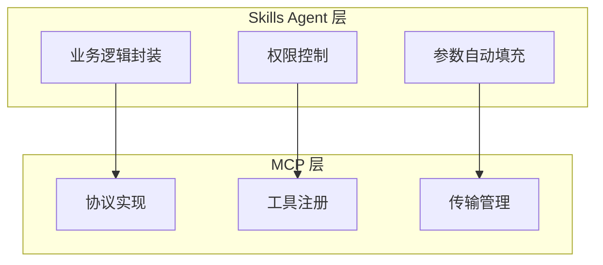
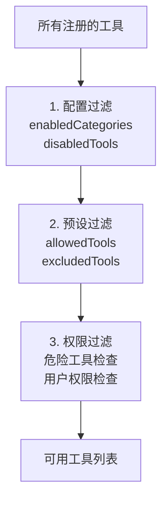
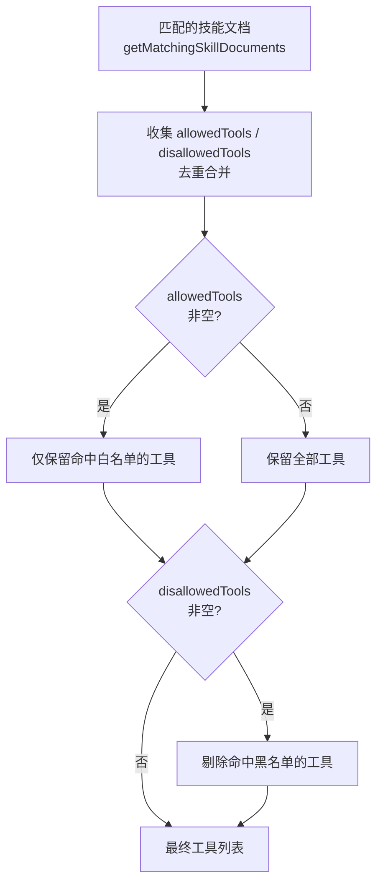
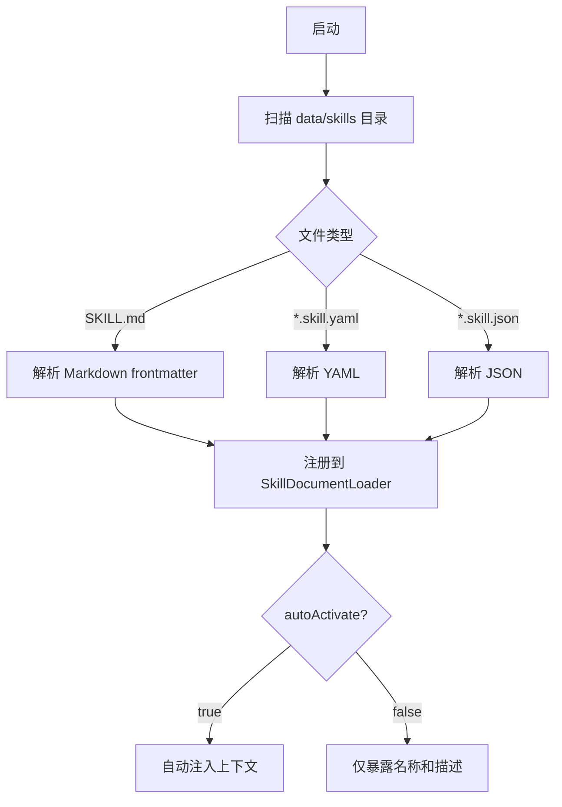
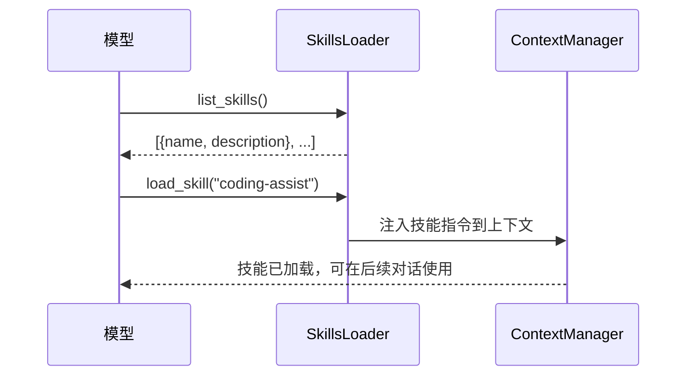
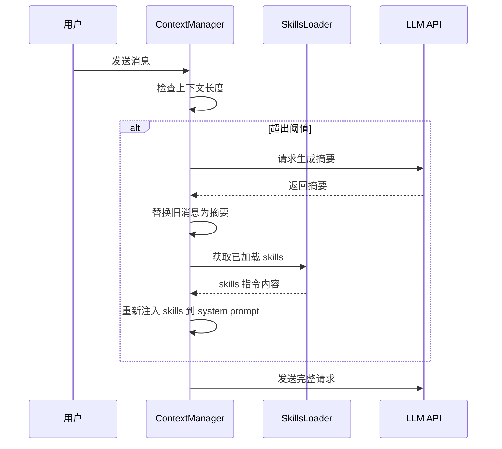

# Skills Agent

Skills Agent 是在 MCP 之上的高层抽象，为业务层提供更友好的接口。

## 概念

Skills Agent 将底层的"工具"概念封装为业务层的"技能"，提供：

- 统一的技能调用接口
- 权限过滤机制
- 参数自动填充
- 执行日志记录

## 与 MCP 的关系


```mermaid
graph TB
    subgraph "Skills Agent 层"
        SA["业务逻辑封装"]
        PC["权限控制"]
        AF["参数自动填充"]
    end
    
    subgraph "MCP 层"
        PI["协议实现"]
        TR["工具注册"]
        TM["传输管理"]
    end
    
    SA --> PI
    PC --> TR
    AF --> TM
```

## 核心功能

### 创建代理

```javascript
// 方式 1: 工厂函数
const agent = await createSkillsAgent({
  event: e,              // 消息事件
  presetId: 'default',   // 预设ID
  includeMcpTools: true,
  includeBuiltinTools: true
})

// 方式 2: 类构造
const agent = new SkillsAgent({
  userId: '123456',
  groupId: '789',
  userPermission: 'admin'
})
await agent.init()
```

### 获取可用技能

```javascript
// 获取所有可执行技能
const skills = agent.getExecutableSkills()

// 按类别获取
const basicSkills = agent.getSkillsByCategory('basic')

// 获取技能定义（用于 AI 调用）
const toolDefinitions = agent.getToolDefinitions()
```

### 执行技能

```javascript
// 执行单个技能
const result = await agent.execute('get_current_time', { timezone: 'Asia/Shanghai' })

// 并行执行多个技能
const results = await agent.executeParallel([
  { name: 'get_current_time', args: {} },
  { name: 'get_weather', args: { city: '北京' } }
])
```

## 权限过滤

Skills Agent 实现多层权限过滤：


```mermaid
flowchart TD
    A["所有注册的工具"] --> B["1. 配置过滤<br/>enabledCategories<br/>disabledTools"]
    B --> C["2. 预设过滤<br/>allowedTools<br/>excludedTools"]
    C --> D["3. 权限过滤<br/>危险工具检查<br/>用户权限检查"]
    D --> E["可用工具列表"]
```

### 配置过滤

```yaml
builtinTools:
  enabledCategories:
    - basic
    - user
  disabledTools:
    - execute_command
```

### 预设过滤

```yaml
# 预设文件
tools:
  allowedTools:
    - get_current_time
    - get_weather
  excludedTools: []
```

### 权限过滤

```javascript
// 危险工具检查
if (tool.dangerous && !options.allowDangerous) {
  throw new PermissionError('Dangerous tool not allowed')
}

// 管理员工具检查
if (tool.adminOnly && !context.isAdmin) {
  throw new PermissionError('Admin permission required')
}
```

## 文档技能工具约束 {#skill-tool-constraints}

除类别/预设/权限过滤外，**文档技能（SKILL.md）可对工具集施加额外约束**（`src/services/skills/SkillToolConstraints.js`）。当某个技能文档被匹配激活时，其 `allowedTools` / `disallowedTools` 会进一步收窄模型可见的工具列表。

### 约束来源

`buildDocument()`（`SkillDocumentLoader.js`）在解析技能文档时，会从 frontmatter/元数据中提取工具约束字段，并兼容多种命名写法：

| 规范化字段 | 兼容的元数据键 |
|:-----------|:---------------|
| `allowedTools` | `allowedTools`、`allowed_tools`、`allowed-tools` |
| `disallowedTools` | `disallowedTools`、`disallowed_tools`、`disallowed-tools` |

```yaml
# SKILL.md frontmatter 示例
---
name: coding-assist
description: 编码辅助技能
allowed-tools:        # 该技能激活时仅暴露以下工具
  - read_file
  - write_file
  - execute_command
disallowed-tools:     # 从可用工具中排除以下工具
  - kick_member
---
```

### 约束收集与应用

`getSkillToolConstraints()` 收集当前匹配到的所有技能文档的约束并去重合并，`applySkillToolConstraints()` 再据此过滤工具列表：


```mermaid
flowchart TD
    A["匹配的技能文档<br/>getMatchingSkillDocuments"] --> B["收集 allowedTools / disallowedTools<br/>去重合并"]
    B --> C{"allowedTools<br/>非空?"}
    C -->|是| D["仅保留命中白名单的工具"]
    C -->|否| E["保留全部工具"]
    D --> F{"disallowedTools<br/>非空?"}
    E --> F
    F -->|是| G["剔除命中黑名单的工具"]
    F -->|否| H["最终工具列表"]
    G --> H
```

::: tip 匹配规则与优先级
- **白名单优先收窄**：`allowedTools` 非空时，先只保留命中白名单的工具；随后再用 `disallowedTools` 从中剔除。两者可叠加（先白名单、后黑名单）
- **匹配维度**：`toolMatches()` 同时按工具名（`getToolDefinitionName`）和 identity（`getToolIdentity`）匹配，任一命中即视为匹配
- **空约束不生效**：`allowedTools`、`disallowedTools` 均为空时，工具列表原样返回
- **多技能合并**：多个技能同时激活时，各自的 `allowedTools`/`disallowedTools` 会跨文档合并去重后统一应用
:::

## 参数自动填充

Skills Agent 可以自动填充上下文参数：

```javascript
// 工具定义
{
  name: 'send_group_message',
  parameters: {
    properties: {
      group_id: { type: 'string', description: '目标群号' },
      message: { type: 'string', description: '消息内容' }
    }
  }
}

// 调用时传入实际参数
agent.execute('send_group_message', { group_id: '456', message: 'Hello' })
```

## 静态方法 vs 实例方法

| 方法类型 | 用途 | 示例 |
|----------|------|------|
| 静态方法 | MCP 服务器管理 | `SkillsAgent.getMcpServers()` |
| 实例方法 | 工具执行 | `agent.execute('get_current_time', {})` |

```javascript
// 静态方法 - 管理操作
const servers = SkillsAgent.getMcpServers()
await SkillsAgent.connectMcpServer('my-server', config)
await SkillsAgent.reloadAllTools()

// 实例方法 - 执行操作
const result = await agent.execute('send_group_message', { group_id: '456', message: 'Hello' })
```

## 执行日志

每次工具执行都会记录日志：

```javascript
// 日志结构
{
  id: 'uuid',
  toolName: 'get_current_time',
  args: { timezone: 'Asia/Shanghai' },
  result: '2024-12-15 14:30:25',
  userId: '123456',
  groupId: '789',
  duration: 15,  // 毫秒
  timestamp: '2024-12-15T06:30:25.000Z'
}
```

查看日志：

```javascript
const logs = await SkillsAgent.getExecutionLogs({
  limit: 100,
  toolName: 'get_current_time'
})
```

## 下一步

- [数据流](./data-flow) - 完整请求流程
- [LLM 适配器](./adapters) - 模型适配器

## Skills 文件加载系统

### 文件扫描流程


```mermaid
graph TD
    A[启动] --> B[扫描 data/skills 目录]
    B --> C{文件类型}
    C -->|SKILL.md| D[解析 Markdown frontmatter]
    C -->|*.skill.yaml| E[解析 YAML]
    C -->|*.skill.json| F[解析 JSON]
    D --> G[注册到 SkillDocumentLoader]
    E --> G
    F --> G
    G --> H{autoActivate?}
    H -->|true| I[自动注入上下文]
    H -->|false| J[仅暴露名称和描述]
```

### 懒加载机制

模型默认只能看到技能列表，需要通过内置工具显式加载：


```mermaid
sequenceDiagram
    participant M as 模型
    participant S as SkillsLoader
    participant C as ContextManager

    M->>S: list_skills()
    S-->>M: [{name, description}, ...]
    M->>S: load_skill("coding-assist")
    S->>C: 注入技能指令到上下文
    C-->>M: 技能已加载，可在后续对话使用
```

### 上下文压缩与重注入


```mermaid
sequenceDiagram
    participant U as 用户
    participant CM as ContextManager
    participant SL as SkillsLoader
    participant LLM as LLM API

    U->>CM: 发送消息
    CM->>CM: 检查上下文长度
    alt 超出阈值
        CM->>LLM: 请求生成摘要
        LLM-->>CM: 返回摘要
        CM->>CM: 替换旧消息为摘要
        CM->>SL: 获取已加载 skills
        SL-->>CM: skills 指令内容
        CM->>CM: 重新注入 skills 到 system prompt
    end
    CM->>LLM: 发送完整请求
```
