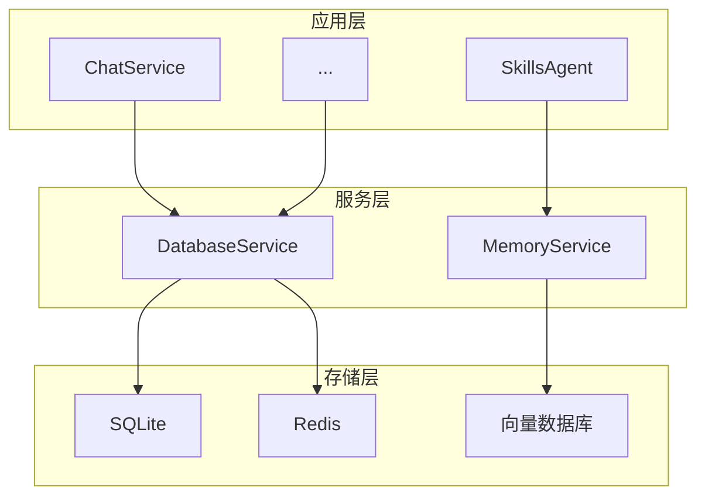

# 存储系统

存储系统负责数据的持久化，包括配置、对话历史、记忆等。

## 存储层级



## SQLite 数据库

主要用于结构化数据存储：

```javascript
// services/storage/DatabaseService.js
import Database from 'better-sqlite3'

export class DatabaseService {
  constructor(dbPath) {
    this.db = new Database(dbPath)
    this.init()
  }
  
  init() {
    // 创建表
    this.db.exec(`
      CREATE TABLE IF NOT EXISTS conversations (
        id TEXT PRIMARY KEY,
        user_id TEXT,
        group_id TEXT,
        messages TEXT,
        created_at INTEGER,
        updated_at INTEGER
      );
      
      CREATE TABLE IF NOT EXISTS memories (
        id TEXT PRIMARY KEY,
        user_id TEXT,
        content TEXT,
        embedding BLOB,
        created_at INTEGER
      );
      
      CREATE INDEX IF NOT EXISTS idx_conv_user 
        ON conversations(user_id);
      CREATE INDEX IF NOT EXISTS idx_conv_group 
        ON conversations(group_id);
    `)
  }
  
  // 保存对话
  saveConversation(id, userId, groupId, messages) {
    const stmt = this.db.prepare(`
      INSERT OR REPLACE INTO conversations 
      (id, user_id, group_id, messages, created_at, updated_at)
      VALUES (?, ?, ?, ?, ?, ?)
    `)
    
    const now = Date.now()
    stmt.run(id, userId, groupId, JSON.stringify(messages), now, now)
  }
  
  // 获取对话
  getConversation(userId, groupId) {
    const stmt = this.db.prepare(`
      SELECT * FROM conversations 
      WHERE user_id = ? AND group_id = ?
      ORDER BY updated_at DESC
      LIMIT 1
    `)
    
    const row = stmt.get(userId, groupId)
    if (row) {
      row.messages = JSON.parse(row.messages)
    }
    return row
  }
}
```

## Redis 缓存

用于高频访问数据的缓存：

```javascript
// core/cache/RedisClient.js
import Redis from 'ioredis'

export class RedisClient {
  constructor(options) {
    this.client = new Redis(options)
  }
  
  async get(key) {
    const value = await this.client.get(key)
    return value ? JSON.parse(value) : null
  }
  
  async set(key, value, ttl = 3600) {
    await this.client.setex(key, ttl, JSON.stringify(value))
  }
  
  async del(key) {
    await this.client.del(key)
  }
  
  // 缓存装饰器
  async cached(key, ttl, fn) {
    const cached = await this.get(key)
    if (cached) return cached
    
    const result = await fn()
    await this.set(key, result, ttl)
    return result
  }
}
```

## 向量数据库

用于语义搜索和记忆检索：

```javascript
// services/storage/VectorStore.js
import { LocalIndex } from 'vectra'

export class VectorStore {
  constructor(options) {
    this.index = new LocalIndex(options.path)
    this.embedder = options.embedder
  }
  
  async init() {
    if (!await this.index.isIndexCreated()) {
      await this.index.createIndex()
    }
  }
  
  // 添加文档
  async add(id, text, metadata = {}) {
    const vector = await this.embedder.embed(text)
    
    await this.index.insertItem({
      id,
      vector,
      metadata: { text, ...metadata }
    })
  }
  
  // 语义搜索
  async search(query, limit = 5) {
    const vector = await this.embedder.embed(query)
    
    const results = await this.index.queryItems(vector, limit)
    
    return results
      .filter(r => r.score > 0.7)
      .map(r => ({
        id: r.item.id,
        text: r.item.metadata.text,
        score: r.score
      }))
  }
  
  // 删除
  async delete(id) {
    await this.index.deleteItem(id)
  }
}
```

## 记忆服务

```javascript
// services/storage/MemoryService.js
export class MemoryService {
  constructor(options) {
    this.db = options.db
    this.vectorStore = options.vectorStore
  }
  
  // 保存记忆
  async save(userId, content) {
    const id = generateId()
    
    // 保存到 SQLite
    this.db.saveMemory(id, userId, content)
    
    // 保存到向量库
    await this.vectorStore.add(id, content, { userId })
    
    return id
  }
  
  // 检索相关记忆
  async retrieve(userId, query, limit = 5) {
    // 语义搜索
    const results = await this.vectorStore.search(query, limit * 2)
    
    // 过滤用户记忆
    return results
      .filter(r => r.metadata.userId === userId)
      .slice(0, limit)
  }
  
  // 清除用户记忆
  async clear(userId) {
    const memories = this.db.getMemoriesByUser(userId)
    
    for (const memory of memories) {
      await this.vectorStore.delete(memory.id)
    }
    
    this.db.clearMemories(userId)
  }
}
```

## 数据模型

### 对话

```typescript
interface Conversation {
  id: string
  userId: string
  groupId?: string
  messages: Message[]
  createdAt: number
  updatedAt: number
}

interface Message {
  role: 'system' | 'user' | 'assistant' | 'tool'
  content: string
  toolCalls?: ToolCall[]
  toolCallId?: string
}
```

### 记忆

```typescript
interface Memory {
  id: string
  userId: string
  content: string
  embedding: number[]
  category?: string
  createdAt: number
}
```

## 数据迁移

```javascript
// 版本迁移
const migrations = [
  {
    version: 1,
    up: (db) => {
      db.exec(`
        ALTER TABLE conversations 
        ADD COLUMN preset_id TEXT
      `)
    }
  },
  {
    version: 2,
    up: (db) => {
      db.exec(`
        CREATE TABLE tool_logs (...)
      `)
    }
  }
]

function migrate(db) {
  const currentVersion = db.pragma('user_version', { simple: true })
  
  for (const migration of migrations) {
    if (migration.version > currentVersion) {
      migration.up(db)
      db.pragma(`user_version = ${migration.version}`)
    }
  }
}
```

## 下一步

- [API 概述](/api/) - REST API 文档
- [架构概述](./index) - 返回架构概述
