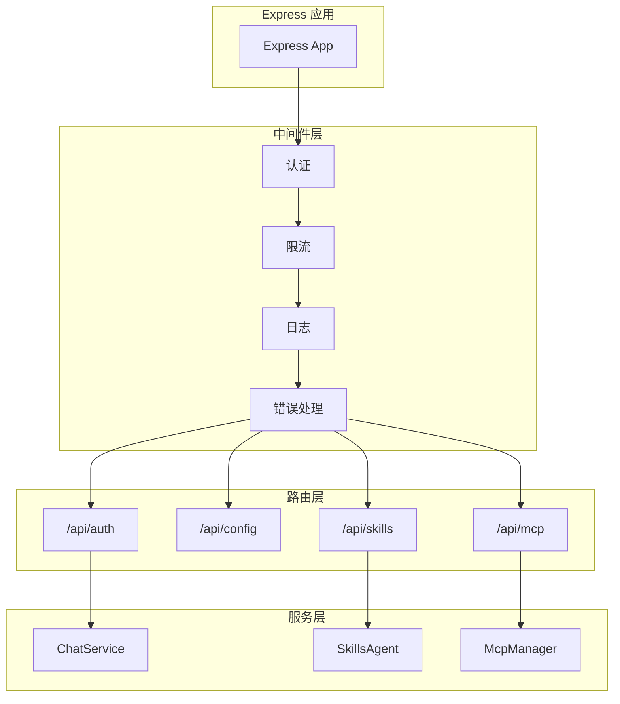

# Web 服务

Web 服务提供 HTTP API 和管理面板功能。

## 架构



## 服务启动

```javascript
// services/webServer.js
import express from 'express'
import cookieParser from 'cookie-parser'

export async function startWebServer(options) {
  const app = express()
  
  // 基础中间件
  app.use(express.json())
  app.use(cookieParser())
  
  // 自定义中间件
  app.use(requestLogger)
  app.use(rateLimiter)
  
  // API 路由
  app.use('/api/auth', authRoutes)
  app.use('/api/config', configRoutes)
  app.use('/api/skills', skillsRoutes)
  app.use('/api/mcp', mcpRoutes)
  
  // 静态资源
  app.use(express.static('resources/web'))
  
  // 错误处理
  app.use(errorHandler)
  
  // 启动服务
  const port = options.port || 3000
  app.listen(port, () => {
    console.log(`Web server started on port ${port}`)
  })
  
  return app
}
```

## 认证中间件

```javascript
// services/middleware/auth.js
import jwt from 'jsonwebtoken'

export function authMiddleware(req, res, next) {
  // 获取 token
  const token = req.cookies.auth_token || 
                req.headers.authorization?.replace('Bearer ', '')
  
  if (!token) {
    return res.status(401).json({ error: 'Unauthorized' })
  }
  
  try {
    // 验证 token
    const payload = jwt.verify(token, process.env.JWT_SECRET)
    req.user = payload
    next()
  } catch (error) {
    return res.status(401).json({ error: 'Invalid token' })
  }
}
```

## 限流中间件

```javascript
// services/middleware/rateLimit.js
import rateLimit from 'express-rate-limit'

export const apiLimiter = rateLimit({
  windowMs: 60 * 1000, // 1 分钟
  max: 60,             // 最多 60 次请求
  message: { error: 'Too many requests' },
  standardHeaders: true,
  legacyHeaders: false
})
```

## 路由定义

### 认证路由

```javascript
// services/routes/auth.js
import { Router } from 'express'

const router = Router()

// 登录
router.post('/login', async (req, res) => {
  const { token } = req.body
  
  // 验证临时 token
  const user = await verifyLoginToken(token)
  if (!user) {
    return res.status(401).json({ error: 'Invalid token' })
  }
  
  // 签发 JWT
  const jwt = signJwt(user)
  
  // 设置 cookie
  res.cookie('auth_token', jwt, {
    httpOnly: true,
    secure: process.env.NODE_ENV === 'production',
    maxAge: 24 * 60 * 60 * 1000
  })
  
  res.json({ success: true })
})

// 验证
router.get('/verify', authMiddleware, (req, res) => {
  res.json({ user: req.user })
})

export default router
```

### 技能路由

```javascript
// services/routes/skills.js
import { Router } from 'express'

const router = Router()

// 获取工具列表
router.get('/tools', authMiddleware, async (req, res) => {
  const tools = await SkillsAgent.getAllTools()
  res.json({ tools })
})

// 执行工具
router.post('/execute', authMiddleware, async (req, res) => {
  const { name, args } = req.body
  
  const agent = new SkillsAgent({ userId: req.user.id })
  await agent.init()
  
  try {
    const result = await agent.execute(name, args)
    res.json({ success: true, result })
  } catch (error) {
    res.status(400).json({ error: error.message })
  }
})

// SSE 状态流
router.get('/sse', authMiddleware, (req, res) => {
  res.setHeader('Content-Type', 'text/event-stream')
  res.setHeader('Cache-Control', 'no-cache')
  res.setHeader('Connection', 'keep-alive')
  
  const sendStatus = () => {
    const status = SkillsAgent.getStatus()
    res.write(`data: ${JSON.stringify(status)}\n\n`)
  }
  
  const interval = setInterval(sendStatus, 5000)
  sendStatus()
  
  req.on('close', () => {
    clearInterval(interval)
  })
})

export default router
```

## 错误处理

```javascript
// services/middleware/errorHandler.js
export function errorHandler(err, req, res, next) {
  console.error('API Error:', err)
  
  // 已知错误类型
  if (err instanceof ValidationError) {
    return res.status(400).json({
      error: 'Validation Error',
      details: err.details
    })
  }
  
  if (err instanceof AuthError) {
    return res.status(401).json({
      error: 'Authentication Error',
      message: err.message
    })
  }
  
  if (err instanceof PermissionError) {
    return res.status(403).json({
      error: 'Permission Denied',
      message: err.message
    })
  }
  
  // 未知错误
  res.status(500).json({
    error: 'Internal Server Error',
    message: process.env.NODE_ENV === 'development' 
      ? err.message 
      : 'Something went wrong'
  })
}
```

## TRSS 兼容

```javascript
// 共享端口模式
if (config.sharePort && global.segment) {
  const trssApp = global.segment.app
  trssApp.use('/chatai', app)
  console.log('Mounted on TRSS at /chatai')
} else {
  app.listen(port)
}
```

## 下一步

- [存储系统](./storage) - 数据持久化
- [API 概述](/api/) - API 文档
