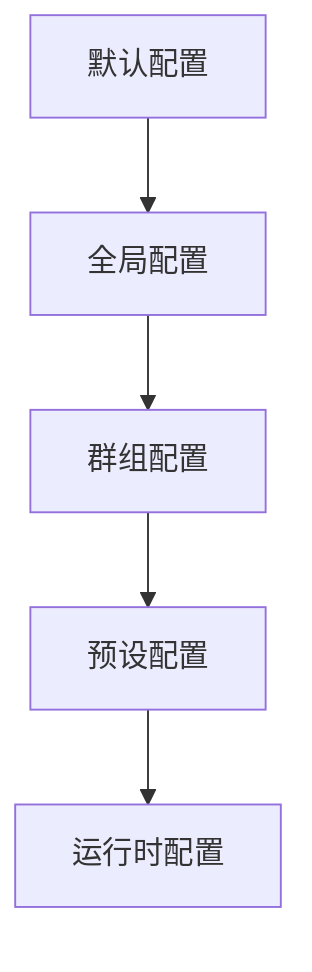

# 高级配置 <Badge type="warning" text="进阶" />

本文档介绍高级配置选项和技巧，适合需要深度定制的用户。

::: tip 💡 阅读建议
建议先阅读 [基础配置](./basic) 和 [渠道配置](./channels)，再阅读本文档。
:::

## 配置层级 {#config-hierarchy}

ChatAI Plugin 使用多层配置系统：



配置按优先级合并，后者覆盖前者。

## 环境变量

支持通过环境变量覆盖配置：

```bash
# API 密钥
export CHATAI_OPENAI_KEY=sk-xxx
export CHATAI_CLAUDE_KEY=sk-ant-xxx

# 代理配置
export CHATAI_PROXY=http://127.0.0.1:7890
export HTTPS_PROXY=http://127.0.0.1:7890

# 调试模式
export CHATAI_DEBUG=true
export CHATAI_LOG_LEVEL=debug
```

### 环境变量映射

| 环境变量 | 配置路径 | 说明 |
|:---------|:---------|:-----|
| `CHATAI_OPENAI_KEY` | `channels[0].key` | OpenAI API Key |
| `CHATAI_PROXY` | `proxy.url` | 代理地址 |
| `CHATAI_DEBUG` | `debug` | 调试模式 |
| `CHATAI_PORT` | `server.port` | Web 服务端口 |

## 多环境配置 {#multi-env}

::: code-group
```yaml [config.dev.yaml 开发环境]
debug: true
logLevel: debug

server:
  port: 3001

channels:
  - name: dev-channel
    baseUrl: http://localhost:8080/v1
    key: test-key
```

```yaml [config.prod.yaml 生产环境]
debug: false
logLevel: info

server:
  port: 3000
  cors:
    enabled: true
    origins:
      - https://your-domain.com

rateLimit:
  enabled: true
  maxRequests: 60
```
:::

::: details 📦 加载指定环境配置
```bash
# 通过环境变量指定
export CHATAI_ENV=prod
```
:::

## 渠道高级配置 {#channel-advanced}

::: warning ⚙️ 进阶配置
以下配置适合有多个 API 渠道的用户，可实现高可用和负载均衡。
:::

### 负载均衡 {#load-balance}

```yaml
channels:
  - name: openai-1
    priority: 1        # 优先级，数字越小优先级越高
    weight: 3          # 权重，用于加权轮询
    maxConcurrent: 10  # 最大并发数
    
  - name: openai-2
    priority: 1
    weight: 2
    maxConcurrent: 10
    
  - name: backup
    priority: 2        # 备用渠道
    weight: 1

loadBalance:
  strategy: weighted   # round-robin | weighted | priority | random
  healthCheck:
    enabled: true
    interval: 60       # 健康检查间隔（秒）
    timeout: 5         # 超时时间（秒）
```

### 故障转移

```yaml
channels:
  - name: primary
    priority: 1
    failover:
      enabled: true
      maxRetries: 3
      retryDelay: 1000     # 重试延迟（毫秒）
      fallbackChannel: backup
      
  - name: backup
    priority: 2
```

### 请求限制

```yaml
channels:
  - name: limited-channel
    rateLimit:
      requestsPerMinute: 60
      tokensPerMinute: 100000
      requestsPerDay: 1000
    
    quotas:
      daily: 100000      # 每日 Token 配额
      monthly: 3000000   # 每月 Token 配额
      alertThreshold: 0.8  # 80% 时告警
```

## 模型别名

配置模型别名简化切换：

```yaml
models:
  aliases:
    default: gpt-4o
    fast: gpt-4o-mini
    smart: claude-3-5-sonnet-20241022
    cheap: deepseek-chat
    
  # 按用途映射
  usage:
    chat: default
    memory: fast
    summary: fast
    embedding: text-embedding-3-small
```

使用方式：

```bash
#切换模型 smart
```

## 触发器高级配置

### 正则触发

```yaml
triggers:
  regex:
    enabled: true
    patterns:
      - pattern: "^(帮我|请问|能不能)"
        flags: "i"
        priority: 1
      - pattern: "(AI|人工智能|机器人)"
        flags: "gi"
        priority: 2
```

### 上下文触发

```yaml
triggers:
  contextual:
    enabled: true
    # 最近 N 条消息内回复过则继续响应
    replyWindow: 5
    # 超时时间（秒）
    timeout: 300
```

### 时间触发

```yaml
triggers:
  schedule:
    enabled: true
    rules:
      - cron: "0 9 * * *"    # 每天9点
        action: morning_greeting
        groups: ["123456"]
      - cron: "0 22 * * *"   # 每天22点
        action: summary_push
```

## 内容过滤

### 输入过滤

```yaml
filter:
  input:
    enabled: true
    # 敏感词过滤
    keywords:
      - 敏感词1
      - 敏感词2
    # 正则过滤
    patterns:
      - "\\d{11}"           # 手机号
      - "\\d{18}"           # 身份证
    # 替换规则
    replacements:
      "脏话": "[已屏蔽]"
```

### 输出过滤

```yaml
filter:
  output:
    enabled: true
    # 移除特定内容
    remove:
      - "<think>"
      - "</think>"
    # 长度限制
    maxLength: 2000
    truncateMessage: "...(内容过长已截断)"
```

## 缓存配置

```yaml
cache:
  # 响应缓存
  response:
    enabled: true
    ttl: 3600           # 缓存时间（秒）
    maxSize: 1000       # 最大缓存条数
    
  # 模型列表缓存
  models:
    ttl: 86400          # 24小时
    
  # 工具结果缓存
  tools:
    enabled: true
    ttl: 300
    # 可缓存的工具
    cacheable:
      - get_time
      - get_weather
```

## 日志配置

```yaml
logging:
  level: info           # debug | info | warn | error
  
  # 文件日志
  file:
    enabled: true
    path: ./logs
    maxSize: 10M
    maxFiles: 7
    
  # 控制台日志
  console:
    enabled: true
    colorize: true
    
  # 请求日志
  request:
    enabled: true
    includeBody: false   # 生产环境关闭
    
  # 敏感信息脱敏
  redact:
    - key
    - password
    - token
```

## 性能调优

### 并发控制

```yaml
performance:
  # 全局并发限制
  maxConcurrentRequests: 50
  
  # 队列配置
  queue:
    enabled: true
    maxSize: 100
    timeout: 30000
    
  # 连接池
  connectionPool:
    maxConnections: 20
    keepAlive: true
    timeout: 30000
```

### 内存优化

```yaml
performance:
  memory:
    # 对话历史限制
    maxHistoryLength: 50
    # 工具日志保留
    toolLogRetention: 7  # 天
    # 定期 GC
    gcInterval: 3600
```

## 安全配置

### CORS

```yaml
server:
  cors:
    enabled: true
    origins:
      - https://your-domain.com
      - https://admin.your-domain.com
    methods:
      - GET
      - POST
      - PUT
      - DELETE
    credentials: true
```

### 认证增强

```yaml
auth:
  # JWT 配置
  jwt:
    secret: your-secret-key
    expiresIn: 7d
    
  # 登录限制
  login:
    maxAttempts: 5
    lockoutDuration: 300  # 秒
    
  # IP 白名单
  ipWhitelist:
    enabled: false
    ips:
      - 127.0.0.1
      - 192.168.1.0/24
```

### 加密存储

```yaml
security:
  encryption:
    enabled: true
    algorithm: aes-256-gcm
    # 密钥从环境变量读取
    keyEnv: CHATAI_ENCRYPTION_KEY
```

## 插件系统

### 自定义中间件

```yaml
middleware:
  custom:
    - path: ./plugins/my-middleware.js
      enabled: true
      config:
        option1: value1
```

```javascript
// plugins/my-middleware.js
export default {
  name: 'my-middleware',
  
  // 请求前处理
  async onRequest(ctx, next) {
    console.log('Request:', ctx.path)
    await next()
  },
  
  // 响应后处理
  async onResponse(ctx, response) {
    return response
  }
}
```

### 事件钩子

```yaml
hooks:
  onStart:
    - ./plugins/on-start.js
  onMessage:
    - ./plugins/on-message.js
  onToolCall:
    - ./plugins/on-tool-call.js
```

## 配置验证

启动时验证配置：

```yaml
validation:
  enabled: true
  strict: false      # 严格模式：未知字段报错
  
  # 必需配置检查
  required:
    - channels
    - server.port
```

## 配置导入导出

### 导出配置

```bash
#ai导出配置
```

### 导入配置

```bash
#ai导入配置 [配置文件路径]
```

### 配置同步

```yaml
sync:
  enabled: false
  provider: git      # git | s3 | webdav
  remote: https://github.com/your/config.git
  branch: main
  interval: 3600     # 同步间隔（秒）
```

## 下一步

- [基础配置](./basic) - 基础配置选项
- [渠道配置](./channels) - 渠道详细配置
- [触发配置](./triggers) - 触发方式配置
