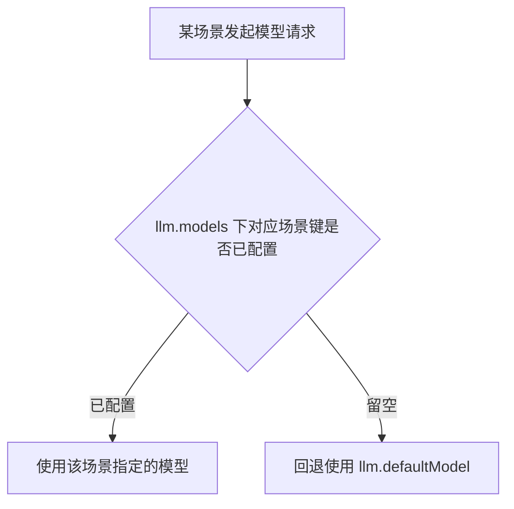
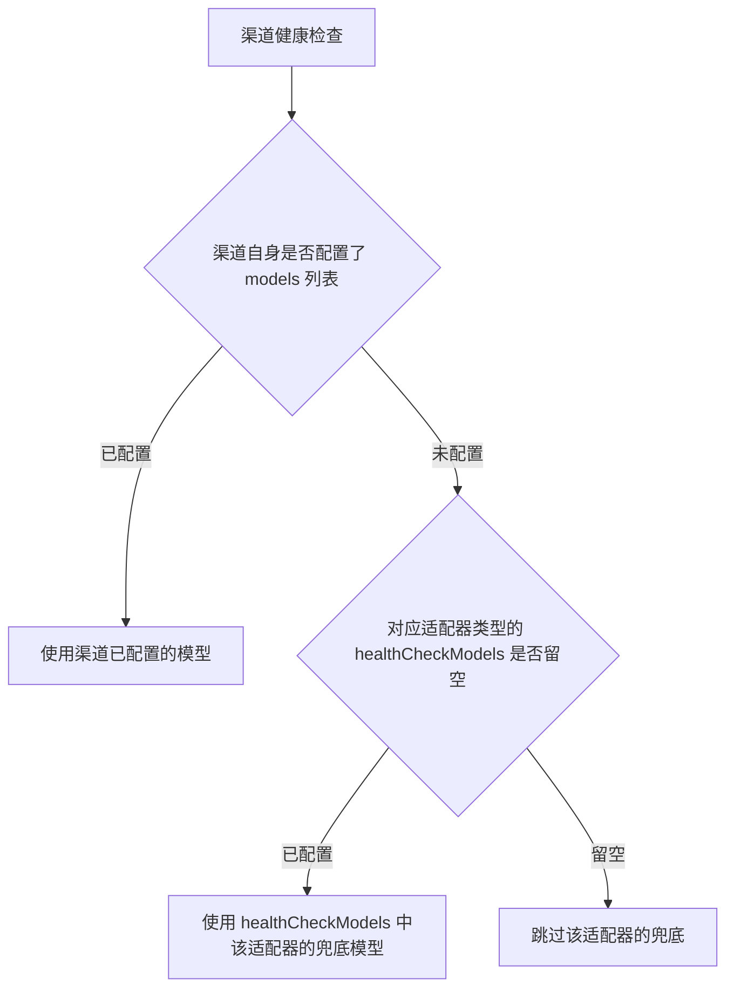

# 基础配置

本文对照 config 默认配置（`config/config.js` 的 `getDefaultConfig()`，对应提交 `5351e7d7`）编写，配置文件位于 `config/config.yaml`。

## basic 基础设置 {#basic}

```yaml
basic:
  commandPrefix: '#ai'         # AI 命令前缀
  debug: false
  showThinkingMessage: true    # 是否发送"思考中..."提示
  debugToConsoleOnly: true     # 调试信息仅输出到控制台
  quoteReply: true             # 是否引用触发消息
  autoRecall:
    enabled: false             # 是否启用自动撤回
    delay: 60                  # 撤回延迟（秒）
    recallError: true          # 是否撤回错误消息
```

### 参数说明

| 参数 | 类型 | 默认值 | 说明 |
|------|------|--------|------|
| `commandPrefix` | string | `'#ai'` | AI 命令前缀 |
| `debug` | boolean | `false` | 调试模式开关 |
| `showThinkingMessage` | boolean | `true` | 是否发送「思考中...」提示 |
| `debugToConsoleOnly` | boolean | `true` | 调试信息仅输出到控制台 |
| `quoteReply` | boolean | `true` | 回复时是否引用触发消息 |
| `autoRecall.enabled` | boolean | `false` | 自动撤回开关 |
| `autoRecall.delay` | number | `60` | 撤回延迟（秒） |
| `autoRecall.recallError` | boolean | `true` | 是否撤回错误消息 |

## admin 管理员配置 {#admin}

```yaml
admin:
  masterQQ: []                    # 主人QQ列表，留空使用Yunzai配置
  pluginAuthorQQ: []
  loginNotifyPrivate: true        # 登录链接私聊推送
  sensitiveCommandMasterOnly: true  # 敏感命令仅主人可用
```

| 参数 | 类型 | 默认值 | 说明 |
|------|------|--------|------|
| `masterQQ` | array | `[]` | 主人 QQ 列表，留空使用 Yunzai 框架配置 |
| `pluginAuthorQQ` | array | `[]` | 插件作者 QQ 列表 |
| `loginNotifyPrivate` | boolean | `true` | 登录链接是否私聊推送 |
| `sensitiveCommandMasterOnly` | boolean | `true` | 敏感命令仅主人可用 |

## llm 模型配置 {#llm}

```yaml
llm:
  defaultModel: 'qwen/qwen3-next-80b-a3b-instruct'  # 默认模型
  defaultChatPresetId: 'default'
  embeddingModel: 'text-embedding-004'  # Gemini embedding 模型
  dimensions: 1536
  models:                    # 模型分类配置（每个分类配置一个模型名，空则使用默认模型）
    chat: ''                 # 对话模型 - 用于普通聊天
    image: ''                # 图像模型 - 用于图像理解和生成
    roleplay: ''             # 伪人模型 - 用于模拟真人回复
    dispatch: ''             # 工具调度模型 - 用于工具组/意图分发
    tools: ''                # 工具执行模型 - 用于工具相关调用
    vision: ''               # 视觉模型 - 用于图像理解
    search: ''               # 搜索模型 - 用于联网搜索总结
    summary: ''              # 群聊总结模型
    profile: ''              # 用户画像模型
    game: ''                 # 游戏模型 - 用于Galgame等互动游戏
  fallback:                  # 备选模型配置 - 主模型失败时自动轮询
    enabled: true
    models: []               # 备选模型列表，按优先级排序
    maxRetries: 3            # 最大重试次数
    retryDelay: 500          # 重试间隔(ms)
    notifyOnFallback: false  # 切换模型时是否通知用户
  healthCheckModels:         # 渠道健康检查的兜底模型（按适配器类型）
    openai: 'gpt-4o-mini'
    gemini: 'gemini-2.5-flash'
    claude: 'claude-3-5-haiku-20241022'
  chatModel: ''              # 旧配置兼容
  codeModel: ''              # 旧配置兼容
  translationModel: ''       # 旧配置兼容
```

| 参数 | 类型 | 默认值 | 说明 |
|------|------|--------|------|
| `defaultModel` | string | `'qwen/qwen3-next-80b-a3b-instruct'` | 默认模型 |
| `defaultChatPresetId` | string | `'default'` | 默认预设 ID |
| `embeddingModel` | string | `'text-embedding-004'` | 嵌入模型 |
| `dimensions` | number | `1536` | 嵌入维度 |
| `models.*` | string | `''` | 各场景模型（共 10 个：`chat` / `image` / `roleplay` / `dispatch` / `tools` / `vision` / `search` / `summary` / `profile` / `game`），留空使用默认模型 |
| `fallback.enabled` | boolean | `true` | 启用备选模型轮询 |
| `fallback.models` | array | `[]` | 备选模型列表，按优先级排序 |
| `fallback.maxRetries` | number | `3` | 最大重试次数 |
| `fallback.retryDelay` | number | `500` | 重试间隔（ms） |
| `fallback.notifyOnFallback` | boolean | `false` | 切换模型时是否通知用户 |
| `healthCheckModels.openai` | string | `'gpt-4o-mini'` | OpenAI 适配器健康检查兜底模型 |
| `healthCheckModels.gemini` | string | `'gemini-2.5-flash'` | Gemini 适配器健康检查兜底模型 |
| `healthCheckModels.claude` | string | `'claude-3-5-haiku-20241022'` | Claude 适配器健康检查兜底模型 |
| `chatModel` / `codeModel` / `translationModel` | string | `''` | 旧配置兼容字段 |

各场景模型（`models.*`）留空时回退默认模型：



`healthCheckModels` 仅在渠道自身未配置 `models` 列表时使用；留空则跳过该适配器的兜底，改用渠道已配置的模型。



`config.yaml` 实例中出现的 `llm.temperature` / `llm.maxTokens` / `llm.topP` / `llm.frequencyPenalty` / `llm.presencePenalty` 是用户/运行期写入的扩展键，**不在默认配置中**；默认配置的同类参数位于两个层级：渠道级 `channels[].advanced.llm`（见 [渠道高级配置](./channels-advanced)）与各 override 层（`TemperatureResolver` 的解析顺序含 `channel.advanced.llm.temperature`），请按对应层级配置。

## Web 服务配置 {#web}

`web` 段的默认配置为：

```yaml
web:
  port: 3000           # 监听端口
  sharePort: false     # TRSS 环境下共享端口
  mountPath: /chatai   # TRSS 共享端口时的挂载路径
  corsOrigins: []      # 额外允许跨域访问的来源
```

各字段说明与运行期自动写入的键（`jwtSecret` / `publicUrl` / `loginLinks` 等）见 [思考 / 渲染 / 输出优化配置](./shared-advanced#web)。

::: danger 历史页面更正
本页旧版曾把 `jwtSecret` / `publicUrl` 写成默认配置内容，并出现过 `web.enabled` / `web.host` / `web.basePath` 等写法。默认配置中 `web` 仅含 `port` / `sharePort` / `mountPath` / `corsOrigins` 四个键，其余键要么是运行期生成，要么不存在，已全部更正。
:::

## redis 配置 {#redis}

见 [思考 / 渲染 / 输出优化配置](./shared-advanced#redis)。

## images 图片配置 {#images}

见 [思考 / 渲染 / 输出优化配置](./shared-advanced#images)。

## update 更新配置 {#update}

见 [思考 / 渲染 / 输出优化配置](./shared-advanced#更新配置-update)。

## 完整示例 {#full-example}

以下示例仅含默认配置中确有的键（值可自行调整）：

```yaml
basic:
  commandPrefix: "#ai"
  debug: false
  showThinkingMessage: true
  debugToConsoleOnly: true
  quoteReply: true
  autoRecall:
    enabled: false
    delay: 60
    recallError: true

admin:
  masterQQ: []
  pluginAuthorQQ: []
  loginNotifyPrivate: true
  sensitiveCommandMasterOnly: true

llm:
  defaultModel: qwen/qwen3-next-80b-a3b-instruct
  defaultChatPresetId: default
  embeddingModel: text-embedding-004
  dimensions: 1536
  models:
    chat: ""
    image: ""
    roleplay: ""
    dispatch: ""
    tools: ""
    vision: ""
    search: ""
    summary: ""
    profile: ""
    game: ""
  fallback:
    enabled: true
    models: []
    maxRetries: 3
    retryDelay: 500
    notifyOnFallback: false
  healthCheckModels:
    openai: gpt-4o-mini
    gemini: gemini-2.5-flash
    claude: claude-3-5-haiku-20241022
  chatModel: ""
  codeModel: ""
  translationModel: ""

web:
  port: 3000
  sharePort: false
  mountPath: /chatai
  corsOrigins: []
```

## 下一步

- [渠道配置](./channels) - 配置 API 渠道
- [模型配置](./models) - 模型参数调优
- [触发配置](./triggers) - 触发方式设置
- [思考 / 渲染 / 输出优化配置](./shared-advanced) - streaming / render / output / thinking 等全局段
