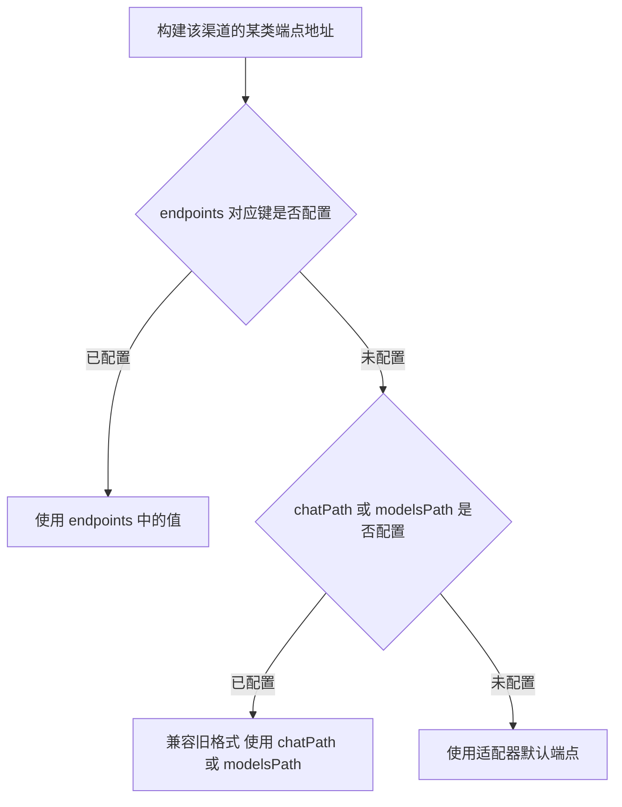
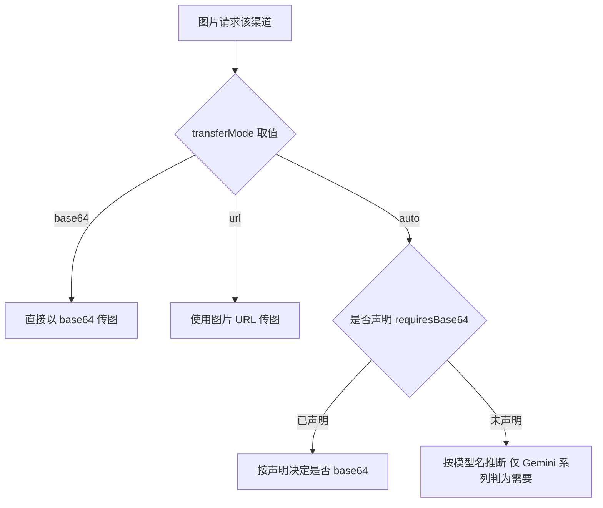

# 渠道高级配置 <Badge type="warning" text="进阶" />

本文对照 config 默认配置版本（`config/config.js` 的 `getDefaultConfig()`，对应提交 `5351e7d7`，渠道结构注释位于该文件第 400-520 行）。渠道的基础字段（`id` / `name` / `adapterType` / `baseUrl` / `baseUrls` / `apiKey` / `apiKeys` / `models` / `enabled` / `priority` / `weight`）见 [渠道配置](./channels)。

## 自定义端点

```yaml
channels:
  - id: chan-1
    name: my-channel
    # 自定义对话接口路径（兼容旧格式，如 '/chat/completions'）
    chatPath: ''
    # 自定义模型列表路径（兼容旧格式，如 '/models'）
    modelsPath: ''
    # 自定义端点配置（优先使用，覆盖 chatPath/modelsPath）
    endpoints:
      chat: ''        # 对话端点，如 '/chat/completions' 或 '/v1/chat'
      models: ''      # 模型列表端点，如 '/models' 或 '/v1/models'
      embeddings: ''  # 嵌入端点，如 '/embeddings' 或 '/v1/embeddings'
      images: ''      # 图像生成端点，如 '/images/generations' 或 '/v1/images'
```

`endpoints` 优先于 `chatPath` / `modelsPath`；三者均未配置时使用适配器默认端点。



## 认证方式 auth

```yaml
auth:
  type: ''            # 认证类型: 'bearer' | 'api-key' | 'custom'
  headerName: ''      # 自定义认证头名称
  prefix: ''          # 认证值前缀
```

## 单渠道系统提示词传递策略 systemPromptConfig

未配置时保持默认行为：

```yaml
systemPromptConfig:
  mode: ''            # 'inherit' | 'replace' | 'disable'
  target: ''          # 'messages' | 'instructions' | 'top_level_text' | 'top_level_object'
  fieldName: ''       # target 为顶层字段模式时使用
  role: ''            # 'auto' | 'system' | 'developer' | 自定义 role
  override: ''        # 单渠道系统提示词覆盖
  prefix: ''          # 系统提示前缀
  suffix: ''          # 系统提示后缀
```

## 图片处理配置 imageConfig

```yaml
imageConfig:
  transferMode: 'auto'      # 图片传递方式: 'base64' | 'url' | 'auto'
  requiresBase64: false     # 该端点是否要求 base64 图片
  convertFormat: false      # 是否转换图片格式
  targetFormat: 'auto'      # 目标格式: 'png' | 'jpeg' | 'auto'
  compress: false           # 是否压缩图片
  quality: 85               # 压缩质量 (0-100)
  maxSize: 4096             # 最大尺寸（像素）
  processAnimated: false    # 是否处理动图
```

关于 `requiresBase64`（实例渠道中出现，默认注释内无显式默认值）：当 `transferMode` 为 `'auto'` 时优先采用此声明；不声明则按模型名推断（仅 Gemini 系列判为需要），供 glm-4v / qwen-vl / 网关重命名后的视觉模型显式指定。



## 端点能力声明 experimental

仅 OpenAI 兼容适配器读取：

```yaml
experimental:
  # 该端点是否接受推理模型专有参数
  # （developer 角色 / max_completion_tokens / reasoning_effort）；
  # 不声明则按模型名推断（模型名含 gemini 时判为不接受）。
  # 非推理模型的兼容网关开启思考开关会收到 400 时，置为 false
  supportsReasoningParams: false
  ws: {}   # Responses API 的 WebSocket 传输配置
```

## 超时配置 timeout

```yaml
timeout:
  connect: 10000    # 连接超时（毫秒）
  read: 60000       # 读取超时（毫秒）
```

## 重试配置 retry

```yaml
retry:
  maxAttempts: 3           # 最大重试次数
  delay: 1000              # 重试延迟（毫秒）
  backoff: 'exponential'   # 退避策略: 'exponential' | 'linear' | 'fixed'
```

渠道级重试结构为 `retry` 对象（`ChannelManager` 读取 `channel.retry`，未配置时回退 `{ maxAttempts: 3, delay: 1000, backoff: 'exponential' }`）。**不存在**顶层 `maxRetries` / `retryDelay` / `retryBackoff` / `retryOn` 渠道字段，请勿按历史文档那样写成渠道顶层键。

## 配额配置 quota

```yaml
quota:
  daily: 0        # 每日配额（0=无限制）
  hourly: 0       # 每小时配额（0=无限制）
  perMinute: 0    # 每分钟配额（0=无限制）
```

## 参数覆盖配置 overrides

```yaml
overrides:
  temperature: null            # 固定温度（0-2），强制覆盖渠道默认与预设温度
  disableTemperature: false    # true 表示该渠道请求不携带 temperature 字段
  modelTemperatures: null      # 模型级温度覆盖 { "model": { disableTemperature, temperature } }
  maxTokens: null              # 最大 token 覆盖
  modelMapping: {}             # 模型映射 { "requested": "actual" }
  systemPromptPrefix: ''       # 系统提示前缀
  systemPromptSuffix: ''       # 系统提示后缀
```

## 高级配置 advanced

```yaml
advanced:
  streaming:
    enabled: false      # 渠道流式开关
    chunkSize: 1024     # 流式分块大小
  thinking:
    enableReasoning: false
    defaultLevel: 'medium'
    adaptThinking: true
    sendThinkingAsMessage: false
    vendorThinkingControl: 'auto'   # 'auto' | 'off' | 'glm'
  llm:
    temperature: 0.7
    maxTokens: 4000
    topP: 1
    frequencyPenalty: 0
    presencePenalty: 0
    maxCharacters: 0     # 字符上限，0 = 不限制，超出上限时从最旧的历史消息开始清理
```

## 运维状态字段

| 字段 | 类型 | 说明 |
| --- | --- | --- |
| `status` | string | 渠道状态: `'idle'` / `'active'` / `'error'` / `'disabled'` / `'quota_exceeded'` |
| `lastHealthCheck` | number | 最后健康检查时间戳 |
| `testedAt` | number | 最后测试时间戳 |
| `errorCount` | number | 错误计数 |
| `lastErrorTime` | number | 最后错误时间戳 |

::: tip 额外提示
- `baseUrls` 支持配置多个 Base URL，系统会自动测试延迟并选择最优的；第一个不可用时自动切换到下一个。
- `selectedBaseUrlIndex` 为当前选中的 Base URL 索引（自动选择或手动指定）；`baseUrlLatencies` 为延迟测试结果，格式 `{ "url": latency(ms) }`。
- 请求头 JSON 模板（`headersTemplate`）与请求体 JSON 模板（`requestBodyTemplate`）支持占位符。
- `customHeaders` 为自定义请求头对象。
:::

## 下一步

- [渠道配置](./channels) - 渠道列表字段、API Key 轮询策略、备选模型
- [思考 / 渲染 / 输出优化配置](./shared-advanced) - 全局 thinking / render / output / streaming 等
- [代理配置](./proxy) - 按 scope 选择代理 profile