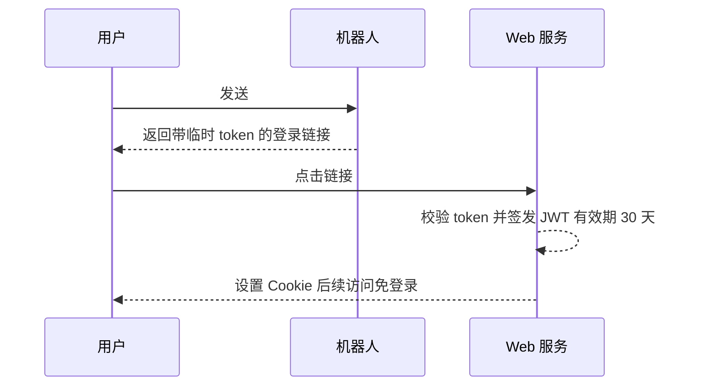
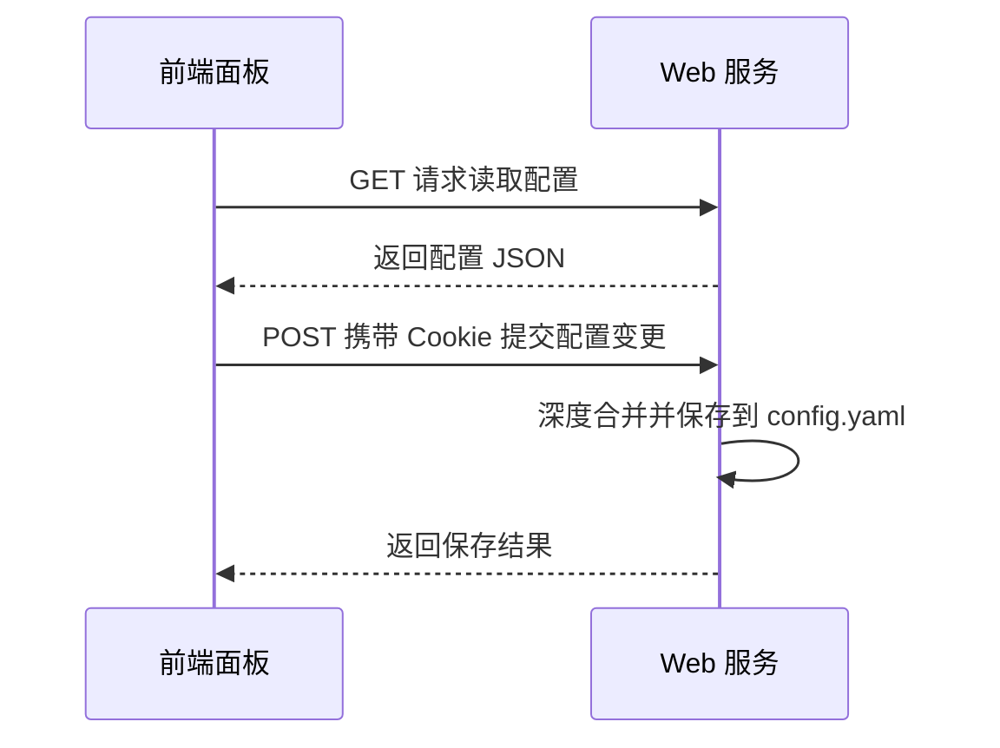

# 前端配置

Web 管理面板的配置与使用说明。

## 访问面板

### 获取登录链接

在机器人对话中发送：

```
#ai管理面板
```

机器人会返回一个带临时 token 的登录链接。

### 登录方式

1. 点击链接自动登录
2. 登录后会设置 Cookie，后续访问无需重复登录
3. Cookie 有效期默认 24 小时

## Web 服务相关配置

Web 服务配置的**默认配置**（`web` 顶层段，见 `config/config.js`）：

```yaml
web:
  port: 3000           # 监听端口
  sharePort: false     # TRSS 环境下共享端口
  mountPath: /chatai   # TRSS 共享端口时的挂载路径
  corsOrigins: []      # 额外允许跨域访问的来源
```

::: danger 历史页面更正
本页旧版书写的 `web.enabled` / `web.host` / `web.security` / `web.auth` / `web.rateLimit` / `web.theme` 以及 `basePath` 写法均无代码依据，已删除。真实的 `web` 段结构见 [思考 / 渲染 / 输出优化配置](./shared-advanced#web)。
:::

### 端口冲突

端口被占用（`EADDRINUSE`）时，服务端会自动尝试切换端口（`src/services/webServer.js`）。也可以直接修改 `web.port`。系统不会打印外部端口检测命令，如需排查可用系统工具自行检查。

### TRSS 共享端口

如果使用 TRSS-Yunzai，可以共享 Yunzai 的端口：

```yaml
web:
  sharePort: true         # 使用 Yunzai 的端口
  mountPath: /chatai      # 共享端口时的挂载路径
```

访问地址变为：`http://your-server:yunzai-port/chatai`。

## 登录令牌



- 登录链接由 `#ai管理面板` 命令生成（`apps/Management.js`），支持临时登录链接与永久链接（`web.permanentAuthToken`，运行期键）。
- 登录后 Cookie 有效期为 30 天（`src/services/webServer.js` 中签发 token 使用 `expiresIn: '30d'`、JWT 算法 `HS256`），旧文档书写的「24 小时」与代码不符。
- `web.jwtSecret` 未配置时自动生成 UUID 并写回配置。

## 面板功能

### 首页仪表盘

仪表盘提供系统状态的快速概览：


- **渠道状态** - 活跃渠道数量和总渠道数
- **MCP 服务器** - 已连接的 MCP 服务器数量
- **AI 模型** - 可用模型数量
- **工具数** - 已注册的工具总数
- **配置中心** - 快速访问各项配置
- **AI 扩展** - 工具配置和 MCP 服务
- **数据记录** - 对话历史和调用记录

### 系统设置

系统设置页面用于配置触发方式和基础参数：


- **私聊触发** - 配置私聊消息的触发方式
- **群聊触发** - 配置群聊消息的触发方式（@机器人、前缀等）
- **触发词** - 自定义触发关键词

### 渠道管理

渠道管理页面展示所有配置的 API 渠道：


| 功能 | 说明 |
|------|------|
| 添加渠道 | 配置新的 API 渠道 |
| 编辑渠道 | 修改渠道参数 |
| 测试连接 | 验证 API Key 和网络连通性 |
| 启用/禁用 | 临时禁用渠道 |
| 删除渠道 | 移除渠道配置 |

#### 模型测试

点击渠道卡片可以测试该渠道下的模型：


#### 编辑渠道

编辑渠道时可以配置基本信息和高级选项：


- **渠道名称** - 唯一标识
- **适配器类型** - OpenAI/Claude/Gemini 等
- **Base URI** - API 端点地址
- **API Key** - 认证密钥
- **模型列表** - 该渠道支持的模型

#### 高级配置


- **启用渠道** - 是否启用该渠道
- **高级设置** - 展开更多配置项
- **流式输出** - 启用流式响应
- **启用缓存** - 缓存相同请求的响应
- **思考控制** - 思维链配置
- **自动拓展** - 自动拓展上下文
- **变量定义** - 可视化/手动编辑变量

#### LLM 参数


- **超时时间** - API 请求超时（毫秒）
- **处理函数** - 自定义响应处理
- **Temperature** - 生成随机性（0-2）
- **Max Tokens** - 最大输出 Token 数
- **Top P** - 核采样参数
- **自定义请求头** - 额外的 HTTP 头

### 预设管理

预设管理用于配置 AI 的人格和行为：


| 功能 | 说明 |
|------|------|
| 查看预设 | 浏览所有预设 |
| 编辑预设 | 修改 System Prompt |
| 复制预设 | 基于现有预设创建新预设 |
| 导入/导出 | JSON 格式导入导出 |

### 人设管理

人设管理提供更精细的人格配置和优先级控制：


- **优先级配置** - 群聊人格 > 群内用户人格 > 用户全局人格 > 默认预设
- **启用独立人格** - 找到的人格完全替换默认配置
- **人格设定管理** - 为用户、群组配置独立人格

### 群组管理

群组管理允许为不同群聊配置独立的设置：


#### 基础设置

- **群号** - 目标群聊 ID
- **群名称** - 可选的群名称备注
- **使用预设** - 选择该群使用的预设
- **触发模式** - 该群的触发方式
- **自定义前缀** - 群专属触发前缀
- **独立人设** - 群专属的 System Prompt
- **启用 AI 消息** - 是否在该群启用 AI


#### 高级设置

- **消息处理** - 入群欢迎、退群处理
- **入群欢迎** - 新成员欢迎消息
- **复读配置** - 复读概率和触发条件
- **有一有回复** - 随机回复概率
- **独立存储** - 独立的上下文存储
- **最大消息数** - 上下文消息数量限制
- **发送概率** - 随机触发概率
- **冲突时拒绝发送** - 避免消息冲突


#### 仿人设置

- **仿人模式** - 模拟真人聊天习惯
- **仿人人设** - 选择仿人角色预设
- **触发概率** - 仿人模式触发概率
- **使用模型** - 仿人模式使用的模型
- **温度** - 生成随机性
- **最大 Token** - 输出限制

### 使用统计

统计面板展示使用数据：


- **消息总数** - 处理的消息数量
- **模型调用** - API 调用次数
- **Tokens 消耗** - Token 使用统计
- **工具调用** - 工具调用次数
- **模型使用统计** - 各模型调用排行
- **工具使用统计** - 各工具调用排行

### 调用统计

详细的 API 调用记录：


- **今日调用** - 当日调用次数
- **成功率** - API 调用成功率
- **Token 消耗** - 当日 Token 使用
- **平均耗时** - 响应时间统计
- **模型调用排行** - 模型使用热度
- **渠道调用排行** - 渠道使用分布
- **调用记录** - 详细调用历史（时间、渠道、模型、耗时、输入/输出 Token）

## 前端开发

### 本地开发

```bash
cd plugins/chatgpt-plugin/frontend
pnpm install
pnpm dev
```

### 技术栈

| 技术 | 说明 |
|------|------|
| Next.js 16.1.5 | React 框架 |
| React 19.2.1 | UI 框架 |
| TailwindCSS 4 | 样式框架 |
| Radix UI + shadcn 风格组件 | 组件库 |
| lucide-react 0.556 | 图标库 |
| SWR / zustand / react-hook-form / immer | 数据请求与状态管理 |

### 构建生产版本

```bash
pnpm build       # 包含 lint 与 next build
pnpm export      # 构建并输出到 ../resources/web（npm run export 脚本）
```

构建产物输出到 `resources/web/` 目录（Next.js 静态导出，`distDir: 'out'`）。

### 自定义主题

未在配置系统中核实到 `web.theme` 之类的主题配置键，主题调整请通过前端源码进行。

## API 调用

前端通过 REST API 与后端通信，鉴权路由挂载于 `/api/...`（`src/services/webServer.js` 中 `router.use('/api/config', auth, configRoutes)` 等）。



```javascript
// 更新配置：POST /api/config，对象深度合并后一次性保存
await fetch('/api/config', {
  method: 'POST',
  headers: { 'Content-Type': 'application/json' },
  credentials: 'include',
  body: JSON.stringify({
    'basic.debug': false,
    'trigger.group.at': true
  })
})
```

- 配置读取接口族在 `src/services/routes/configRoutes.js`（如 `GET /api/config`、`GET /api/config/advanced`、`GET /api/config/triggers`、`GET /api/config/context`、`GET/PATCH /api/config/personality`、`GET/POST /api/config/redis` 等）。
- 写入接口对 `__proto__` / `constructor` / `prototype` 路径做安全校验。

## 常见问题

### 无法访问面板

1. 检查 `web.port` 配置与防火墙设置。
2. 端口占用时服务端会自动尝试切换，注意日志中的实际端口。

### 登录失败

1. 临时 token 可能已过期，重新获取 `#ai管理面板`。
2. 检查时钟是否同步。
3. 清除浏览器 Cookie 后重试。

### 配置不生效

1. 部分配置修改后需要重启插件（如 `web.port`）。
2. 检查配置格式是否正确。
3. 查看控制台是否有报错。

## 下一步

- [API 文档](/api/) - REST API 参考
- [渠道配置](./channels) - 渠道详细配置
