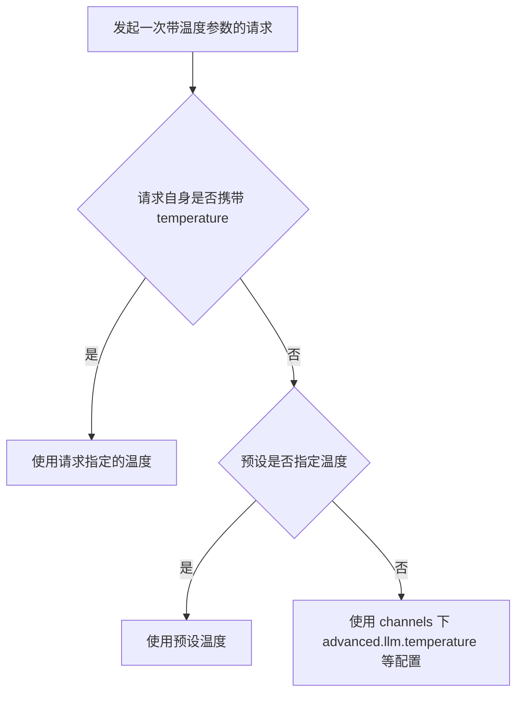
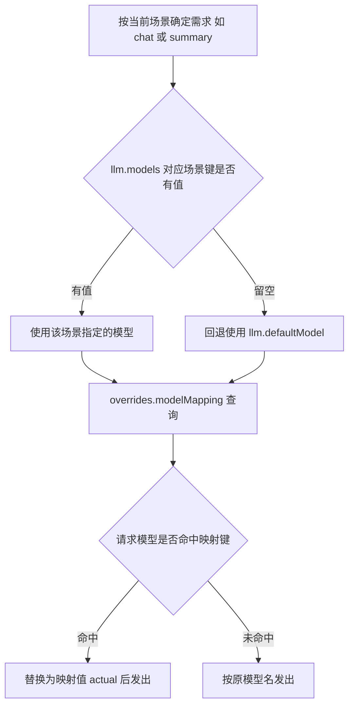

# 模型配置

本文档介绍模型选择渠道模型参数。**注意**：本页旧版以 `channels[].modelParams` / `channels[].model` / `channels[].stream` / `channels[].tags` / `channels[].supportTools` / `channels[].supportVision` / `presets modelParams` / `models.aliases` 等结构书写示例，这些结构在代码中不存在。模型参数的真相如下：

- 默认模型、场景模型、备选模型位于顶层 `llm` 段，见 [基础配置](./basic#llm-模型配置-llm)。
- 渠道支持模型列表在 `channels[].models`；渠道级生成参数（temperature / maxTokens / topP / frequencyPenalty / presencePenalty / maxCharacters）在 `channels[].advanced.llm`，见 [渠道高级配置](./channels-advanced)。
- 温度解析顺序（`src/services/llm/TemperatureResolver.js`）：请求 > 预设 > `channels[].advanced.llm.temperature` 等。
- 模型映射在渠道 `overrides.modelMapping`（`{ "requested": "actual" }`）。



## 模型参数

### 参数说明

| 参数 | 类型 | 范围 | 说明 |
|------|------|------|------|
| `temperature` | number | 0-2 | 控制随机性，越高越随机 |
| `maxTokens` | number | - | 最大输出 Token 数 |
| `topP` | number | 0-1 | 核采样参数 |
| `frequencyPenalty` | number | -2~2 | 频率惩罚，减少重复 |
| `presencePenalty` | number | -2~2 | 存在惩罚，增加话题多样性 |

以上参数在渠道内配置于：

```yaml
channels:
  - id: my-channel
    name: default
    models:
      - gpt-4o
    advanced:
      llm:
        temperature: 0.7
        maxTokens: 4000
        topP: 1
        frequencyPenalty: 0
        presencePenalty: 0
        maxCharacters: 0
```

## 常用模型

用品市场模型的介绍型列表（OpenAI / Claude / Gemini / DeepSeek / xAI Grok / Mistral / Groq / 国内厂商）与具体渠道的可用模型无关——可用模型以 `channels[].models` 与各厂商平台为准，请以渠道测试结果为准（渠道页可「测试连接」）。

| 模型 | 说明 | 上下文 |
|------|------|--------|
| `claude-3-5-sonnet-20241022` | Claude 3.5 Sonnet（默认健康检查兜底模型之一） | 200K |
| `gpt-4o-mini` | OpenAI 轻量模型（默认健康检查兜底模型之一） | 128K |
| `gemini-2.5-flash` | Gemini 轻量模型（默认健康检查兜底模型之一） | 1M |
| `qwen/qwen3-next-80b-a3b-instruct` | 默认配置的默认模型 | - |

## 模型选择策略

### 按场景选择（llm.models）

```yaml
llm:
  models:
    chat: ''        # 对话模型 - 用于普通聊天
    image: ''       # 图像模型 - 用于图像理解和生成
    roleplay: ''    # 伪人模型 - 用于模拟真人回复
    dispatch: ''    # 工具调度模型 - 用于工具组/意图分发
    tools: ''       # 工具执行模型 - 用于工具相关调用
    vision: ''      # 视觉模型 - 用于图像理解
    search: ''      # 搜索模型 - 用于联网搜索总结
    summary: ''     # 群聊总结模型
    profile: ''     # 用户画像模型
    game: ''        # 游戏模型 - 用于Galgame等互动游戏
```

留空使用默认模型（`llm.defaultModel`）。



### 预设中指定

预设中的模型与参数配置属于预设系统（`data/presets.json` / 预设管理接口），不在本页默认配置范围内，详见 [人格隔离配置](./personality)。

## 温度调优

| 场景 | 推荐温度 |
|------|----------|
| 代码生成 | 0.1-0.3 |
| 问答/事实 | 0.3-0.5 |
| 通用对话 | 0.7-0.9 |
| 创意写作 | 0.9-1.2 |

## 上下文长度

### 计算 Token

不同模型的 Token 计算方式不同：
- GPT: ~4 字符/Token（英文），~1.5 字符/Token（中文）
- Claude: 类似 GPT

### 配置最大上下文

```yaml
context:
  maxMessages: 20
  maxTokens: 4000
```

上下文压缩相关见 [上下文配置](./context)。

## 流式响应

渠道级流式开关为 `channels[].advanced.streaming.enabled`（默认配置注释示例为 `false`，实例渠道多配置为 `true`），全局 `streaming.enabled` 默认 `true`。详见 [渠道高级配置](./channels-advanced) 与 [思考 / 渲染 / 输出优化配置](./shared-advanced)。

## 动态模型获取

```
#获取模型列表（未在命令清单中核实到该命令，勿直接照抄）
```

可在渠道编辑面板中执行「测试连接」/获取模型列表等操作（以面板实际按钮为准）。

## 下一步

- [触发配置](./triggers) - 触发方式配置
- [上下文配置](./context) - 上下文管理
- [渠道配置](./channels) - 渠道模型列表与测试
