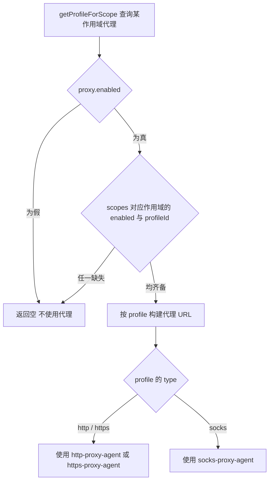

# 代理配置

本文对照 config 默认配置（`config/config.js` 的 `getDefaultConfig()`，对应提交 `5351e7d7`）的 `proxy` 段与 `src/services/proxy/ProxyService.js` 编写。

## 默认配置结构

```yaml
proxy:
  enabled: false          # 全局开关
  profiles: []            # 代理配置列表
  scopes:                 # 环境作用域
    browser:
      enabled: false
      profileId: null
    api:
      enabled: false
      profileId: null
    channel:
      enabled: false
      profileId: null
```

## 配置字段

| 字段 | 类型 | 默认值 | 说明 |
| --- | --- | --- | --- |
| `proxy.enabled` | boolean | `false` | 全局代理开关，关闭时任何 scope 都拿不到代理 |
| `proxy.profiles` | array | `[]` | 代理配置列表，每个 profile 保含连接参数（构建代理 URL 时按 `type` / `host` / `port` / `username` / `password` 组织） |
| `proxy.scopes.browser.enabled` | boolean | `false` | 浏览器/Puppeteer（website 工具）是否走代理 |
| `proxy.scopes.browser.profileId` | string \| null | `null` | browser 作用域使用的 profile ID |
| `proxy.scopes.api.enabled` | boolean | `false` | 通用 API 请求（fetch/axios）是否走代理 |
| `proxy.scopes.api.profileId` | string \| null | `null` | api 作用域使用的 profile ID |
| `proxy.scopes.channel.enabled` | boolean | `false` | 渠道 API 请求（OpenAI 等 LLM API）是否走代理 |
| `proxy.scopes.channel.profileId` | string \| null | `null` | channel 作用域使用的 profile ID |

## 运行时行为（ProxyService）



- `getProfileForScope(scope)`：`proxy.enabled` 为假时直接返回空；再看 `scopes[scope].enabled` 与 `profileId`，任一缺失即视为不使用代理。
- 支持 HTTP / HTTPS / SOCKS 代理类型（`http-proxy-agent` / `https-proxy-agent` / `socks-proxy-agent`）。
- 作用域取值固定为 `'browser'` / `'api'` / `'channel'` 三类。
- 作用域绑定被移除（profile 删除等场景）时，对应 `scopes.<scope>.profileId` 会被置空。

::: danger 历史页面更正
本页旧版书写了大量默认配置中不存在的字段：`proxy.type` / `proxy.host` / `proxy.port` / `proxy.auth` / `proxy.url` / `proxy.noProxy` / `proxy.rules` / `proxy.pool` / `proxy.healthCheck` / `proxy.rejectUnauthorized` 以及渠道内的 `channels[].proxy` / `channels[].useProxy` 等均无代码依据，已全部删除。渠道走代理的入口就是 `proxy.scopes.channel`。
:::

## 环境变量

进程级代理环境变量（`HTTP_PROXY` / `HTTPS_PROXY` / `ALL_PROXY`）由 Node 运行时处理，不属于插件配置系统，插件内未核实到对这些变量的显式读取/代理构建逻辑，此处不作配置保证。

## 下一步

- [配置概述](./index) - 返回配置概述
- [渠道配置](./channels) - 渠道配置详情
- [思考 / 渲染 / 输出优化配置](./shared-advanced) - 其余基础设施段