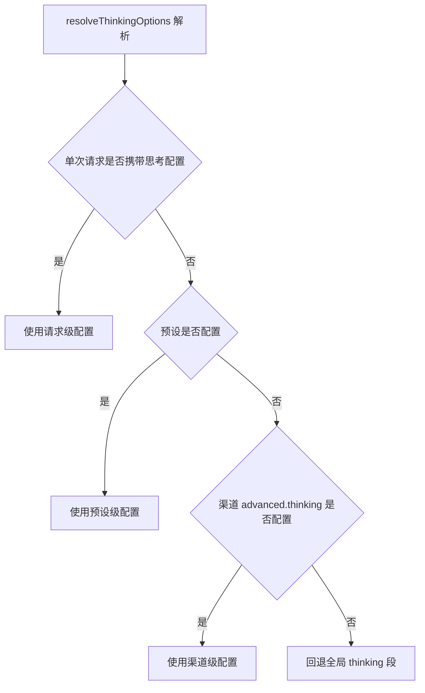
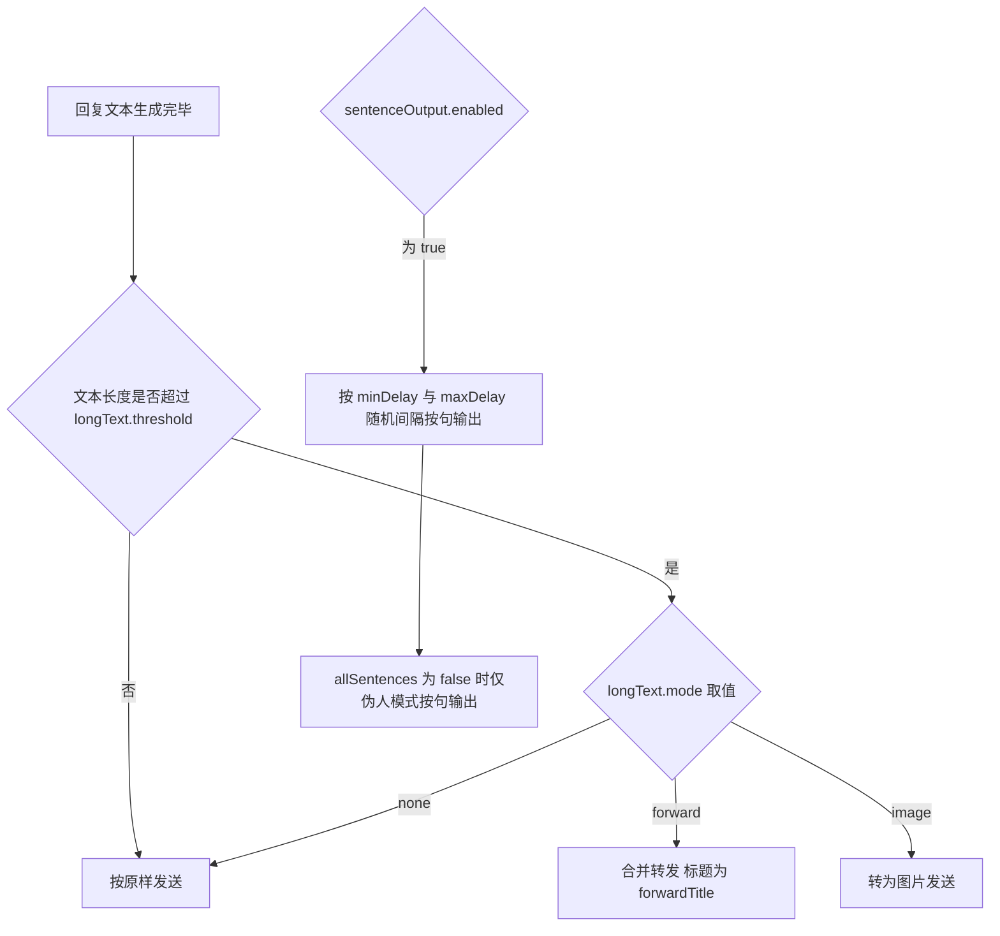
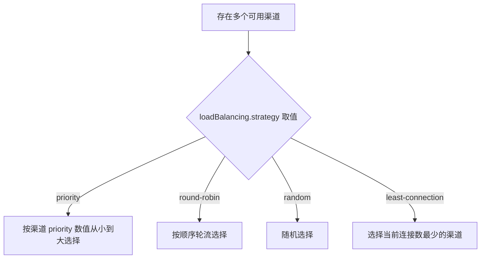

# 思考 / 渲染 / 输出优化配置 <Badge type="warning" text="进阶" />

本文对照 config 默认配置版本（`config/config.js` 的 `getDefaultConfig()`，对应提交 `5351e7d7`）。仅收录能在该默认配置中核实的字段。

## 思考配置 thinking

`thinking` 段是思考（推理）相关的全局默认值，可被渠道、预设、单次请求逐级覆盖（由 `src/services/llm/ThinkingOptions.js` 的 `resolveThinkingOptions` 解析，优先级：请求 > 预设 > 渠道 > 全局）。



```yaml
thinking:
  enabled: true               # 思考适配总开关（关闭后不解析和显示思考内容）
  defaultLevel: 'low'         # 思考深度: 'none' | 'minimal' | 'low' | 'medium' | 'high' | 'xhigh' | 'auto'
  enableReasoning: false      # 启用推理模式（发送 reasoning 参数给 API）
  reasoningBudgetTokens: 0    # 推理预算 tokens，0 表示不指定
  showThinkingContent: true   # 显示思考内容
  useForwardMsg: true         # 思考内容使用合并转发
```

| 字段 | 类型 | 默认值 | 说明 |
| --- | --- | --- | --- |
| `thinking.enabled` | boolean | `true` | 思考适配总开关，为 `false` 时关闭推理相关的解析与展示 |
| `thinking.defaultLevel` | string | `'low'` | 默认思考深度，枚举值见上方代码块注释 |
| `thinking.enableReasoning` | boolean | `false` | 是否发送 reasoning 参数（启用推理） |
| `thinking.reasoningBudgetTokens` | number | `0` | 推理 token 预算，`0` 表示不指定 |
| `thinking.showThinkingContent` | boolean | `true` | 是否向用户显示思考内容 |
| `thinking.useForwardMsg` | boolean | `true` | 思考内容是否以合并转发消息发送 |

**可选键 `thinking.vendorThinkingControl`**（默认配置中无该字段）：可选值 `'auto'` / `'off'` / `'glm'`，由 `resolveThinkingOptions` 读取 `globalThinking.vendorThinkingControl`，用于智谱等厂商需在请求体传 `thinking.type` 的场景。各渠道单独的思考配置见 [渠道高级配置](./channels-advanced) 的 `advanced.thinking`。

## 渲染配置 render

```yaml
render:
  mathFormula: true          # 启用数学公式自动渲染为图片
  theme: 'light'             # 渲染主题: 'light' | 'dark'
  width: 800                 # 渲染宽度
```

| 字段 | 类型 | 默认值 | 说明 |
| --- | --- | --- | --- |
| `render.mathFormula` | boolean | `true` | 数学公式自动渲染为图片 |
| `render.theme` | string | `'light'` | 渲染主题，可选 `'light'` / `'dark'` |
| `render.width` | number | `800` | 渲染宽度 |

消费点：`apps/chat.js`（`render.mathFormula !== false`、`render.theme || 'light'`、`render.width || 800`）。

## 输出优化配置 output

```yaml
output:
  # 长文本处理
  longText:
    enabled: true            # 启用长文本优化
    threshold: 500           # 长文本阈值（字符数）
    mode: 'forward'          # 处理模式: 'auto' | 'forward' | 'image' | 'none'（默认合并转发）
    forwardTitle: 'AI 回复'  # 合并转发标题
  # 按句输出
  sentenceOutput:
    enabled: false           # 启用按句输出
    allSentences: false      # 全部按句输出（否则仅伪人模式）
    minDelay: 300            # 句子间最小延迟（毫秒）
    maxDelay: 1500           # 句子间最大延迟（毫秒）
    randomDelay: true        # 随机延迟（更自然）
```

| 字段 | 类型 | 默认值 | 说明 |
| --- | --- | --- | --- |
| `output.longText.enabled` | boolean | `true` | 长文本优化开关 |
| `output.longText.threshold` | number | `500` | 触发长文本处理的字符数阈值 |
| `output.longText.mode` | string | `'forward'` | `'auto'` / `'forward'` / `'image'` / `'none'`，默认行为为合并转发 |
| `output.longText.forwardTitle` | string | `'AI 回复'` | 合并转发的标题 |
| `output.sentenceOutput.enabled` | boolean | `false` | 按句输出开关 |
| `output.sentenceOutput.allSentences` | boolean | `false` | 是否对所有消息按句输出；为 `false` 时仅伪人模式按句输出 |
| `output.sentenceOutput.minDelay` | number | `300` | 句子间最小延迟（毫秒） |
| `output.sentenceOutput.maxDelay` | number | `1500` | 句子间最大延迟（毫秒） |
| `output.sentenceOutput.randomDelay` | boolean | `true` | 是否在 min/max 之间随机延迟 |

消费点：`apps/chat.js` 与 `apps/bym.js` 均读取 `output.longText`、`output.sentenceOutput`。



## 基础设施配置（同属顶层默认配置段）

### 流式输出 streaming

```yaml
streaming:
  enabled: true
```

默认配置中 `streaming` 仅含 `enabled: true`。`config.yaml` 实例另有 `chunkSize: 1024` 键（同样出现在渠道 `advanced.streaming` 中），该键不在默认配置注释中，如需全局调整请以面板行为为准。

### 负载均衡 loadBalancing {#loadbalancing}

```yaml
loadBalancing:
  strategy: priority   # 'priority' | 'round-robin' | 'random'
```

| 字段 | 类型 | 默认值 | 说明 |
| --- | --- | --- | --- |
| `loadBalancing.strategy` | string | `'priority'` | 渠道选择策略。`ChannelManager.selectBestChannel` 支持 `'priority'` / `'round-robin'` / `'random'` / `'least-connection'`，未配置时回退 `'priority'` |



### IP 探针 probe

```yaml
probe:
  serverUrl: 'http://127.0.0.1:9527'       # 探针服务器地址
  secretKey: 'your-secret-key-change-me'   # API 密钥，需与服务端一致
```

| 字段 | 类型 | 默认值 | 说明 |
| --- | --- | --- | --- |
| `probe.serverUrl` | string | `'http://127.0.0.1:9527'` | 探针服务器地址 |
| `probe.secretKey` | string | `'your-secret-key-change-me'` | API 密钥，需与服务端一致 |

### AI 声聊配置 voice

```yaml
voice:
  enabled: false             # 全局开关
  defaultCharacter: ''       # 默认 AI 声聊角色
  maxTextLength: 500         # 最大文本长度
```

| 字段 | 类型 | 默认值 | 说明 |
| --- | --- | --- | --- |
| `voice.enabled` | boolean | `false` | AI 声聊全局开关（QQ 原生功能） |
| `voice.defaultCharacter` | string | `''` | 默认 AI 声聊角色 |
| `voice.maxTextLength` | number | `500` | 最大文本长度 |

::: tip 区分两处「语音」配置
- 顶层 `voice` 段（本页）：AI 声聊（QQ 原生功能）。
- `features.voiceReply` 段（[功能配置](./features)）：语音回复（旧配置，兼容），含 `enabled` / `ttsProvider` / `triggerOnTool` / `triggerAlways` / `maxTextLength`。
:::

### 更新配置 update

```yaml
update:
  autoCheck: true       # 启用自动检查更新
  checkOnStart: true    # 启动时检查更新
  autoUpdate: false     # 自动更新（不推荐）
  autoRestart: false    # 更新后自动重启
  notifyMaster: true    # 有更新时通知主人
```

| 字段 | 类型 | 默认值 | 说明 |
| --- | --- | --- | --- |
| `update.autoCheck` | boolean | `true` | 自动检查更新 |
| `update.checkOnStart` | boolean | `true` | 启动时检查更新 |
| `update.autoUpdate` | boolean | `false` | 自动更新（默认关闭，注释标注「不推荐」） |
| `update.autoRestart` | boolean | `false` | 更新后自动重启 |
| `update.notifyMaster` | boolean | `true` | 有更新时通知主人 |

### Web 服务配置 web {#web}

```yaml
web:
  port: 3000          # 监听端口
  sharePort: false    # TRSS 环境下共享端口
  mountPath: /chatai  # TRSS 共享端口时的挂载路径
  corsOrigins: []     # 额外允许跨域访问的来源，形如 https://panel.example.com
```

| 字段 | 类型 | 默认值 | 说明 |
| --- | --- | --- | --- |
| `web.port` | number | `3000` | Web 面板监听端口。端口被占用（`EADDRINUSE`）时服务会尝试自动切换（`src/services/webServer.js`） |
| `web.sharePort` | boolean | `false` | TRSS 环境下共享 Yunzai 端口 |
| `web.mountPath` | string | `'/chatai'` | TRSS 共享端口时的挂载路径 |
| `web.corsOrigins` | string[] | `[]` | 额外允许的跨域来源。同源、本机回环、`web.publicUrl` 与 `web.loginLinks` 已默认放行，无需重复填写 |

默认配置之外、由运行时自动写入或按需配置的键（不在默认配置中，据 `src/services/webServer.js` 与 `src/services/routes/configRoutes.js`）：`web.jwtSecret`（未配置时自动生成 UUID）、`web.publicUrl`、`web.loginLinks`、`web.permanentAuthToken`、`web.groupAdminSecret`（实例配置中出现）。这些键不是默认配置内容，本页不作字段表收录。

### 图片存储配置 images {#images}

```yaml
images:
  storagePath: './data/images'
  maxSize: 10485760                 # 10 * 1024 * 1024 字节
  allowedFormats:
    - jpg
    - jpeg
    - png
    - gif
    - webp
```

| 字段 | 类型 | 默认值 | 说明 |
| --- | --- | --- | --- |
| `images.storagePath` | string | `'./data/images'` | 图片存储路径 |
| `images.maxSize` | number | `10485760` | 图片大小上限（字节，10 MB） |
| `images.allowedFormats` | string[] | `['jpg','jpeg','png','gif','webp']` | 允许的图片格式 |

### Redis 缓存配置 redis {#redis}

```yaml
redis:
  enabled: true
  host: '127.0.0.1'
  port: 6379
  password: ''
  db: 0
```

| 字段 | 类型 | 默认值 | 说明 |
| --- | --- | --- | --- |
| `redis.enabled` | boolean | `true` | 启用 Redis 缓存 |
| `redis.host` | string | `'127.0.0.1'` | Redis 主机 |
| `redis.port` | number | `6379` | Redis 端口 |
| `redis.password` | string | `''` | Redis 密码，留空表示无密码 |
| `redis.db` | number | `0` | Redis 数据库编号 |

消费点：`src/core/cache/RedisClient.js`（`config.get('redis')`）、配置接口 `src/services/routes/configRoutes.js`（`GET /redis`、`POST /redis` 写入）。

### B 站视频配置 bilibili

```yaml
bilibili:
  sessdata: ''   # B 站登录 Cookie 的 SESSDATA，用于获取 AI 视频总结
```

| 字段 | 类型 | 默认值 | 说明 |
| --- | --- | --- | --- |
| `bilibili.sessdata` | string | `''` | B 站登录 Cookie 的 SESSDATA，用于获取 AI 视频总结 |

消费点：`src/mcp/tools/bltools.js`（`config.get('bilibili.sessdata')`）。

## 下一步

- [基础配置](./basic) - basic / admin / llm 等核心段
- [渠道配置](./channels) - 渠道列表与多 Base URL、多 API Key
- [渠道高级配置](./channels-advanced) - 渠道系统提示词、图片、超时、重试、配额、参数覆盖
- [功能配置](./features) - features 各子功能段