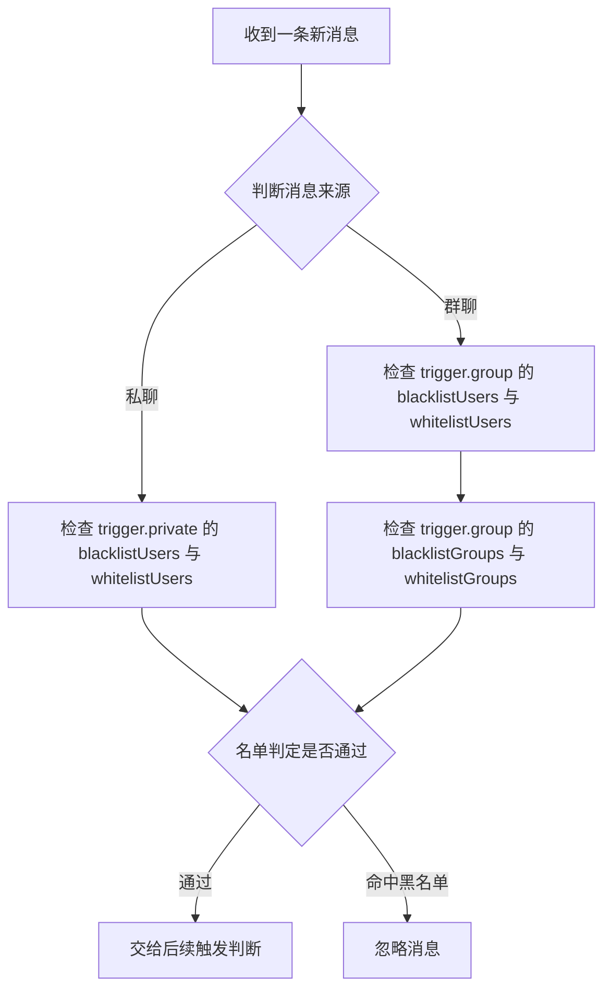
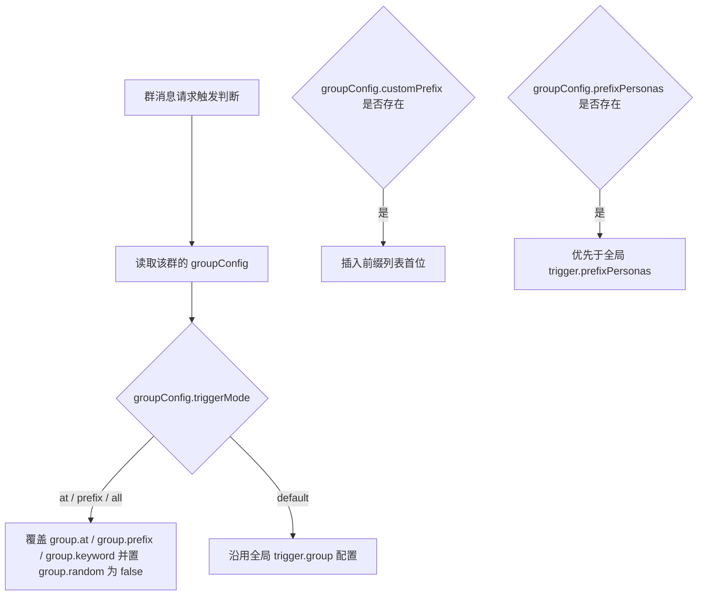

# 触发配置

本文对照 config 默认配置（`config/config.js` 的 `getDefaultConfig()`，对应提交 `5351e7d7`）的 `trigger` 段编写。触发判断逻辑位于 `apps/chat.js`（`getTriggerConfig` 与 `checkTriggerWithTracking`）。

## 基础配置

```yaml
trigger:
  # 私聊触发
  private:
    enabled: true          # 是否响应私聊
    mode: 'prefix'         # 私聊触发模式: 'always'(总是), 'prefix'(需前缀), 'off'(关闭)
    blacklistUsers: []     # 私聊用户黑名单
    whitelistUsers: []     # 私聊用户白名单（空=不限）
  # 群聊触发
  group:
    enabled: true          # 是否响应群聊
    at: true               # @机器人触发
    prefix: true           # 前缀触发
    keyword: false         # 关键词触发
    random: false          # 随机触发
    randomRate: 0.05       # 随机触发概率
    blacklistUsers: []     # 群聊用户黑名单
    whitelistUsers: []     # 群聊用户白名单（空=不限）
    blacklistGroups: []    # 群号黑名单
    whitelistGroups: []    # 群号白名单（空=不限）
  prefixes: ['#chat']      # 前缀列表
  keywords: []             # 关键词列表
  collectGroupMsg: true    # 采集群消息用于记忆
```

## 配置参数

| 参数 | 类型 | 默认值 | 说明 |
|------|------|--------|------|
| `private.enabled` | boolean | `true` | 启用私聊 |
| `private.mode` | string | `'prefix'` | 私聊触发模式，见下方「私聊触发模式」 |
| `private.blacklistUsers` | array | `[]` | 私聊用户黑名单 |
| `private.whitelistUsers` | array | `[]` | 私聊用户白名单（空=不限） |
| `group.enabled` | boolean | `true` | 启用群聊 |
| `group.at` | boolean | `true` | @ 机器人触发 |
| `group.prefix` | boolean | `true` | 前缀触发 |
| `group.keyword` | boolean | `false` | 关键词触发 |
| `group.random` | boolean | `false` | 随机触发 |
| `group.randomRate` | number | `0.05` | 随机触发概率 |
| `group.blacklistUsers` | array | `[]` | 群聊用户黑名单 |
| `group.whitelistUsers` | array | `[]` | 群聊用户白名单（空=不限） |
| `group.blacklistGroups` | array | `[]` | 群号黑名单 |
| `group.whitelistGroups` | array | `[]` | 群号白名单（空=不限） |
| `prefixes` | array | `['#chat']` | 触发前缀列表 |
| `keywords` | array | `[]` | 关键词列表 |
| `collectGroupMsg` | boolean | `true` | 采集群消息用于记忆 |

## 私聊触发模式

| 模式 | 说明 |
|------|------|
| `'always'` | 始终触发 |
| `'prefix'` | 需要前缀（默认） |
| `'off'` | 关闭 |

::: danger 历史页面更正
旧版书写的枚举 `always | prefix | keyword` 中 `keyword` 不是私聊模式枚举；默认配置注释为 `'always'(总是) | 'prefix'(需前缀) | 'off'(关闭)`。代码实现在 `apps/chat.js`：`off`（或 `enabled === false`）完全关闭、`always` 无条件触发、其余（含缺省 `|| 'prefix'`）走前缀匹配。

旧版把 `blacklistUsers` / `whitelistUsers` / `blacklistGroups` / `whitelistGroups` 写在 `trigger` 顶层，真实结构是分私聊/群聊两组的：用户类名单在 `trigger.private` 与 `trigger.group` 下各一份，群名单仅 `trigger.group`。旧版顶层名单会被 `migrateTriggerAccessLists`（`config/config.js`）自动迁移进新结构。
:::

## 前缀配置

```yaml
trigger:
  prefixes:
    - "#chat"
    - "/ai"
```

带前缀的消息才触发（`checkPrefix` 匹配前缀列表并去除前缀）。

## 关键词触发

```yaml
trigger:
  group:
    keyword: true
  keywords:
    - "问一下"
    - "请问"
    - "帮我"
```

消息中包含关键词即触发。

## 随机触发

```yaml
trigger:
  group:
    random: true
    randomRate: 0.05  # 5% 概率
```

## 黑白名单

黑白名单按私聊/群聊分组配置（见上方 [基础配置](#基础配置) 示例），均为 QQ 号或群号数组，空数组表示不限。



## 前缀人格映射 prefixPersonas

`config.yaml` 实例中出现过 `trigger.prefixPersonas` 键，**不在默认配置中**；`apps/chat.js` 在群组自定义前缀合并时读取 `triggerCfg.prefixPersonas`，其元素结构未在默认配置注释中定义，此处不展开示例。

## 群组独立触发配置

群组级配置会覆盖全局触发行为（`apps/chat.js`）：



- `groupConfig.triggerMode` 为 `'at'` / `'prefix'` / `'all'` 时覆盖 `group.at` / `group.prefix` / `group.keyword`（并置 `group.random = false`）；`'default'` 表示沿用全局。
- `groupConfig.customPrefix` 会插入前缀列表首位。
- `groupConfig.prefixPersonas` 存在时优先于全局 `prefixPersonas`。

该部分属于群组配置数据（面板「群组管理」页维护），不在 `trigger` 默认配置内。

## 完整示例

```yaml
trigger:
  private:
    enabled: true
    mode: prefix
    blacklistUsers: []
    whitelistUsers: []
  group:
    enabled: true
    at: true
    prefix: true
    keyword: false
    random: false
    randomRate: 0.05
    blacklistUsers: []
    whitelistUsers: []
    blacklistGroups: []
    whitelistGroups: []
  prefixes:
    - "#chat"
    - "/ai"
  keywords: []
  collectGroupMsg: true
```

## 下一步

- [上下文配置](./context) - 上下文管理
- [记忆配置](./memory) - 长期记忆