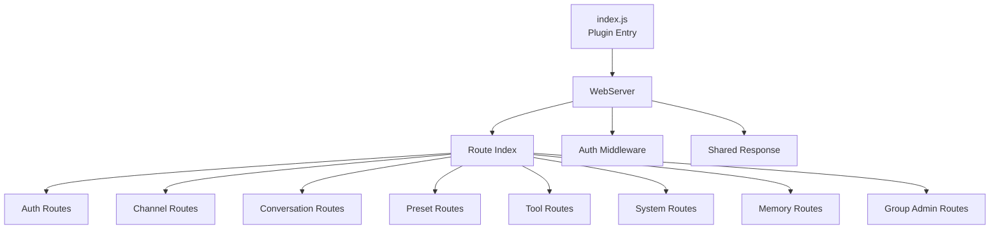
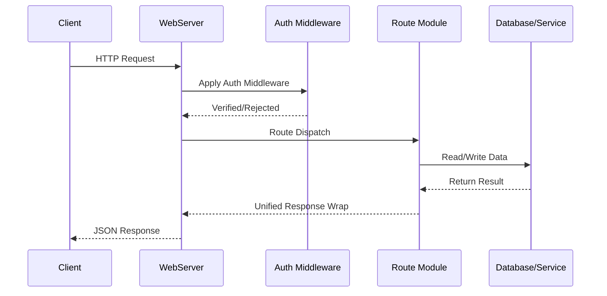

# API Overview <Badge type="tip" text="REST API" />

ChatAI Plugin provides **REST API** for management and extension, supporting Web panel and third-party integration.

## Basic Information {#basic-info}

| Item | Value | Description |
|:-----|:------|:------------|
| **Base URL** | `http://localhost:3000/api` | Port configurable |
| **Authentication** | JWT Token | Supports Cookie or Bearer Token |
| **Response Format** | JSON | Unified JSON response structure |
| **Rate Limit** | 60 req/min | Default rate limit |

## Architecture Overview {#architecture}



## API Modules {#api-modules}

::: info Module Description
Each module provides a set of related API endpoints that can be used independently.
:::

| Module | Path | Description | Docs |
|:-------|:-----|:------------|:----:|
| **Auth** | `/api/auth` | Login, verification, Token management | [View](./auth) |
| **Config** | `/api/config` | Configuration read/update | [View](./config) |
| **Channels** | `/api/channels` | Channel CRUD, testing, model list | - |
| **Conversations** | `/api/conversations` | Conversation history management | - |
| **Presets** | `/api/presets` | Preset CRUD | - |
| **Tools** | `/api/tools` | Tool management and logs | [View](./tools) |
| **MCP** | `/api/mcp` | MCP server management | [View](./mcp) |
| **Skills** | `/api/skills` | Skills agent interface | - |
| **Group Admin** | `/api/group-admin` | Group-specific configuration | - |
| **System** | `/api/system` | System status and statistics | - |

## Authentication {#authentication}

### Get Login Link {#get-login-link}

::: tip How to Get
Send `#ai管理面板` to bot for temporary login link, or `#ai管理面板 永久` for permanent link.
:::

### Login Flow {#login-flow}



### API Authentication {#api-auth}

::: code-group
```bash [Cookie Auth]
# Browser automatically carries Cookie
curl http://localhost:3000/api/config \
  -H "Cookie: auth_token=xxx"
```

```bash [Bearer Token]
# For third-party calls
curl http://localhost:3000/api/config \
  -H "Authorization: Bearer xxx"
```
:::

## Response Format {#response-format}

::: code-group
```json [Success Response]
{
  "success": true,
  "data": { ... }
}
```

```json [Error Response]
{
  "success": false,
  "error": "Error message",
  "code": "ERROR_CODE"
}
```
:::

## Error Codes {#error-codes}

| Code | Description | Common Causes |
|:----:|:------------|:--------------|
| `200` | Success | - |
| `400` | Bad Request | Missing required params, invalid format |
| `401` | Unauthorized | Token missing or expired |
| `403` | Forbidden | No permission to access resource |
| `404` | Not Found | Requested resource not found |
| `429` | Too Many Requests | Rate limit exceeded |
| `500` | Internal Server Error | Server-side exception |

## Rate Limiting {#rate-limit}

::: warning Rate Limit Rules
- **Window**: 60 seconds
- **Max Requests**: 60 requests
- Exceeding limit returns `429` status code
:::

## SSE Endpoints {#sse}

Some endpoints support **Server-Sent Events** for real-time push:

```javascript{1,3-6}
const eventSource = new EventSource('/api/skills/sse')

eventSource.onmessage = (event) => {
  const data = JSON.parse(event.data)
  console.log('Status update:', data)
}

eventSource.onerror = (error) => {
  console.error('SSE Error:', error)
}
```

## Detailed API Documentation {#detailed-docs}

| Document | Description | Main Endpoints |
|:---------|:------------|:---------------|
| [Authentication](./auth) | Login & verification | `POST /auth/login`, `GET /auth/verify` |
| [Configuration](./config) | Config management | `GET /config`, `PUT /config` |
| [Tools](./tools) | Tool management | `GET /tools`, `POST /tools/call` |
| [MCP](./mcp) | MCP servers | `GET /mcp/servers`, `POST /mcp/connect` |
| [Chat](./chat) | Chat functionality | `POST /chat`, `GET /conversations` |
