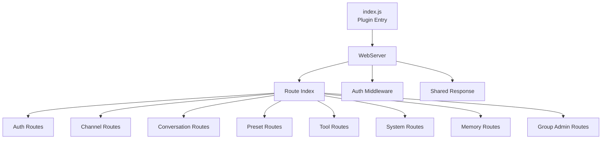
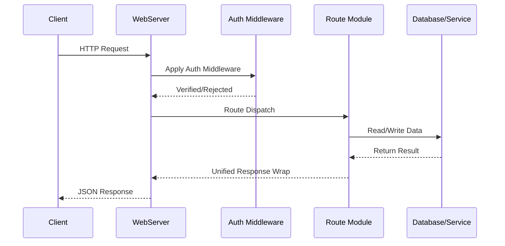

# API Overview <Badge type="tip" text="REST API" />

ChatAI Plugin provides **REST API** for management and extension, supporting the Web panel and third-party integration.

## Basic Information {#basic-info}

| Item | Value | Description |
|:-----|:------|:------------|
| **Base URL** | `http://localhost:3000/api` | Port configurable |
| **Authentication** | JWT Token | Supports Cookie or Bearer Token |
| **Response Format** | JSON | Unified JSON response structure |
| **Rate Limit** | 60 req/min | Default rate limit |

## Architecture Overview {#architecture}


```mermaid
graph TB
    A["index.js<br/>Plugin Entry"] --> B["WebServer"]
    B --> C["Route Index"]
    C --> D["Auth Routes"]
    C --> E["Channel Routes"]
    C --> F["Conversation Routes"]
    C --> G["Preset Routes"]
    C --> H["Tool Routes"]
    C --> I["System Routes"]
    C --> J["Memory Routes"]
    C --> K["Group Admin Routes"]
    B --> L["Auth Middleware"]
    B --> M["Shared Response"]
```

## API Modules {#api-modules}

::: info Module Description
Each module provides a set of related API endpoints that can be used independently.
:::

| Module | Path | Description | Docs |
|:-------|:-----|:------------|:----:|
| **Auth** | `/api/auth` | Login, verification, Token management | [View](./auth) |
| **Config** | `/api/config` | Config read/update, channel management, group config | [View](./config) |
| **Conversations** | `/api/conversations` | Conversation history view and cleanup | [View](./chat) |
| **Presets** | `/api/presets` | Preset CRUD, preset file management | [View](./presets) |
| **Tools** | `/api/tools` | Tool management, execution, logs, dangerous tool config | [View](./tools) |
| **MCP** | `/api/mcp` | MCP server connection, management, SSE status push | [View](./mcp) |
| **Skills** | `/api/skills` | Skills Agent endpoints, tool categories, global switch, SSE | [View](./skills) |
| **Group Admin** | `/api/group-admin` | Per-group configuration, group admin login | [View](./groups) |
| **System** | `/api/system` | Health checks, version info, statistics | [View](./stats) |
| **Memory** | `/api/memory` | Structured user memory management, categories, statistics | [View](./memories) |
| **Knowledge Base** | `/api/knowledge` | Knowledge base document CRUD, search | [View](./knowledge) |
| **Knowledge Graph** | `/api/graph` | Entity/relationship/property CRUD, visualization data | [View](./graph) |
| **Image** | `/api/image` | Drawing preset management, remote preset caching | [View](./image) |
| **Game** | `/api/game` | Galgame character preset management | [View](./game) |
| **Logs** | `/api/logs` | Log file listing, error log viewing | [View](./logs) |
| **Proxy** | `/api/proxy` | Network proxy configuration management | [View](./proxy-api) |
| **Scope** | `/api/scope` | User/group level independent config management | [View](./scope) |

## Authentication {#authentication}

### Get Login Link {#get-login-link}

::: tip How to Get
Send `#ai管理面板` to the bot for a temporary login link, or `#ai管理面板 永久` for a permanent link.
:::

### Login Flow {#login-flow}


```mermaid
sequenceDiagram
    participant Client as Client
    participant Web as WebServer
    participant MW as Auth Middleware
    participant Route as Route Module
    participant DB as Database/Service

    Client->>Web: HTTP Request
    Web->>MW: Apply Auth Middleware
    MW-->>Web: Verified/Rejected
    Web->>Route: Route Dispatch
    Route->>DB: Read/Write Data
    DB-->>Route: Return Result
    Route-->>Web: Unified Response Wrap
    Web-->>Client: JSON Response
```

### API Authentication {#api-auth}

::: code-group
```bash [Cookie Auth]
# Browser automatically carries Cookie
curl http://localhost:3000/api/config \
  -H "Cookie: auth_token=xxx"
```

```bash [Bearer Token]
# For third-party calls
curl http://localhost:3000/api/config \
  -H "Authorization: Bearer xxx"
```
:::

## Response Format {#response-format}

::: code-group
```json [Success Response]
{
  "success": true,
  "data": { ... }
}
```

```json [Error Response]
{
  "success": false,
  "error": "Error message",
  "code": "ERROR_CODE"
}
```
:::

## Error Codes {#error-codes}

| Code | Description | Common Causes |
|:----:|:------------|:--------------|
| `200` | Success | - |
| `400` | Bad Request | Missing required params, invalid format |
| `401` | Unauthorized | Token missing or expired |
| `403` | Forbidden | No permission to access resource |
| `404` | Not Found | Requested resource not found |
| `429` | Too Many Requests | Rate limit exceeded |
| `500` | Internal Server Error | Server-side exception |

## Rate Limiting {#rate-limit}

::: warning Rate Limit Rules
- **Window**: 60 seconds
- **Max Requests**: 60 requests
- Exceeding the limit returns a `429` status code
:::

## SSE Endpoints {#sse}

Some endpoints support **Server-Sent Events** for real-time push:

```javascript{1,3-6}
const eventSource = new EventSource('/api/skills/sse')

eventSource.onmessage = (event) => {
  const data = JSON.parse(event.data)
  console.log('Status update:', data)
}

eventSource.onerror = (error) => {
  console.error('SSE Error:', error)
}
```

## Detailed API Documentation {#detailed-docs}

| Document | Description | Main Endpoints |
|:---------|:------------|:---------------|
| [Authentication](./auth) | Login & verification | `POST /auth/verify`, `POST /auth/logout` |
| [Configuration](./config) | Config & channel management | `GET /config`, `PUT /config`, `POST /config/channels` |
| [Chat](./chat) | Conversations & memory | `POST /chat`, `GET /chat/history` |
| [Tools](./tools) | Tool management | `GET /tools`, `POST /tools/:name/execute` |
| [Skills](./skills) | Skills Agent | `GET /skills/categories`, `POST /skills/toggle-category` |
| [MCP](./mcp) | MCP servers | `GET /mcp/servers`, `POST /mcp/servers/:name/connect` |
| [Memory](./memories) | User memories | `GET /memories/users`, `POST /memories/user/:userId` |
| [Knowledge Base](./knowledge) | Knowledge documents | `GET /knowledge`, `GET /knowledge/search` |
| [Knowledge Graph](./graph) | Entities & relationships | `GET /graph/entities`, `POST /graph/relationships` |
| [Image](./image) | Drawing presets | `GET /image/presets`, `PUT /image/config` |
| [Game](./game) | Galgame | `GET /game/presets`, `POST /game/presets` |
| [Logs](./logs) | Log viewing | `GET /logs`, `GET /logs/recent` |
| [Proxy](./proxy-api) | Network proxy | `GET /proxy`, `PUT /proxy/scopes/:scope` |
| [Scope](./scope) | Granular config | `GET /scope/users`, `PUT /scope/group/:groupId` |