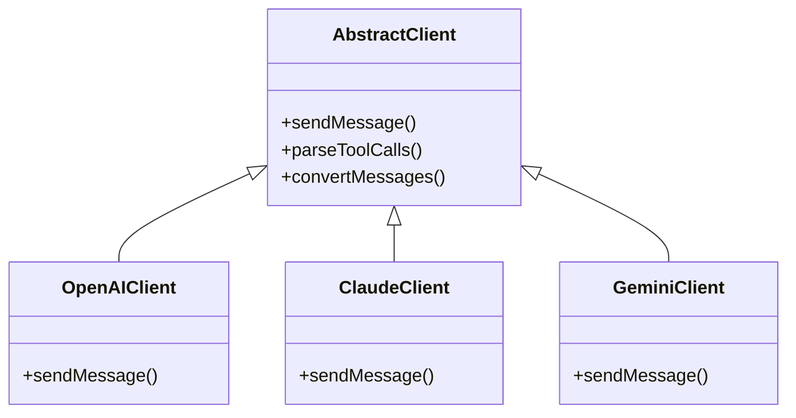
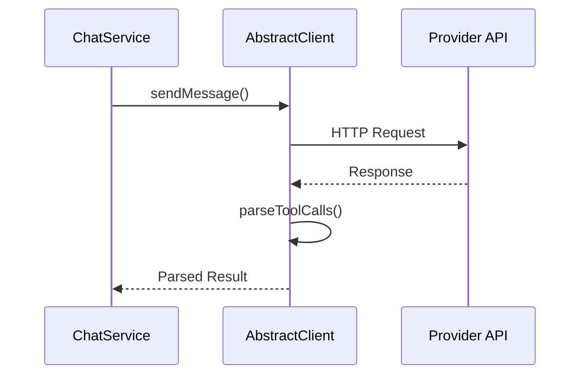

# LLM Adapters <Badge type="info" text="Core" />

Unified interface for multiple AI model providers.

## Architecture {#architecture}



## AbstractClient {#abstract-client}

Base class in `src/core/adapters/AbstractClient.js`:

```javascript
class AbstractClient {
  // Send message to LLM
  async sendMessage(messages, options) { }
  
  // Parse tool calls from response
  parseToolCalls(response) { }
  
  // Convert message format
  convertMessages(messages) { }
}
```

## Supported Providers {#providers}

| Provider | Client | Features |
|:---------|:-------|:---------|
| **OpenAI** | `OpenAIClient` | Tool calling, streaming, vision |
| **Claude** | `ClaudeClient` | Tool use, streaming |
| **Gemini** | `GeminiClient` | Function calling |
| **DeepSeek** | Uses OpenAI client | OpenAI-compatible |

## Message Flow {#message-flow}



## Creating Custom Adapter {#custom}

1. Extend `AbstractClient`
2. Implement required methods
3. Register in adapter factory

```javascript
import { AbstractClient } from './AbstractClient.js'

export class MyClient extends AbstractClient {
  async sendMessage(messages, options) {
    // Implementation
  }
}
```

## Next Steps {#next}

- [Chat Service](./chat-service) - Message handling
- [MCP System](./mcp) - Tool integration
