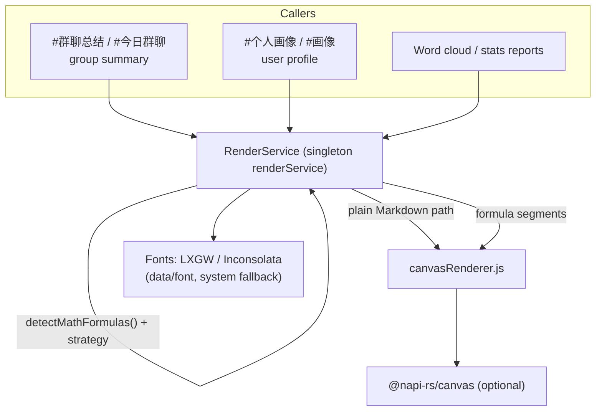
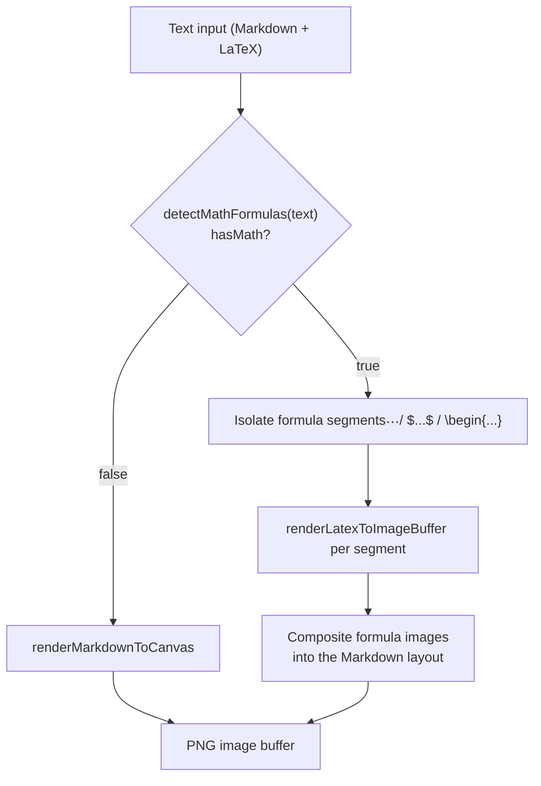

# Canvas Renderer / RenderService <Badge type="info" text="Architecture" />

## Positioning

The Markdown/formula-to-image pipeline lives in two files under `src/services/media/`:

| File | Responsibility |
|:-----|:---------------|
| `canvasRenderer.js` | Low-level layout and drawing: `renderMarkdownToCanvas()` (Markdown to image), `unwrapMarkdownFence()` (strips code fences), `renderLatexToImageBuffer()` (formula to image) |
| `RenderService.js` | Service wrapper (singleton `renderService`): detects math formulas, loads fonts, picks a rendering strategy, and exposes `renderMarkdownToImage` and friends to callers |

The default pixel density is `2` (`DEFAULT_PIXEL_RATIO` in `canvasRenderer.js`), which doubles the resolution for Markdown rendering; `pixelRatio` only accepts `1` or `2`.



## Low-Level Dependency

Drawing is based on `@napi-rs/canvas`. **A failed module load does not block plugin startup**: `RenderService` imports it in a try/catch (logged through `logService` debug) and sets `this.useCanvas = !!canvasModule`. When the canvas module is unavailable, rendering entry points throw `Canvas 模块未加载，无法渲染图片`.

## renderMarkdownToCanvas Interface

```javascript
import { renderMarkdownToCanvas, unwrapMarkdownFence } from './canvasRenderer.js'

const imageBuffer = await renderMarkdownToCanvas(markdown, {
    canvasModule,            // required: canvas module injected by RenderService
    theme: 'light',          // theme (THEMES keys, default light)
    width: 800,              // rendering width (240-2400 integer)
    title: '',               // title
    subtitle: '',            // subtitle
    showTimestamp: true,     // whether to show the timestamp
    fontSize: 15,            // font size (8-48)
    pixelRatio: 2,           // 1 or 2 (2x density is roughly 4x the pixels)
    fontFamily: 'LXGW, "Noto Sans SC", "PingFang SC", "Microsoft YaHei", sans-serif',
    codeFont: 'Inconsolata, "Courier New", monospace'
})
```

Invalid parameters throw errors with explicit messages (`渲染宽度必须是 240–2400 的整数`,
`渲染字号必须在 8–48 之间`, `Markdown 内容过长`, `像素密度必须为 1 或 2`, etc.).
Height and total pixel caps are computed against the physical bitmap (`MAX_HEIGHT` / `MAX_PIXELS`);
at 2x density the budget shrinks by roughly 4x in pixels.

## Supported Markdown Features (CanvasLayout)

- Headings, bold/italic/strikethrough, ordered/unordered lists, task lists, blockquotes
- Code blocks and inline code (monospace font), horizontal rules
- Tables (cell alignment; too many columns throws `表格列数过多，请增加渲染宽度`)
- Images (URLs loaded through `canvasModule.loadImage`; size-limited)
- Math formulas mixed with Markdown
- Automatic pagination / multi-column layout for long text

## Formula Rendering (RenderService)

`RenderService` ships over a dozen built-in math detection regex groups in `this.mathPatterns`
(`blockLatex`, `inlineLatex`, `bracketBlock`, `bracketInline`, `latexEnv`, `mathCommands`,
`integralSymbol`, `mathSymbols`, `greekLetters`, and more). `detectMathFormulas(text)` returns
`{ hasMath, confidence, matches, mathScore }`; formula segments are handed to
`renderLatexToImageBuffer` and composited back, while pure-text content goes through
`renderMarkdownToCanvas`.



## Typical Callers

- Group chat summary / today's group chat (`#群聊总结`, `#今日群聊`)
- User profile and analysis reports (`#个人画像` / `#画像`)
- Word cloud and statistics report image output

> Note: `RenderService` only handles the "Markdown/formula to image" pipeline.
> Serving online images and media files is handled by `ImageService.js` and the chat pipeline.