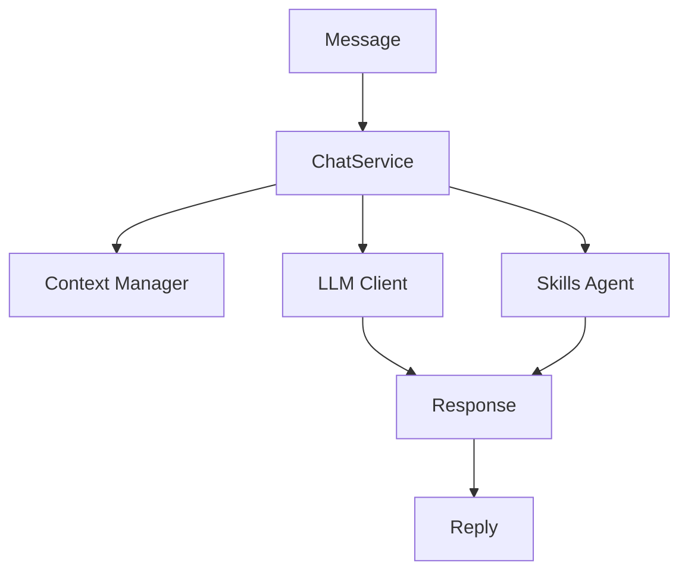

# Chat Service <Badge type="info" text="Service" />

Core service for conversation management.

## Overview {#overview}

ChatService handles message processing, context management, and LLM communication.



## Core Functions {#functions}

```javascript
class ChatService {
  // Process incoming message
  async processMessage(event) { }
  
  // Send message to LLM
  async sendMessage(options) { }
  
  // Handle tool calls
  async handleToolCalls(response) { }
  
  // Build conversation context
  async buildContext(userId, groupId) { }
}
```

## Message Processing {#processing}

### Input Processing

```javascript
async processMessage(event) {
  const { userId, groupId, message } = event
  
  // Get preset for context
  const preset = await this.getPreset(userId, groupId)
  
  // Build context
  const context = await this.buildContext(userId, groupId)
  
  // Add user message
  context.push({ role: 'user', content: message })
  
  // Send to LLM
  const response = await this.sendMessage({
    messages: context,
    preset,
    tools: await this.getAvailableTools(userId, groupId)
  })
  
  return response
}
```

### Response Handling

```javascript
async sendMessage(options) {
  const { messages, preset, tools } = options
  
  // Get LLM client
  const client = await this.getClient(preset.channel)
  
  // Send request
  let response = await client.sendMessage(messages, {
    tools,
    temperature: preset.temperature,
    maxTokens: preset.maxTokens
  })
  
  // Handle tool calls
  while (response.toolCalls?.length > 0) {
    const results = await this.executeTools(response.toolCalls)
    response = await client.continueWithResults(results)
  }
  
  return response
}
```

## Context Management {#context}

```javascript
class ContextManager {
  // Get conversation context
  async getContext(userId, groupId) {
    const key = `${userId}:${groupId}`
    return this.contexts.get(key) || []
  }
  
  // Add message to context
  async addMessage(userId, groupId, message) {
    const context = await this.getContext(userId, groupId)
    context.push(message)
    
    // Apply cleaning strategy
    if (context.length > this.maxMessages) {
      context.shift()
    }
    
    this.contexts.set(`${userId}:${groupId}`, context)
  }
  
  // Clear context
  async clearContext(userId, groupId) {
    this.contexts.delete(`${userId}:${groupId}`)
  }
}
```

## Streaming Support {#streaming}

```javascript
async *streamMessage(options) {
  const client = await this.getClient(options.channel)
  
  for await (const chunk of client.streamMessage(options.messages)) {
    yield chunk
  }
}
```

## Error Handling {#errors}

```javascript
async sendMessage(options) {
  try {
    return await this.client.sendMessage(options)
  } catch (error) {
    if (this.isRetryable(error)) {
      return await this.retryWithBackoff(options)
    }
    
    if (this.hasFailover()) {
      return await this.failover(options)
    }
    
    throw error
  }
}
```

## Configuration {#config}

```yaml
chat:
  defaultChannel: main
  streamingEnabled: true
  retryAttempts: 3
  retryDelay: 1000
```

## Next Steps {#next}

- [LLM Adapters](./adapters) - Client implementation
- [Skills Agent](./skills-agent) - Tool management
