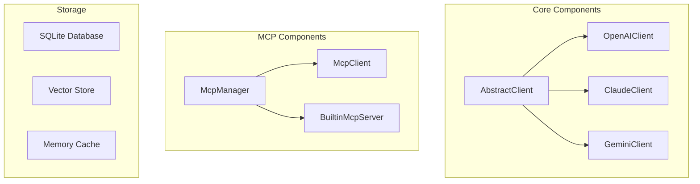

# Core Architecture <Badge type="info" text="Deep Dive" />

Detailed explanation of core system components.

## Component Overview {#overview}



## LLM Adapters {#adapters}

### AbstractClient

Base class for all LLM clients:

```javascript
class AbstractClient {
  constructor(config) {
    this.config = config
  }

  // Send message to LLM
  async sendMessage(messages, options) {
    throw new Error('Not implemented')
  }

  // Parse tool calls from response
  parseToolCalls(response) {
    // Implementation
  }

  // Convert message format
  convertMessages(messages) {
    // Implementation
  }
}
```

### Provider Clients

| Client | Provider | Features |
|:-------|:---------|:---------|
| `OpenAIClient` | OpenAI, compatible APIs | Tool calling, streaming, vision |
| `ClaudeClient` | Anthropic | Tool use, streaming |
| `GeminiClient` | Google | Function calling |

## MCP System {#mcp}

### McpManager

Central hub for tool management:

```javascript
class McpManager {
  constructor() {
    this.sources = new Map()
    this.tools = new Map()
  }

  // Register tool source
  registerSource(name, source) {
    this.sources.set(name, source)
  }

  // List all tools
  async listTools() {
    const tools = []
    for (const source of this.sources.values()) {
      tools.push(...await source.listTools())
    }
    return tools
  }

  // Call a tool
  async callTool(name, args, context) {
    const source = this.findToolSource(name)
    return await source.callTool(name, args, context)
  }
}
```

### McpClient

Protocol client supporting multiple transports:

```javascript
class McpClient {
  constructor(config) {
    this.transport = this.createTransport(config)
  }

  createTransport(config) {
    switch (config.transport) {
      case 'stdio': return new StdioTransport(config)
      case 'sse': return new SSETransport(config)
      case 'http': return new HTTPTransport(config)
    }
  }

  async connect() {
    await this.transport.connect()
  }

  async listTools() {
    return await this.transport.request('tools/list')
  }

  async callTool(name, args) {
    return await this.transport.request('tools/call', { name, args })
  }
}
```

### BuiltinMcpServer

Manages built-in tools:

```javascript
class BuiltinMcpServer {
  constructor() {
    this.tools = new Map()
    this.categories = new Map()
  }

  // Load tools from directory
  async loadTools() {
    for (const category of enabledCategories) {
      const module = await import(`./tools/${category}.js`)
      this.registerCategory(category, module.tools)
    }
  }

  // Hot reload support
  async reloadTools() {
    this.tools.clear()
    await this.loadTools()
  }
}
```

## Storage System {#storage}

### SQLite Database

Primary storage for:
- Conversations
- User settings
- Tool logs
- Presets

### Vector Store

For semantic memory search:
- User memories
- Knowledge base
- Similarity search

### Memory Cache

In-memory caching for:
- Context windows
- Tool results
- Configuration

## Configuration System {#config}

```javascript
class ConfigManager {
  constructor() {
    this.config = {}
    this.watchers = []
  }

  // Load config
  async load() {
    this.config = await this.readYaml('config.yaml')
    this.mergeDefaults()
  }

  // Hot reload
  async reload() {
    await this.load()
    this.notifyWatchers()
  }

  // Watch for changes
  watch(callback) {
    this.watchers.push(callback)
  }
}
```

## Next Steps {#next}

- [LLM Adapters](./adapters) - Adapter details
- [MCP System](./mcp) - Protocol implementation
- [Data Flow](./data-flow) - Request processing
