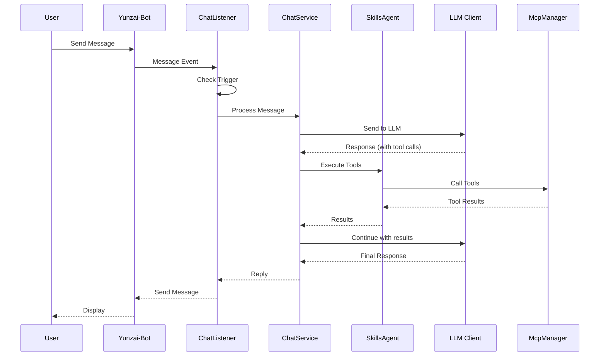
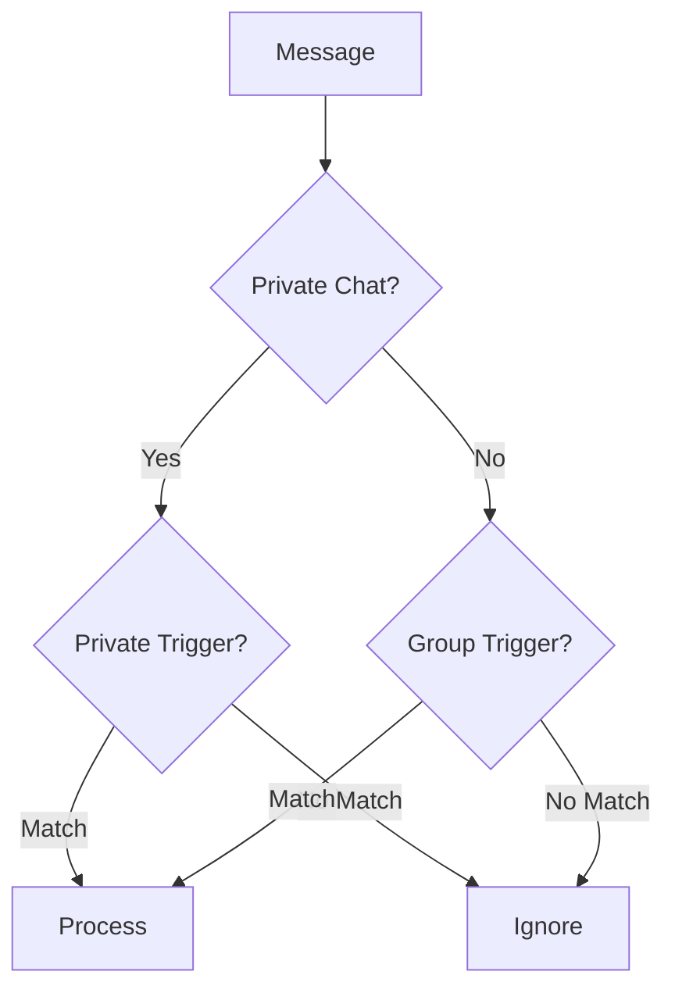
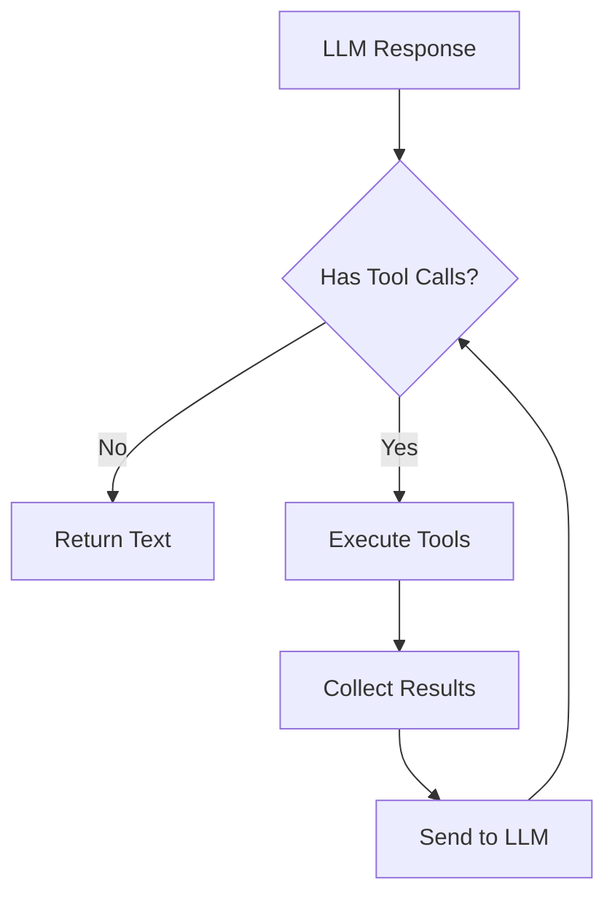
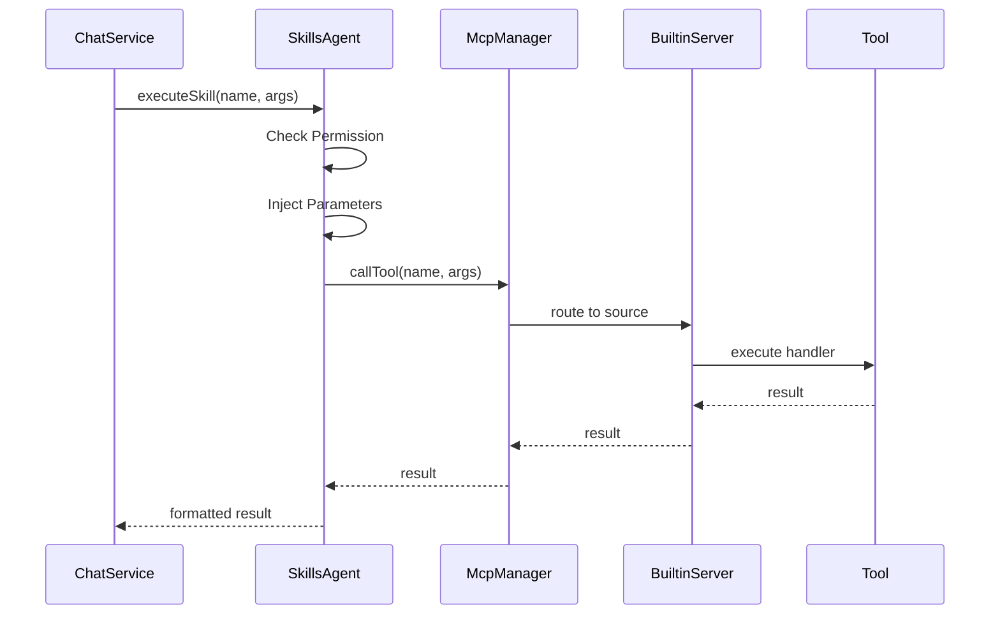
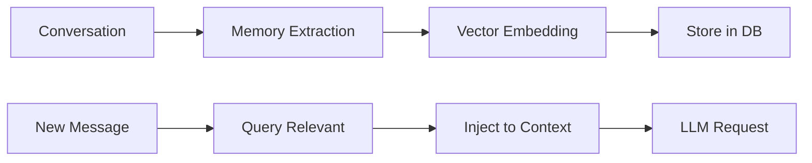
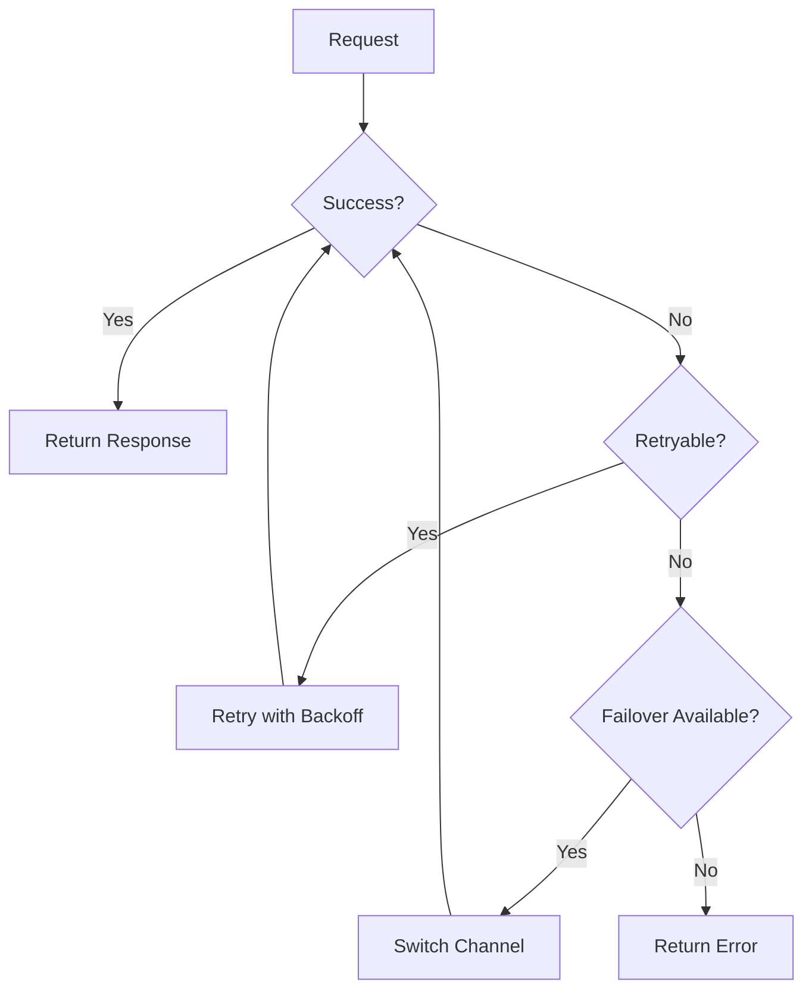

# Data Flow <Badge type="info" text="Architecture" />

How requests flow through the ChatAI Plugin system.

## Request Flow Overview {#overview}



## Message Processing {#message-processing}

### 1. Message Reception {#step-1}

```javascript
// apps/chat.js
async accept(e) {
  // Check if message should trigger AI
  if (!this.shouldTrigger(e)) return false
  
  // Process message
  await this.processMessage(e)
}
```

### 2. Trigger Check {#step-2}



### 3. Context Building {#step-3}

```javascript
// Build conversation context
const context = await contextService.getContext(userId, groupId)

// Add system prompt
const messages = [
  { role: 'system', content: preset.systemPrompt },
  ...context.messages,
  { role: 'user', content: userMessage }
]
```

### 4. LLM Request {#step-4}

```javascript
// Send to LLM with tools
const response = await llmClient.sendMessage(messages, {
  tools: availableTools,
  temperature: config.temperature,
  maxTokens: config.maxTokens
})
```

### 5. Tool Execution {#step-5}



### 6. Response Delivery {#step-6}

```javascript
// Format and send response
const reply = formatResponse(response)
await e.reply(reply)

// Save to context
await contextService.addMessage(userId, groupId, {
  role: 'assistant',
  content: response.text
})
```

## Tool Call Flow {#tool-flow}



## Memory Flow {#memory-flow}



## Error Handling {#errors}



## Next Steps {#next}

- [LLM Adapters](./adapters) - Model integration
- [MCP System](./mcp) - Tool protocol
