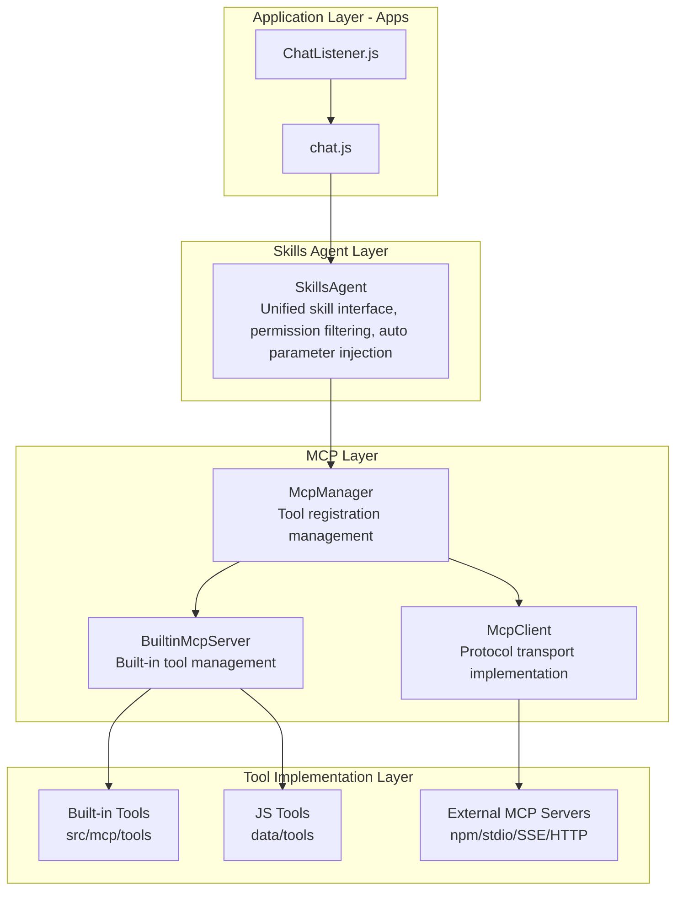

# Architecture Overview <Badge type="info" text="Developer" />

ChatAI Plugin uses **modular layered architecture** design, implementing tool calling system based on MCP standard.

::: tip Before Reading
It's recommended to understand [MCP (Model Context Protocol)](https://modelcontextprotocol.io/) basics first.
:::

## Architecture Diagram {#architecture-diagram}



## Core Concepts {#core-concepts}

### Three-Layer Architecture {#three-layers}

::: info Layered Design Principle
Each layer only depends on lower layers, not upper layers, ensuring module decoupling and testability.
:::

| Layer | Description | Main Modules | Responsibility |
|:------|:------------|:-------------|:---------------|
| **Application** | Message handling, command response | `apps/`, `ChatListener` | Receive Yunzai message events, route to handlers |
| **Service** | Business logic, API services | `services/`, `agent/` | LLM calls, context management, tool orchestration |
| **Core** | Infrastructure, adapters | `core/`, `mcp/` | Multi-model adaptation, MCP protocol, cache storage |

### MCP System {#mcp-system}

::: tip MCP Protocol
**MCP (Model Context Protocol)** is an open standard by Anthropic for defining AI-tool interactions.
:::

| Component | File | Responsibility |
|:----------|:-----|:---------------|
| **McpManager** | `src/mcp/McpManager.js` | Unified management of all tool sources, provides registration, query, call interfaces |
| **McpClient** | `src/mcp/McpClient.js` | MCP protocol client, supports stdio/npm/SSE/HTTP transports |
| **BuiltinMcpServer** | `src/mcp/BuiltinMcpServer.js` | Built-in tool server, manages 20 tool categories and custom JS tools |

### Skills Agent {#skills-agent}

**Skills Agent** is the business abstraction layer above MCP, defined in `src/services/agent/SkillsAgent.js`:

| Function | Description |
|:---------|:------------|
| **Unified Skill Interface** | Integrates all tool sources into unified "skill" concept |
| **Permission Filtering** | Filters available tools based on user/group permissions |
| **Auto Parameter Injection** | Auto-injects user_id, group_id and other context parameters |
| **Preset Level Control** | Supports preset-level tool whitelist/blacklist |

## Directory Structure {#directory-structure}

::: details Full Directory Structure (click to expand)
```
chatgpt-plugin/
├── apps/                    # Application modules (Yunzai plugin entry)
│   ├── chat.js              # Main chat handler
│   ├── Commands.js          # Command handler
│   ├── Management.js        # Management commands
│   └── ...                  # Other functional modules
├── config/                  # Configuration management
├── data/                    # Runtime data
│   ├── presets/             # Preset files
│   ├── tools/               # Custom JS tools
│   ├── mcp-servers.json     # MCP server configuration
│   └── chatai.db            # SQLite database
├── src/
│   ├── core/                # Core layer
│   │   ├── adapters/        # LLM adapters
│   │   │   ├── AbstractClient.js  # Abstract base class
│   │   │   ├── openai/      # OpenAI client
│   │   │   ├── claude/      # Claude client
│   │   │   └── gemini/      # Gemini client
│   │   ├── types/           # Type definitions
│   │   └── utils/           # Utility functions
│   ├── mcp/                 # MCP system
│   │   ├── McpManager.js    # MCP manager
│   │   ├── McpClient.js     # MCP client
│   │   ├── BuiltinMcpServer.js  # Built-in tool server
│   │   └── tools/           # Built-in tools (20 categories)
│   └── services/            # Service layer
│       ├── agent/           # Skills Agent
│       ├── llm/             # LLM service
│       ├── storage/         # Storage service
│       ├── routes/          # API routes
│       └── webServer.js     # Web service
└── index.js                 # Plugin entry
```
:::

**Core Directory Reference:**

| Directory | Description | Key Files |
|:----------|:------------|:----------|
| `apps/` | Yunzai plugin entry | `chat.js` main chat handler |
| `src/core/adapters/` | LLM adapters | `AbstractClient.js` base class |
| `src/mcp/` | MCP system | `McpManager.js` tool management |
| `src/services/` | Service layer | `llm/`, `agent/`, `storage/` |
| `data/tools/` | Custom tools | User JS tool scripts |

## Core Components {#core-components}

::: info Component Dependencies
Components listed in dependency order, upper components depend on lower ones.
:::

| Component | File | Responsibility | Layer |
|:----------|:-----|:---------------|:-----:|
| **AbstractClient** | `src/core/adapters/AbstractClient.js` | LLM adapter base class, tool call parsing | Core |
| **OpenAIClient** | `src/core/adapters/openai/OpenAIClient.js` | OpenAI/compatible API client | Core |
| **McpManager** | `src/mcp/McpManager.js` | Tool registration, query, call management | Core |
| **McpClient** | `src/mcp/McpClient.js` | MCP protocol client (stdio/npm/SSE/HTTP) | Core |
| **BuiltinMcpServer** | `src/mcp/BuiltinMcpServer.js` | Built-in tool server, context management, hot reload | Core |
| **SkillsAgent** | `src/services/agent/SkillsAgent.js` | Skill agent, permission control, parameter injection | Service |
| **ToolFilterService** | `src/services/tools/ToolFilterService.js` | Tool filtering, blacklist/whitelist | Service |

## Design Principles {#design-principles}

| Principle | Description | Implementation |
|:----------|:------------|:---------------|
| 🧩 **Modular** | Decoupled features, independent maintenance | Each module in separate directory with clear exports |
| 🔌 **Extensible** | Support custom tools and adapters | Abstract base classes + plugin mechanism |
| 📋 **Standardized** | Follow MCP protocol spec | Implement MCP standard interfaces |
| 🔒 **Secure** | Complete permission control mechanism | Multi-layer permission filtering, dangerous command interception |

## Detailed Documentation {#detailed-docs}

::: tip 📚 Deep Dive into Each Module
:::

| Document | Content | Recommended |
|:---------|:--------|:-----------:|
| [Layered Architecture](./layers) | Detailed layer structure explanation | ⭐⭐ |
| [MCP System](./mcp) | MCP protocol implementation details | ⭐⭐⭐ |
| [Skills Agent](./skills-agent) | Skill agent system | ⭐⭐ |
| [Data Flow](./data-flow) | Request processing flow | ⭐⭐⭐ |
| [LLM Adapters](./adapters) | Multi-model adaptation implementation | ⭐⭐⭐ |
| [Storage System](./storage) | Data persistence solution | ⭐⭐ |
