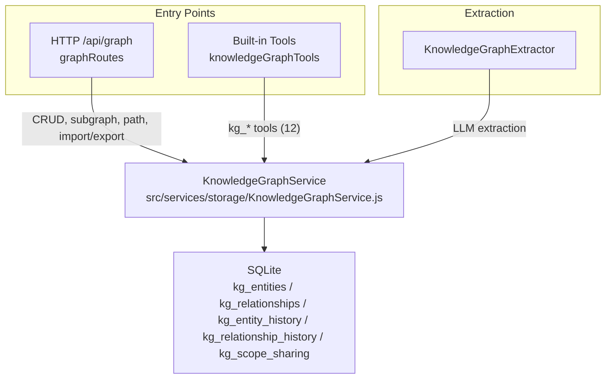
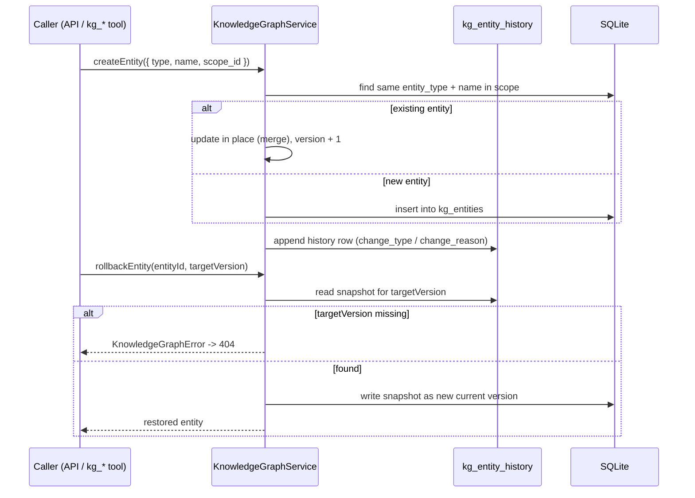

# Knowledge Graph Service <Badge type="info" text="Architecture" />

## Positioning

`KnowledgeGraphService` (`src/services/storage/KnowledgeGraphService.js`) provides CRUD for entities and relationships, version history, subgraph/path queries, and scope sharing.

The HTTP surface is mounted at `/api/graph` (see [Knowledge Graph API](/en/api/graph)); the model-facing side lives in the built-in tool category `knowledgeGraph` (see [Built-in Tools](/en/tools/builtin#knowledge-graph-tools-kg_)), and extraction is done by `KnowledgeGraphExtractor` in the same directory.

## Data Model

SQLite tables (initialized by `DatabaseService`):

| Table | Purpose |
|:------|:--------|
| `kg_entities` | Entities (`entity_id`, `entity_type`, `name`, `scope_id`, `properties`, `version`) |
| `kg_relationships` | Relationships (`relationship_id`, `from_entity_id`, `to_entity_id`, `relation_type`, `scope_id`, `properties`, `version`) |
| `kg_entity_history` | Entity version history (rollback basis) |
| `kg_relationship_history` | Relationship version history |
| `kg_scope_sharing` | Scope sharing (global / inherited) |

Entities read back with `entityType` (the create request uses `type`). Entity and relationship
identifiers use the `<scopeId>:entity:<uuid>` form. Scopes support `global`,
`user:<id>`, `group:<id>`, and `group:<gid>:user:<uid>`.

## Service Capabilities

| Method group | Methods |
|:-------------|:--------|
| Entities | `createEntity` / `getEntity` / `listEntities` / `searchEntities` / `countEntities` / `updateEntity` / `deleteEntity` |
| Relationships | `createRelationship` / `getRelationship` / `updateRelationship` / `deleteRelationship` / `getEntityRelationships` |
| Versions | `getEntityHistory` / `hasEntityVersion` / `rollbackEntity`; same-name methods on the relationship side |
| Graph queries | `querySubgraph` (depth / node / edge caps), `pathQuery` (shortest path, `relationTypes` filter), `getKnowledgeContext` (user context) |
| Scopes | `listScopes` / `getScopeStats` |
| Import / export | `exportGraph` / `importGraph` (validates `schemaVersion` / `truncated` / `counts` consistency), `iterateScopeEntities` / `iterateScopeRelationships` (streaming export) |

## Key Semantics

- **Same-name merge**: saving an entity with the same `entity_type` + `name` within the same scope merges updates instead of creating a duplicate.
- **Delete keeps history**: deleting an entity first cleans up its relationships, then marks it gone; history versions are kept and can be restored as a new current version via `POST /api/graph/entities/:id/rollback` (version increments).
- **Rollback implementation**: the target snapshot is written back as a new change, not by moving the version number backwards.
- **Domain errors**: the service throws `KnowledgeGraphError(message, statusCode)`; routes map `statusCode` to HTTP statuses (400/404), unknown exceptions become 500 without leaking internals.
- **Visualization summary**: `getVisualization(scopeId, { limit, focusEntityId })` returns a capped graph with `totalEntities` / `totalRelationships` / `truncated`.

## Extraction Side

`KnowledgeGraphExtractor` uses an LLM to extract structured knowledge from conversations. The entity type set is `person` / `thing` / `place` / `concept` / `event` (defined in `ENTITY_TYPES`, `src/services/storage/KnowledgeGraphExtractor.js`).

The model-side `kg_*` tools (`src/mcp/tools/knowledgeGraph.js`, 12 tools exported as `knowledgeGraphTools`) and `/api/graph` share the same service instance (`knowledgeGraphService`, a singleton exported at the bottom of `KnowledgeGraphService.js`).

| Tool | Purpose |
|:-----|:--------|
| `kg_get_knowledge` | Knowledge context for the current user/group |
| `kg_list_entities` | List entities in a scope |
| `kg_search_entities` | Fuzzy-search entities by name |
| `kg_save_entity` / `kg_update_entity` / `kg_delete_entity` | Entity write/update/delete (delete keeps history) |
| `kg_entity_history` / `kg_entity_relations` | History and direct neighbors |
| `kg_save_relation` / `kg_delete_relation` | Relationship maintenance |
| `kg_query_subgraph` | Bounded subgraph query |
| `kg_stats` | Scope statistics |

## Next Steps

- [Knowledge Graph API](/en/api/graph) - HTTP endpoints
- [Built-in Tools](/en/tools/builtin) - `kg_*` tool reference
- [Memory System](./memory) - Structured user memory