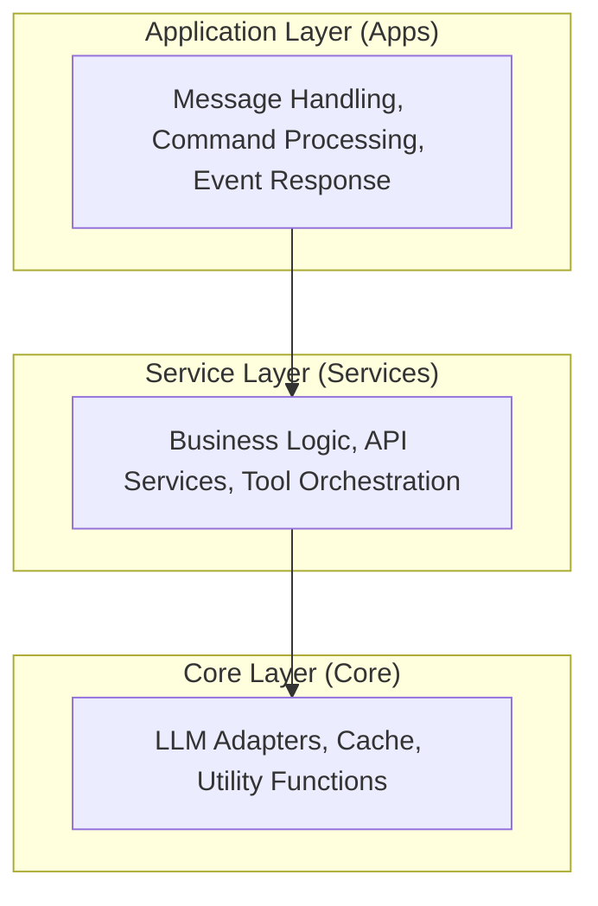
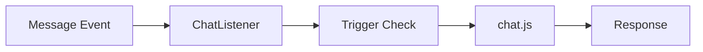
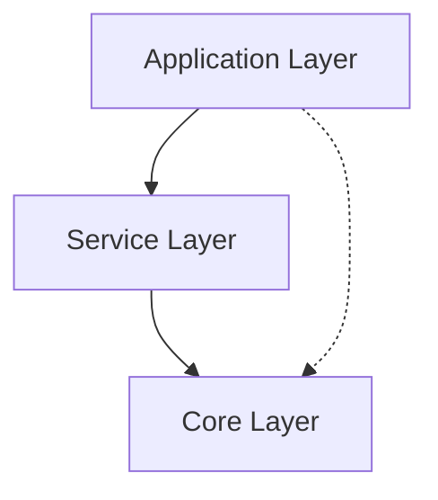
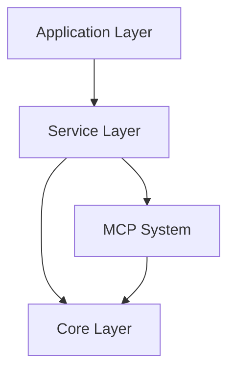

# Layered Architecture <Badge type="info" text="Design" />

ChatAI Plugin adopts a three-layer architecture: Application, Service, and Core layers.

## Architecture Overview {#overview}



## Application Layer {#application}

**Location:** `apps/`

Handles Yunzai-Bot message events and command routing.

| Module | Responsibility |
|:-------|:---------------|
| `chat.js` | Main chat handler |
| `Commands.js` | Command processing |
| `Management.js` | Admin commands |
| `ChatListener.js` | Event listener |
| `GroupEvents.js` | Group event handling |

### Processing Flow



### Code Example

```javascript
// apps/ChatListener.js
export class ChatListener extends plugin {
  constructor() {
    super({
      name: 'ChatAI-Listener',
      event: 'message',
      priority: 100
    })
  }

  async accept(e) {
    // Trigger condition check
    if (!this.shouldTrigger(e)) return false
    
    // Call chat handler
    return await handleChat(e)
  }
}
```

## Service Layer {#service}

**Location:** `src/services/`

Contains business logic and API services.

| Service | Directory | Responsibility |
|:--------|:----------|:---------------|
| LLM Service | `services/llm/` | AI model calls |
| Agent Service | `services/agent/` | Skills orchestration |
| Storage Service | `services/storage/` | Data persistence |
| Web Service | `services/webServer.js` | HTTP API |
| Routes | `services/routes/` | API route definitions |

### ChatService

```javascript
// services/llm/ChatService.js
export class ChatService {
  async chat(options) {
    const { messages, model, tools } = options
    
    // 1. Get adapter
    const adapter = this.getAdapter(model)
    
    // 2. Build request
    const request = this.buildRequest(messages, tools)
    
    // 3. Send request
    const response = await adapter.chat(request)
    
    // 4. Handle tool calls
    if (response.toolCalls) {
      return await this.handleToolCalls(response)
    }
    
    return response
  }
}
```

### SkillsAgent

```javascript
// services/agent/SkillsAgent.js
export class SkillsAgent {
  // Get executable skills
  getExecutableSkills() {
    // Apply permission filtering
    return this.filterByPermission(this.allTools)
  }
  
  // Execute skill
  async execute(skillName, args) {
    // Permission check
    this.checkPermission(skillName)
    
    // Auto-fill parameters
    args = this.fillAutoParams(args)
    
    // Call MCP
    return await McpManager.callTool(skillName, args)
  }
}
```

## Core Layer {#core}

**Location:** `src/core/`, `src/mcp/`

Infrastructure and protocol implementations.

| Module | Responsibility |
|:-------|:---------------|
| `adapters/` | LLM client adapters |
| `McpManager` | Tool management |
| `McpClient` | MCP protocol |
| `BuiltinMcpServer` | Built-in tools |
| `cache/` | Caching layer |

```javascript
// core/adapters/AbstractClient.js
class AbstractClient {
  async sendMessage(messages, options) {
    // Abstract method
  }
  
  parseToolCalls(response) {
    // Parse tool calls from response
  }
}
```

## Layer Dependencies {#dependencies}



**Rules:**
- Upper layers depend on lower layers
- Lower layers never depend on upper layers
- Cross-layer calls should go through interfaces

## Module Dependencies {#module-dependencies}



## Extension Points {#extension}

| Extension Point | Location | Description |
|:----------------|:---------|:------------|
| LLM Adapters | `core/adapters/` | Support new AI models |
| Built-in Tools | `src/mcp/tools/` | Add new tool categories |
| Custom Tools | `data/tools/` | User-defined tools |
| API Routes | `services/routes/` | Extend API endpoints |

## Benefits {#benefits}

| Benefit | Description |
|:--------|:------------|
| **Separation** | Clear responsibility boundaries |
| **Testability** | Layers can be tested independently |
| **Flexibility** | Easy to replace implementations |
| **Maintainability** | Changes isolated to specific layers |

## Next Steps {#next}

- [Data Flow](./data-flow) - Request processing flow
- [MCP System](./mcp) - Tool protocol implementation
- [Skills Agent](./skills-agent) - Skills orchestration details
