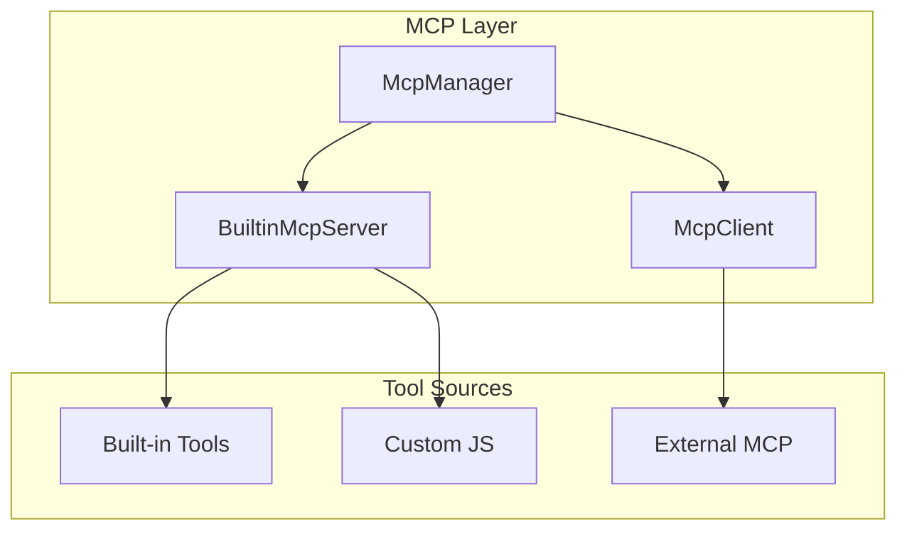

# MCP System <Badge type="info" text="Core" />

Model Context Protocol implementation for AI tool calling.

## Overview {#overview}

**MCP (Model Context Protocol)** is an open standard by Anthropic for AI-tool interactions.



## Core Components {#components}

| Component | File | Responsibility |
|:----------|:-----|:---------------|
| **McpManager** | `src/mcp/McpManager.js` | Tool registration and routing |
| **McpClient** | `src/mcp/McpClient.js` | MCP protocol client |
| **BuiltinMcpServer** | `src/mcp/BuiltinMcpServer.js` | Built-in tool management |

## McpManager {#mcp-manager}

Central hub for all tool sources:

```javascript
class McpManager {
  // Register tool source
  registerToolSource(source) { }
  
  // List all available tools
  async listTools() { }
  
  // Call a tool
  async callTool(name, args, context) { }
}
```

## McpClient {#mcp-client}

Supports multiple transport protocols:

| Transport | Description | Use Case |
|:----------|:------------|:---------|
| **stdio** | Process stdin/stdout | Local CLI tools |
| **npm** | npm package with npx | npm MCP servers |
| **SSE** | Server-Sent Events | Remote servers |
| **HTTP** | HTTP requests | REST APIs |

## BuiltinMcpServer {#builtin-server}

Manages built-in tools with features:

- **Hot Reload** - Update tools without restart
- **Category Management** - Enable/disable by category
- **Context Injection** - Provide runtime context to tools

## Tool Context {#tool-context}

`ToolContext` provides runtime info to tools:

```javascript
const ctx = getBuiltinToolContext()

ctx.getBot()        // Bot instance
ctx.getEvent()      // Message event
ctx.isMaster        // Is master user
ctx.getAdapter()    // Adapter info
```

## Configuration {#config}

```json
// data/mcp-servers.json
{
  "servers": {
    "filesystem": {
      "command": "npx",
      "args": ["-y", "@anthropic/mcp-server-filesystem"]
    }
  }
}
```

## Next Steps {#next}

- [Built-in Tools](/en/tools/builtin) - Tool categories
- [Skills Agent](./skills-agent) - Permission control
