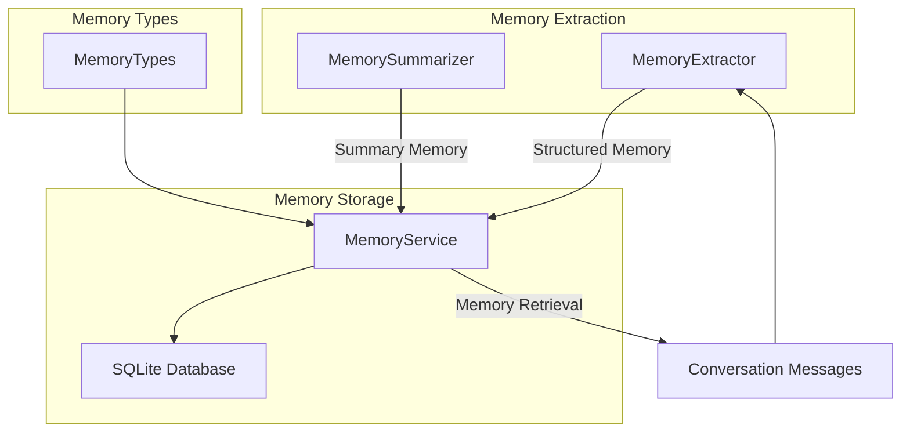
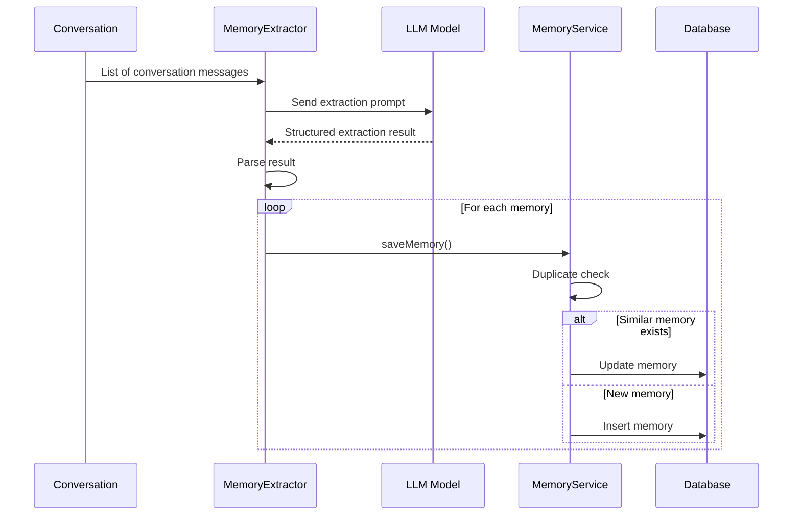
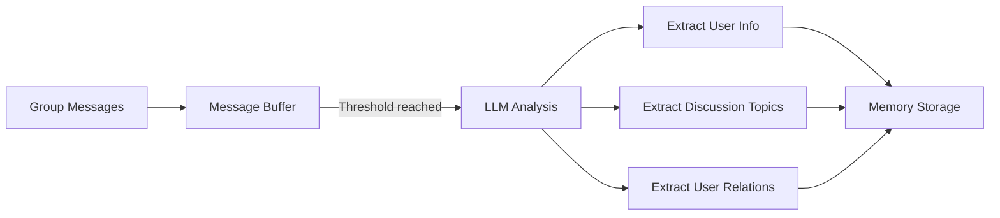

# Memory System Architecture <Badge type="info" text="Architecture" />

The long-term memory system lets AI remember user information across conversations, providing a more personalized experience.

::: tip 📚 Related Docs
- **User Guide**: [Memory System Guide](/guide/memory) - How to use the memory features
- **Config Reference**: [Memory Config](/config/memory) - Detailed configuration options
:::

## Overview {#overview}



## Core Components

### MemoryService

The service class that manages all memory operations.

```javascript
import { memoryService } from './services/memory/MemoryService.js'

// Save a memory
await memoryService.saveMemory({
  userId: '123456',
  groupId: '789',           // optional
  category: 'profile',      // category
  subType: 'name',          // sub-type
  content: 'User is called Xiao Ming',
  confidence: 0.9,          // confidence 0-1
  source: 'auto'            // source
})

// Query memories
const memories = await memoryService.getMemories('123456', {
  category: 'profile',
  limit: 10
})

// Search memories
const results = await memoryService.searchMemories('123456', 'likes')
```

### MemoryExtractor

Automatically extracts user information from conversations.

```javascript
import { memoryExtractor } from './services/memory/MemoryExtractor.js'

// Set the LLM client
memoryExtractor.setLLMClient(llmClient)

// Extract memories
const extracted = await memoryExtractor.extract('123456', messages)
// Returns: [{ category, subType, content, confidence }, ...]
```

### MemorySummarizer

Periodically generates conversation summaries.

```javascript
import { memorySummarizer } from './services/memory/MemorySummarizer.js'

// Generate a group chat summary
const summary = await memorySummarizer.summarizeGroupChat(groupId, messages)
```

## Memory Categories

The system uses structured categories to manage memories:

| Category | Key | Description | Sub-types |
|:---------|:----|:------------|:----------|
| **Basic Information** | `profile` | User's personal info | name, age, gender, location, occupation, education, contact |
| **Preferences & Habits** | `preference` | Likes and habits | like, dislike, hobby, habit, food, style |
| **Important Events** | `event` | Dates and plans | birthday, anniversary, plan, milestone, schedule |
| **Relationships** | `relation` | Social relations | family, friend, colleague, partner, pet |
| **Topic Interests** | `topic` | Discussed topics | interest, discussed, knowledge |
| **Custom** | `custom` | Extended types | - |

### Category Definitions

```javascript
import {
  MemoryCategory,
  ProfileSubType,
  PreferenceSubType,
  getCategoryLabel,
  getSubTypeLabel
} from './services/memory/MemoryTypes.js'

// Using categories
const memory = {
  category: MemoryCategory.PROFILE,
  subType: ProfileSubType.NAME,
  content: 'User is called Xiao Ming'
}

// Get localized labels
getCategoryLabel('profile')  // 'Basic Information'
getSubTypeLabel('name')      // 'Name'
```

## Data Storage

### Database Table Structure

```sql
CREATE TABLE structured_memories (
  id INTEGER PRIMARY KEY AUTOINCREMENT,
  user_id TEXT NOT NULL,
  group_id TEXT,
  category TEXT NOT NULL,
  sub_type TEXT,
  content TEXT NOT NULL,
  confidence REAL DEFAULT 0.8,
  source TEXT DEFAULT 'auto',
  metadata TEXT,
  created_at INTEGER NOT NULL,
  updated_at INTEGER NOT NULL
);

CREATE INDEX idx_memories_user ON structured_memories(user_id);
CREATE INDEX idx_memories_category ON structured_memories(category);
```

### Memory Object Structure

```typescript
interface Memory {
  id: number
  userId: string
  groupId?: string
  category: string      // profile | preference | event | relation | topic | custom
  subType?: string      // Sub-type
  content: string       // Memory content
  confidence: number    // Confidence 0-1
  source: string        // auto | manual | import | summary | migration
  metadata?: object     // Extra metadata
  createdAt: number     // Created timestamp
  updatedAt: number     // Updated timestamp
}
```

## Extraction Flow



### Extraction Prompt

The system uses a dedicated prompt to guide the LLM in extracting memories:

```
You are a memory extraction assistant, responsible for extracting the user's key information from conversations.

[Task] Analyze the conversation and extract the user's personal information with categories.

[Output Format] One memory per line, formatted as [category:subtype] content

[Example Output]
[profile:name] User is called Xiao Ming
[profile:age] 25 years old
[preference:like] Likes playing games
[event:birthday] Birthday is March 15
```

## Deduplication

Similar content is automatically detected when saving a memory:

```javascript
// Internal logic of MemoryService.saveMemory()
const existing = this.findSimilarMemory(userId, category, content, groupId)
if (existing) {
  // Update the existing memory, keeping the higher confidence
  return this.updateMemory(existing.id, {
    content,
    confidence: Math.max(existing.confidence, confidence),
    updatedAt: now
  })
}
// Insert a new memory
```

## Memory Retrieval

### Basic Queries

```javascript
// Query by category
const profiles = await memoryService.getMemories(userId, {
  category: 'profile'
})

// Query by sub-type
const likes = await memoryService.getMemories(userId, {
  category: 'preference',
  subType: 'like'
})

// Paginated query
const memories = await memoryService.getMemories(userId, {
  limit: 20,
  offset: 0
})
```

### Search

```javascript
// Keyword search
const results = await memoryService.searchMemories(userId, 'games')

// With category filter
const hobbies = await memoryService.searchMemories(userId, 'games', {
  category: 'preference'
})
```

## Injecting into Conversations

Memories are injected into AI conversations through the System Prompt:

```javascript
// Build memory context
const memories = await memoryService.getMemories(userId, { limit: 20 })
const memoryText = memories.map(m => `- ${m.content}`).join('\n')

const systemPrompt = `
You are chatting with the user. Here are the memories about this user:

${memoryText}

Please personalize your replies based on this information.
`
```

## Group Chat Context

The group chat memory collection system:



### Configuration

```yaml
memory:
  groupContext:
    enabled: true
    collectInterval: 10       # Collection interval (minutes)
    maxMessagesPerCollect: 50 # Max messages per collection
    analyzeThreshold: 20      # Message count triggering analysis
    extractUserInfo: true     # Extract user info
    extractTopics: true       # Extract topics
    extractRelations: true    # Extract relations
```

## Migration Support

Migrate memories from the old format:

```javascript
import { migrateMemories } from './services/memory/migration.js'

// Migrate a user's memories
await migrateMemories(userId)
```

## API Endpoints

### REST API

| Endpoint | Method | Description |
|:---------|:-------|:------------|
| `/api/memory/:userId` | GET | Get a user's memories |
| `/api/memory/:userId` | POST | Add a memory |
| `/api/memory/:userId/:id` | PUT | Update a memory |
| `/api/memory/:userId/:id` | DELETE | Delete a memory |
| `/api/memory/:userId/search` | GET | Search memories |
| `/api/memory/:userId/tree` | GET | Get tree structure |

### Example Requests

```bash
# Get a user's memories
curl http://localhost:3000/api/memory/123456?category=profile

# Add a memory
curl -X POST http://localhost:3000/api/memory/123456 \
  -H "Content-Type: application/json" \
  -d '{
    "category": "preference",
    "subType": "like",
    "content": "Likes programming"
  }'
```

## Next Steps

- [Storage System](./storage) - Database services
- [Data Flow](./data-flow) - Complete request flow
- [Memory Config](/config/memory) - Configuration options