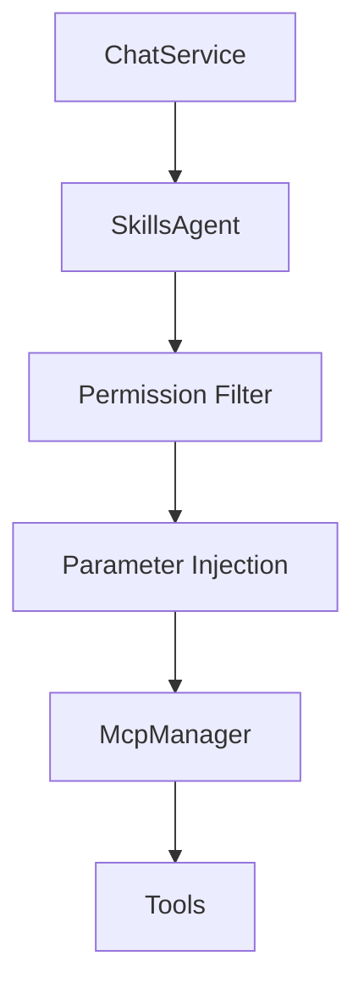
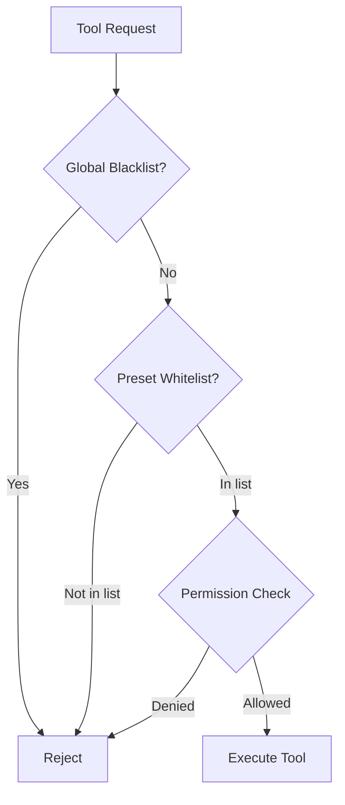

# Skills Agent <Badge type="info" text="Core" />

Business abstraction layer for tool management.

## Overview {#overview}

Skills Agent sits between the chat service and MCP layer, providing:
- Unified skill interface
- Permission filtering
- Parameter injection
- Preset-level control



## Core Functions {#functions}

### Unified Interface {#unified}

Combines all tool sources into "skills":

```javascript
class SkillsAgent {
  // Get available skills for context
  async getAvailableSkills(context) { }
  
  // Execute a skill
  async executeSkill(name, args, context) { }
}
```

### Permission Filtering {#permissions}

Filters tools based on user permissions:

```javascript
// Check if user can use tool
const canUse = await skillsAgent.checkPermission(
  toolName,
  userId,
  groupId
)
```

Permission levels:
| Level | Access |
|:------|:-------|
| `everyone` | All users |
| `member` | Group members |
| `admin` | Group admins |
| `master` | Bot owners |

### Parameter Injection {#injection}

Auto-injects context parameters:

```javascript
// Original tool call
{ name: 'send_message', args: { text: 'Hello' } }

// After injection
{ 
  name: 'send_message', 
  args: { 
    text: 'Hello',
    user_id: '123456789',    // Injected
    group_id: '987654321'    // Injected
  } 
}
```

## Configuration {#config}

```yaml
skills:
  # Tool filtering
  blacklist:
    - dangerous_tool
  whitelist: []           # Empty = allow all
  
  # Permission overrides
  permissions:
    shell_execute:
      level: master
    send_message:
      level: member
```

## Preset Integration {#presets}

Presets can control available tools:

```yaml
# data/presets/safe.yaml
name: safe
tools:
  whitelist:
    - basic
    - search
  blacklist:
    - admin
    - shell
```

## API Reference {#api}

### SkillsAgent Class

```javascript
import { skillsAgent } from './services/agent/SkillsAgent.js'

// Get skills for user
const skills = await skillsAgent.getAvailableSkills({
  userId: '123456789',
  groupId: '987654321',
  preset: 'default'
})

// Execute skill
const result = await skillsAgent.executeSkill(
  'get_time',
  { format: 'full' },
  context
)
```

## Tool Filtering Flow {#flow}



## Next Steps {#next}

- [MCP System](./mcp) - Tool protocol
- [Data Flow](./data-flow) - Request processing
