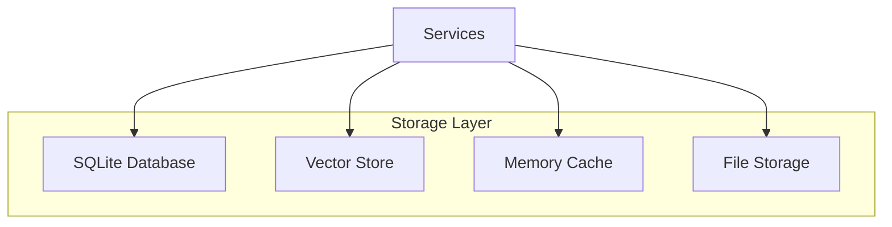

# Storage System <Badge type="info" text="Core" />

Data persistence and caching architecture.

## Overview {#overview}



## SQLite Database {#sqlite}

Primary relational storage using `better-sqlite3`.

### Tables

| Table | Purpose |
|:------|:--------|
| `conversations` | Chat history |
| `messages` | Individual messages |
| `users` | User settings |
| `groups` | Group configurations |
| `presets` | AI presets |
| `tool_logs` | Tool call logs |

### Usage

```javascript
import Database from 'better-sqlite3'

const db = new Database('data/chatai.db')

// Query
const user = db.prepare('SELECT * FROM users WHERE id = ?').get(userId)

// Insert
db.prepare('INSERT INTO messages (content, role) VALUES (?, ?)')
  .run(content, role)
```

## Vector Store {#vector}

For semantic memory search.

```javascript
class VectorStore {
  // Store embedding
  async store(id, text, embedding) {
    await this.db.run(
      'INSERT INTO vectors (id, text, embedding) VALUES (?, ?, ?)',
      [id, text, JSON.stringify(embedding)]
    )
  }

  // Similarity search
  async search(queryEmbedding, limit = 5) {
    const vectors = await this.db.all('SELECT * FROM vectors')
    return vectors
      .map(v => ({
        ...v,
        similarity: this.cosineSimilarity(queryEmbedding, v.embedding)
      }))
      .sort((a, b) => b.similarity - a.similarity)
      .slice(0, limit)
  }
}
```

## Memory Cache {#cache}

In-memory caching for performance.

```javascript
class CacheService {
  constructor() {
    this.cache = new Map()
    this.ttl = 60000  // 1 minute default
  }

  get(key) {
    const item = this.cache.get(key)
    if (!item) return null
    if (Date.now() > item.expires) {
      this.cache.delete(key)
      return null
    }
    return item.value
  }

  set(key, value, ttl = this.ttl) {
    this.cache.set(key, {
      value,
      expires: Date.now() + ttl
    })
  }
}
```

## File Storage {#files}

For presets, tools, and configurations.

```
data/
├── chatai.db          # SQLite database
├── presets/           # Preset YAML files
├── tools/             # Custom JS tools
├── mcp-servers.json   # MCP config
└── backups/           # Automatic backups
```

## Backup System {#backup}

```javascript
class BackupService {
  async createBackup() {
    const timestamp = Date.now()
    const backupPath = `data/backups/backup-${timestamp}.db`
    
    await fs.copyFile('data/chatai.db', backupPath)
    
    // Keep only last 5 backups
    await this.cleanOldBackups()
  }
}
```

## Configuration {#config}

```yaml
storage:
  database: ./data/chatai.db
  backups:
    enabled: true
    maxCount: 5
    interval: 86400000  # Daily
```

## Next Steps {#next}

- [Data Flow](./data-flow) - Request processing
- [Chat Service](./chat-service) - Message handling
