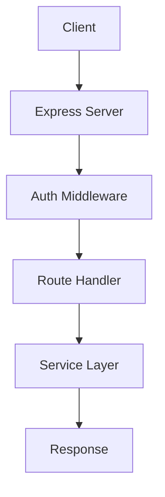

# Web Server <Badge type="info" text="Service" />

REST API and Web Admin Panel server.

## Overview {#overview}

WebServer provides HTTP API and serves the admin panel.



## Architecture {#architecture}

```javascript
class WebServer {
  constructor() {
    this.app = express()
    this.setupMiddleware()
    this.setupRoutes()
  }

  setupMiddleware() {
    this.app.use(cors())
    this.app.use(express.json())
    this.app.use(authMiddleware)
    this.app.use(rateLimiter)
  }

  setupRoutes() {
    this.app.use('/api/auth', authRoutes)
    this.app.use('/api/config', configRoutes)
    this.app.use('/api/tools', toolRoutes)
    this.app.use('/api/mcp', mcpRoutes)
  }
}
```

## Route Modules {#routes}

| Route | File | Description |
|:------|:-----|:------------|
| `/api/auth` | `auth.js` | Authentication |
| `/api/config` | `config.js` | Configuration |
| `/api/channels` | `channels.js` | Channel management |
| `/api/tools` | `tools.js` | Tool management |
| `/api/mcp` | `mcp.js` | MCP servers |
| `/api/conversations` | `conversations.js` | Chat history |

## Authentication {#auth}

JWT-based authentication:

```javascript
const authMiddleware = (req, res, next) => {
  const token = req.cookies.auth_token || 
                req.headers.authorization?.replace('Bearer ', '')
  
  if (!token) {
    return res.status(401).json({ error: 'Unauthorized' })
  }
  
  try {
    req.user = jwt.verify(token, SECRET)
    next()
  } catch {
    res.status(401).json({ error: 'Invalid token' })
  }
}
```

## Response Format {#response}

Unified response wrapper:

```javascript
const sendSuccess = (res, data) => {
  res.json({ success: true, data })
}

const sendError = (res, error, code = 400) => {
  res.status(code).json({ 
    success: false, 
    error: error.message,
    code: error.code 
  })
}
```

## Rate Limiting {#rate-limit}

```javascript
const rateLimiter = rateLimit({
  windowMs: 60 * 1000,  // 1 minute
  max: 60,              // 60 requests per window
  message: { error: 'Too many requests' }
})
```

## Static Files {#static}

Serves Next.js admin panel:

```javascript
// Serve static files
app.use(express.static('resources/web'))

// SPA fallback
app.get('*', (req, res) => {
  res.sendFile('resources/web/index.html')
})
```

## Configuration {#config}

```yaml
web:
  enabled: true
  port: 3000
  host: "127.0.0.1"
```

## Next Steps {#next}

- [API Reference](/en/api/) - API documentation
- [Storage](./storage) - Data persistence
