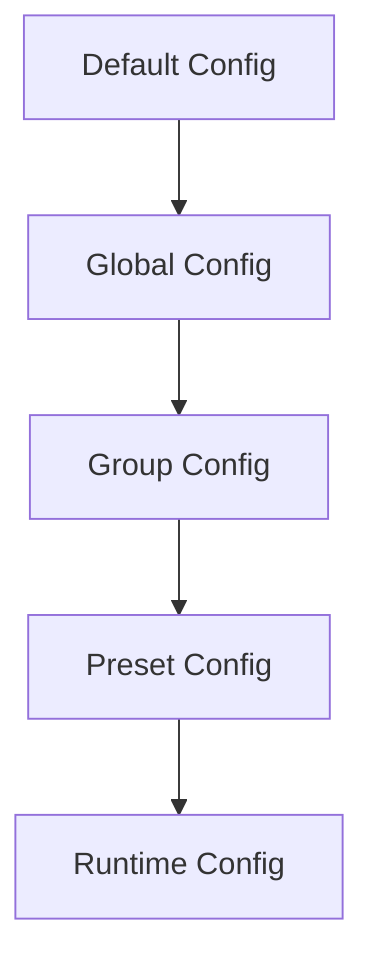

# Advanced Configuration <Badge type="warning" text="Advanced" />

This document covers advanced configuration options and techniques for users who need deep customization.

::: tip 💡 Reading Tips
Read [Basic Config](./basic) and [Channels](./channels) before this document.
:::

## Configuration Hierarchy {#config-hierarchy}

ChatAI Plugin uses a multi-layer configuration system:



Configs are merged by priority; later layers override earlier ones.

## Environment Variables

Configuration overrides via environment variables are supported:

```bash
# API Keys
export CHATAI_OPENAI_KEY=sk-xxx
export CHATAI_CLAUDE_KEY=sk-ant-xxx

# Proxy Config
export CHATAI_PROXY=http://127.0.0.1:7890
export HTTPS_PROXY=http://127.0.0.1:7890

# Debug Mode
export CHATAI_DEBUG=true
export CHATAI_LOG_LEVEL=debug
```

### Environment Variable Mapping

| Environment Variable | Config Path | Description |
|:---------------------|:------------|:------------|
| `CHATAI_OPENAI_KEY` | `channels[0].key` | OpenAI API Key |
| `CHATAI_PROXY` | `proxy.url` | Proxy address |
| `CHATAI_DEBUG` | `debug` | Debug mode |
| `CHATAI_PORT` | `server.port` | Web server port |

## Multi-Environment Config {#multi-env}

::: code-group
```yaml [config.dev.yaml Development]
debug: true
logLevel: debug

server:
  port: 3001

channels:
  - name: dev-channel
    baseUrl: http://localhost:8080/v1
    key: test-key
```

```yaml [config.prod.yaml Production]
debug: false
logLevel: info

server:
  port: 3000
  cors:
    enabled: true
    origins:
      - https://your-domain.com

rateLimit:
  enabled: true
  maxRequests: 60
```
:::

::: details 📦 Loading a specific environment config
```bash
# Specify via environment variable
export CHATAI_ENV=prod
```
:::

## Advanced Channel Config {#channel-advanced}

::: warning ⚙️ Advanced Configuration
The following config suits users with multiple API channels, enabling high availability and load balancing.
:::

### Load Balancing {#load-balance}

```yaml
channels:
  - name: openai-1
    priority: 1        # Priority; smaller number means higher priority
    weight: 3          # Weight, used for weighted round-robin
    maxConcurrent: 10  # Max concurrency

  - name: openai-2
    priority: 1
    weight: 2
    maxConcurrent: 10

  - name: backup
    priority: 2        # Backup channel
    weight: 1

loadBalance:
  strategy: weighted   # round-robin | weighted | priority | random
  healthCheck:
    enabled: true
    interval: 60       # Health check interval (seconds)
    timeout: 5         # Timeout (seconds)
```

### Failover

```yaml
channels:
  - name: primary
    priority: 1
    failover:
      enabled: true
      maxRetries: 3
      retryDelay: 1000     # Retry delay (milliseconds)
      fallbackChannel: backup

  - name: backup
    priority: 2
```

### Request Limits

```yaml
channels:
  - name: limited-channel
    rateLimit:
      requestsPerMinute: 60
      tokensPerMinute: 100000
      requestsPerDay: 1000

    quotas:
      daily: 100000      # Daily token quota
      monthly: 3000000   # Monthly token quota
      alertThreshold: 0.8  # Alert at 80%
```

## Model Aliases

Configure model aliases to simplify switching:

```yaml
models:
  aliases:
    default: gpt-4o
    fast: gpt-4o-mini
    smart: claude-3-5-sonnet-20241022
    cheap: deepseek-chat

  # Per-purpose mapping
  usage:
    chat: default
    memory: fast
    summary: fast
    embedding: text-embedding-3-small
```

Usage:

```bash
#switch model smart
```

## Advanced Trigger Config

### Regex Triggers

```yaml
triggers:
  regex:
    enabled: true
    patterns:
      - pattern: "^(help me|excuse me|can you)"
        flags: "i"
        priority: 1
      - pattern: "(AI|artificial intelligence|robot)"
        flags: "gi"
        priority: 2
```

### Contextual Triggers

```yaml
triggers:
  contextual:
    enabled: true
    # Keep responding if replied within the last N messages
    replyWindow: 5
    # Timeout (seconds)
    timeout: 300
```

### Scheduled Triggers

```yaml
triggers:
  schedule:
    enabled: true
    rules:
      - cron: "0 9 * * *"    # 9:00 every day
        action: morning_greeting
        groups: ["123456"]
      - cron: "0 22 * * *"   # 22:00 every day
        action: summary_push
```

## Content Filtering

### Input Filter

```yaml
filter:
  input:
    enabled: true
    # Sensitive word filter
    keywords:
      - sensitive word 1
      - sensitive word 2
    # Regex filter
    patterns:
      - "\\d{11}"           # Phone numbers
      - "\\d{18}"           # ID card numbers
    # Replacement rules
    replacements:
      "profanity": "[blocked]"
```

### Output Filter

```yaml
filter:
  output:
    enabled: true
    # Remove specific content
    remove:
      - " thinking"
      - " response"
    # Length limit
    maxLength: 2000
    truncateMessage: "...(content too long, truncated)"
```

## Cache Config

```yaml
cache:
  # Response cache
  response:
    enabled: true
    ttl: 3600           # Cache time (seconds)
    maxSize: 1000       # Max cached entries

  # Model list cache
  models:
    ttl: 86400          # 24 hours

  # Tool result cache
  tools:
    enabled: true
    ttl: 300
    # Cacheable tools
    cacheable:
      - get_current_time
      - get_weather
```

## Logging Config

```yaml
logging:
  level: info           # debug | info | warn | error

  # File logging
  file:
    enabled: true
    path: ./logs
    maxSize: 10M
    maxFiles: 7

  # Console logging
  console:
    enabled: true
    colorize: true

  # Request logging
  request:
    enabled: true
    includeBody: false   # Disable in production

  # Sensitive data redaction
  redact:
    - key
    - password
    - token
```

## Performance Tuning

### Concurrency Control

```yaml
performance:
  # Global concurrency limit
  maxConcurrentRequests: 50

  # Queue config
  queue:
    enabled: true
    maxSize: 100
    timeout: 30000

  # Connection pool
  connectionPool:
    maxConnections: 20
    keepAlive: true
    timeout: 30000
```

### Memory Optimization

```yaml
performance:
  memory:
    # Conversation history limit
    maxHistoryLength: 50
    # Tool log retention
    toolLogRetention: 7  # days
    # Periodic GC
    gcInterval: 3600
```

## Security Config

### CORS

```yaml
server:
  cors:
    enabled: true
    origins:
      - https://your-domain.com
      - https://admin.your-domain.com
    methods:
      - GET
      - POST
      - PUT
      - DELETE
    credentials: true
```

### Authentication Hardening

```yaml
auth:
  # JWT config
  jwt:
    secret: your-secret-key
    expiresIn: 7d

  # Login limits
  login:
    maxAttempts: 5
    lockoutDuration: 300  # seconds

  # IP whitelist
  ipWhitelist:
    enabled: false
    ips:
      - 127.0.0.1
      - 192.168.1.0/24
```

### Encrypted Storage

```yaml
security:
  encryption:
    enabled: true
    algorithm: aes-256-gcm
    # Key read from an environment variable
    keyEnv: CHATAI_ENCRYPTION_KEY
```

## Plugin System

### Custom Middleware

```yaml
middleware:
  custom:
    - path: ./plugins/my-middleware.js
      enabled: true
      config:
        option1: value1
```

```javascript
// plugins/my-middleware.js
export default {
  name: 'my-middleware',

  // Pre-request hook
  async onRequest(ctx, next) {
    console.log('Request:', ctx.path)
    await next()
  },

  // Post-response hook
  async onResponse(ctx, response) {
    return response
  }
}
```

### Event Hooks

```yaml
hooks:
  onStart:
    - ./plugins/on-start.js
  onMessage:
    - ./plugins/on-message.js
  onToolCall:
    - ./plugins/on-tool-call.js
```

## Config Validation

Validate config at startup:

```yaml
validation:
  enabled: true
  strict: false      # Strict mode: error on unknown fields

  # Required config checks
  required:
    - channels
    - server.port
```

## Config Import & Export

### Export Config

```bash
#ai导出配置
```

### Import Config

```bash
#ai导入配置 [config file path]
```

### Config Sync

```yaml
sync:
  enabled: false
  provider: git      # git | s3 | webdav
  remote: https://github.com/your/config.git
  branch: main
  interval: 3600     # Sync interval (seconds)
```

## Next Steps

- [Basic Config](./basic) - Basic configuration options
- [Channels](./channels) - Detailed channel configuration
- [Triggers](./triggers) - Trigger method configuration