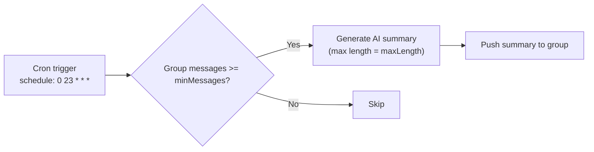
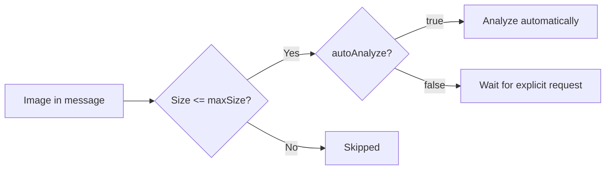
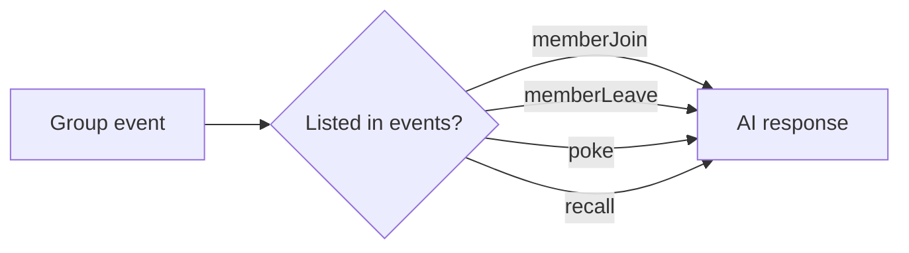

# Feature Configuration <Badge type="tip" text="Features" />

Configure advanced features and group-specific settings.

## Overview {#overview}

Features control additional functionality beyond basic chat.

## Basic Configuration {#basic}

```yaml
features:
  groupSummary: true      # Daily group summaries
  groupPortrait: true     # Group member portraits
  welcomeMessage: true    # New member welcome
  eventResponse: true     # Respond to events
```

## Feature Options {#options}

| Feature | Type | Default | Description |
|:--------|:-----|:--------|:------------|
| `groupSummary` | boolean | `false` | Generate daily summaries |
| `groupPortrait` | boolean | `false` | Analyze group dynamics |
| `welcomeMessage` | boolean | `false` | Welcome new members |
| `eventResponse` | boolean | `false` | Respond to group events |
| `imageRecognition` | boolean | `true` | Analyze images |
| `voiceRecognition` | boolean | `false` | Transcribe voice |

## Group Summary {#group-summary}

Automatic daily group chat summaries:

```yaml
features:
  groupSummary:
    enabled: true
    schedule: "0 23 * * *"  # Daily at 11 PM
    minMessages: 50          # Min messages required
    maxLength: 500           # Summary max length
```



## Welcome Message {#welcome}

Greet new group members:

```yaml
features:
  welcomeMessage:
    enabled: true
    template: "Welcome {{user_name}} to {{group_name}}!"
    useAI: true             # AI-generated welcome
```

## Per-Group Features {#per-group}

Override features per group:

```yaml
groups:
  123456789:
    features:
      groupSummary: true
      welcomeMessage: true
  987654321:
    features:
      groupSummary: false
      eventResponse: true
```

## Image Recognition {#image}

AI can analyze images in messages:

```yaml
features:
  imageRecognition:
    enabled: true
    maxSize: 5242880        # 5MB max
    autoAnalyze: false      # Require explicit request
```



## Voice Features {#voice}

Voice message handling:

```yaml
features:
  voiceRecognition:
    enabled: true
    autoTranscribe: true
  voiceSynthesis:
    enabled: true
    defaultVoice: "zh-CN-XiaoxiaoNeural"
```

## Event Response {#events}

Respond to group events:

```yaml
features:
  eventResponse:
    enabled: true
    events:
      - memberJoin
      - memberLeave
      - poke
      - recall
```



## Web Panel {#web-panel}

Configure features in Web Admin Panel:
1. Go to **Groups** tab
2. Select a group
3. Toggle features
4. Save

## Next Steps {#next}

- [Memory](./memory) - Memory system
- [Triggers](./triggers) - Trigger settings
