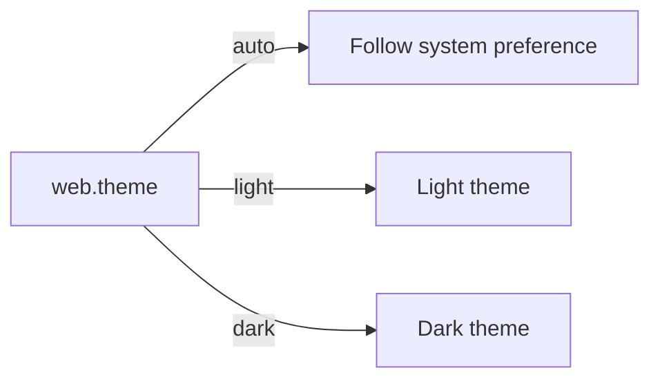
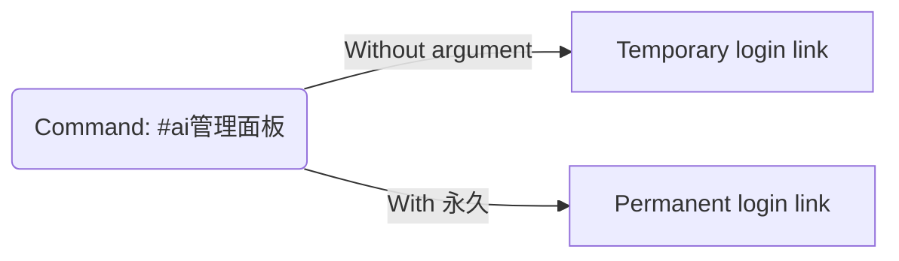
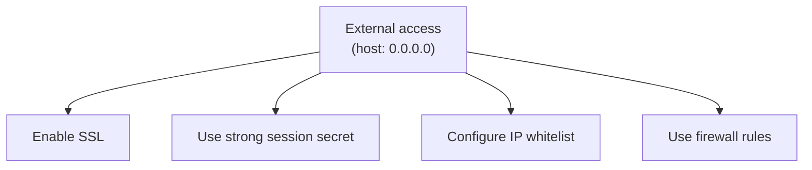

# Frontend Configuration <Badge type="tip" text="Web Panel" />

Configure the Web Admin Panel appearance and behavior.

## Basic Configuration {#basic}

```yaml
web:
  enabled: true
  port: 3000
  host: "127.0.0.1"
```

## Web Panel Options {#options}

| Option | Type | Default | Description |
|:-------|:-----|:--------|:------------|
| `enabled` | boolean | `true` | Enable web panel |
| `port` | number | `3000` | Listen port |
| `host` | string | `127.0.0.1` | Listen address |
| `title` | string | `ChatAI` | Panel title |
| `theme` | string | `auto` | Color theme |

## Theme Configuration {#theme}

```yaml
web:
  theme: auto           # auto, light, dark
  accentColor: blue     # Primary color
```



## Access Control {#access}

```yaml
web:
  auth:
    tokenExpiry: 86400000    # 24 hours
    permanentToken: false    # Allow permanent tokens
    allowedIPs:              # IP whitelist
      - "127.0.0.1"
      - "192.168.1.0/24"
```

## SSL/HTTPS {#ssl}

```yaml
web:
  ssl:
    enabled: true
    cert: "./ssl/cert.pem"
    key: "./ssl/key.pem"
```

## Rate Limiting {#rate-limit}

```yaml
web:
  rateLimit:
    windowMs: 60000      # 1 minute window
    maxRequests: 60      # Max requests per window
```

## Session Configuration {#session}

```yaml
web:
  session:
    secret: ${SESSION_SECRET}
    maxAge: 86400000     # 24 hours
```

## Accessing Panel {#access-panel}

Get login link:
```txt
#ai管理面板          # Temporary link
#ai管理面板 永久     # Permanent link
```



## External Access {#external}

To allow external access:

```yaml
web:
  host: "0.0.0.0"       # Listen on all interfaces
```

::: warning Security
When exposing externally:
1. Enable SSL
2. Use strong session secret
3. Configure IP whitelist
4. Use firewall rules
:::



## Next Steps {#next}

- [Basic Config](./basic) - Core settings
- [Proxy](./proxy) - Network configuration
