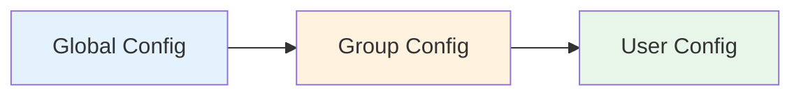

# Configuration Overview <Badge type="tip" text="Config" />

ChatAI Plugin provides a flexible configuration system supporting **global**, **group**, and **user** level overrides.

## Configuration Hierarchy {#config-hierarchy}



::: info Priority
Lower level config **overrides** higher level config. For example: group config overrides global config for the same field.
:::

## Configuration Methods {#config-methods}

### Web Admin Panel (Recommended) {#web-panel}

::: tip Recommended
Web panel provides visual configuration interface, changes take effect **immediately** without restart.
:::

```txt
#ai管理面板
```

### Configuration File {#config-file}

Configuration file location:

```
plugins/chatai-plugin/config/config.yaml
```

::: warning Note
After modifying config file directly, run `#ai重载配置` or restart to apply.
:::

## Configuration Modules {#config-modules}

| Module | Description | Documentation | Importance |
|:-------|:------------|:--------------|:----------:|
| **Basic Config** | Command prefix, debug mode, admins | [Basic Config](./basic) | ⭐⭐⭐ |
| **Channels** | API channels, retry mechanism, load balancing | [Channels](./channels) | ⭐⭐⭐ |
| **Models** | Model selection and parameter tuning | [Models](./models) | ⭐⭐⭐ |
| **Triggers** | Trigger methods and conditions | [Triggers](./triggers) | ⭐⭐ |
| **Context** | Conversation context management | [Context](./context) | ⭐⭐ |
| **Memory** | Long-term memory system | [Memory](./memory) | ⭐⭐ |
| **MCP** | MCP server integration | [MCP](./mcp) | ⭐⭐ |
| **Proxy** | Network proxy settings | [Proxy](./proxy) | ⭐ |
| **Frontend** | Web admin panel customization | [Frontend](./frontend) | ⭐ |
| **Features** | Group summary, portraits, events | [Features](./features) | ⭐⭐ |
| **BYM Mode** | Persona mode, proactive chat | [BYM](./bym) | ⭐ |

## Configuration File Structure {#config-structure}

::: details Full Configuration Example (click to expand)
```yaml
# Basic Config
commandPrefix: "#"
debug: false

# Trigger Config
trigger:
  private: prefix
  group: at
  prefix: "#chat"

# Channel Config
channels:
  - name: default
    baseUrl: https://api.openai.com/v1
    apiKey: sk-xxx
    model: gpt-4o

# Context Config
context:
  maxMessages: 20
  cleaningStrategy: sliding

# Memory Config
memory:
  enabled: true
  maxMemories: 1000

# MCP Config
mcp:
  enabled: true

# Built-in Tools Config
builtinTools:
  enabledCategories:
    - basic
    - user
```
:::

**Core Config Reference:**

| Config | Type | Default | Description |
|:-------|:-----|:--------|:------------|
| `commandPrefix` | string | `"#"` | Command prefix |
| `debug` | boolean | `false` | Debug mode |
| `trigger.group` | string | `"at"` | Group trigger method |
| `context.maxMessages` | number | `20` | Max context messages |
| `memory.enabled` | boolean | `true` | Enable long-term memory |

## Environment Variables {#env-vars}

::: tip Security Tip
Sensitive information (like API Keys) should use environment variables to avoid plaintext storage in config files.
:::

```yaml{3}
channels:
  - name: openai
    apiKey: ${OPENAI_API_KEY}  # Reference environment variable
```

**Supported Environment Variables:**

| Variable | Description | Example |
|:---------|:------------|:--------|
| `OPENAI_API_KEY` | OpenAI API key | `sk-xxx...` |
| `ANTHROPIC_API_KEY` | Claude API key | `sk-ant-xxx...` |
| `GOOGLE_API_KEY` | Gemini API key | `AIzaSy...` |
| `HTTP_PROXY` | HTTP proxy address | `http://127.0.0.1:7890` |

## Hot Reload {#hot-reload}

After modifying config, apply without restart:

```txt
#ai重载配置
```

::: info Hot Reload Scope
Most configs support hot reload, but the following require restart:
- Web server port
- Database path
:::

## Config Backup {#backup}

::: warning Important
Regularly backup config files to avoid data loss.
:::

::: code-group
```bash [Linux/macOS]
cp config/config.yaml config/config.yaml.bak
```

```powershell [Windows]
copy config\config.yaml config\config.yaml.bak
```
:::

## Config Migration {#migration}

::: tip Auto Migration
When upgrading from older versions, the plugin will **auto-merge** new config fields while preserving existing config.
:::

## Next Steps {#next-steps}

| Document | Description | Recommended |
|:---------|:------------|:-----------:|
| [Basic Config](./basic) | Command prefix, debug mode and core settings | ⭐⭐⭐ |
| [Channels](./channels) | Configure API channels and load balancing | ⭐⭐⭐ |
| [Models](./models) | Model parameter tuning | ⭐⭐ |
