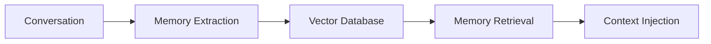

# Memory Configuration <Badge type="tip" text="Memory" />

Configure the long-term memory system.

## Overview {#overview}

The memory system allows AI to remember user preferences and past interactions.



## Basic Configuration {#basic}

```yaml
memory:
  enabled: true           # Enable memory system
  maxMemories: 1000       # Max memories per user
  autoExtract: true       # Auto-extract from conversations
  similarityThreshold: 0.7  # Retrieval threshold
```

## Configuration Options {#options}

| Option | Type | Default | Description |
|:-------|:-----|:--------|:------------|
| `enabled` | boolean | `true` | Enable memory |
| `maxMemories` | number | `1000` | Max per user |
| `autoExtract` | boolean | `true` | Auto-extract memories |
| `similarityThreshold` | number | `0.7` | Match threshold |
| `retrievalCount` | number | `5` | Max memories per query |

## Memory Types {#types}

| Type | Description | Example |
|:-----|:------------|:--------|
| **Preference** | User preferences | "Likes jazz music" |
| **Fact** | Personal facts | "Birthday is May 15" |
| **Context** | Conversation context | "Working on a Python project" |

## Manual Memory Commands {#commands}

```txt
#记忆 添加 喜欢周杰伦的歌    # Add memory
#记忆 列表                   # List memories
#记忆 删除 1                 # Delete by ID
#清除记忆                    # Clear all memories
```

## API Access {#api}

```javascript
// Add memory
await fetch('/api/memory', {
  method: 'POST',
  body: JSON.stringify({
    userId: '123456789',
    content: 'Prefers dark mode'
  })
})

// Get memories
const memories = await fetch('/api/memory?userId=123456789')
```

## Storage Backend {#storage}

Default: SQLite with vector extension

```yaml
memory:
  storage:
    type: sqlite           # sqlite, postgres
    path: ./data/memory.db
```

## Privacy {#privacy}

::: warning User Privacy
- Memories are per-user and private
- Users can view and delete their memories
- Consider data retention policies
:::

```yaml
memory:
  retention:
    maxAge: 365            # Days to keep memories
    autoCleanup: true      # Auto cleanup old memories
```

## Next Steps {#next}

- [Context](./context) - Context management
- [Features](./features) - Feature settings
