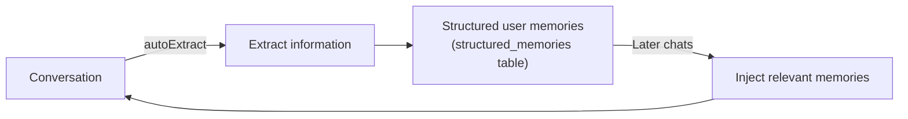
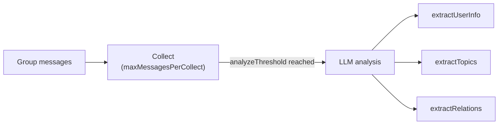
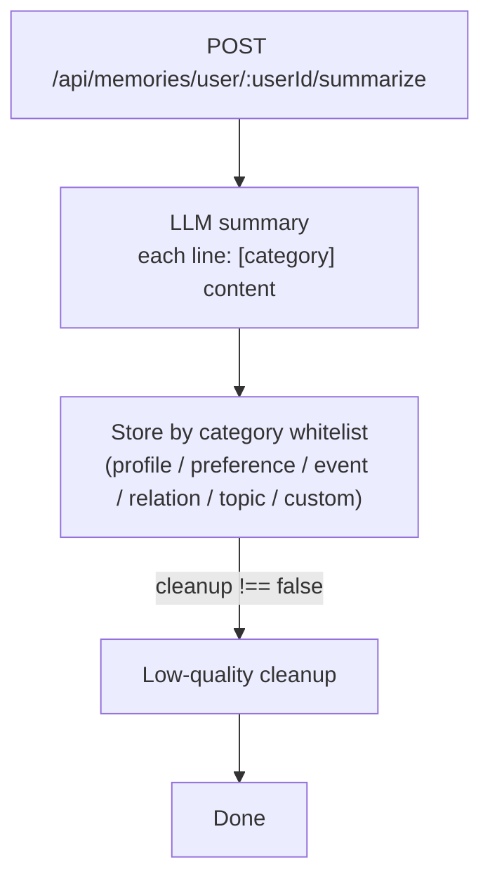

# Memory Configuration <Badge type="tip" text="Memory" />

Configure the long-term memory system.

## Overview {#overview}


```mermaid
flowchart LR
    C["Conversation"] -->|"autoExtract"| X["Extract information"]
    X --> S["Structured user memories<br>(structured_memories table)"]
    S -->|"Later chats"| I["Inject relevant memories"]
    I --> C
```

The memory system stores structured user memories in the `structured_memories` table, extracts information from conversations automatically, and injects relevant memories into later chats.

## Basic Configuration {#basic}

```yaml
memory:
  enabled: false          # Enable memory system
  storage: database       # Storage: database | file
  autoExtract: true       # Auto-extract from conversations
  pollInterval: 5         # Poll interval (minutes)
  minPollInterval: 30     # Min interval between two poll summaries for
                          # the same conversation target (minutes);
                          # defaults to 30 when unset. Read dynamically
                          # by MemoryManager.pollAndSummarize.
  maxMemories: 50         # Max memories per user
  model: ""               # Model for memory extraction (empty = default)
```

## Configuration Options {#options}

| Option | Type | Default | Description |
|:-------|:-----|:--------|:------------|
| `enabled` | boolean | `false` | Enable memory |
| `storage` | string | `database` | Storage backend |
| `autoExtract` | boolean | `true` | Auto-extract memories |
| `pollInterval` | number | `5` | Poll interval (minutes) |
| `minPollInterval` | number | `30` | Min interval between poll summaries per target (minutes) |
| `maxMemories` | number | `50` | Max memories per user |
| `model` | string | `""` | Extraction model (empty = default) |

## Group Context Collection {#group-context}

```yaml
memory:
  groupContext:
    enabled: true               # Enable group context collection
    collectInterval: 10         # Collection interval (minutes)
    maxMessagesPerCollect: 50   # Max messages per collection
    analyzeThreshold: 20        # Min messages to trigger analysis
    extractUserInfo: true       # Extract user info
    extractTopics: true         # Extract discussion topics
    extractRelations: true      # Extract user relations
```


```mermaid
flowchart LR
    M["Group messages"] --> B["Collect<br>(maxMessagesPerCollect)"]
    B -->|"analyzeThreshold reached"| A["LLM analysis"]
    A --> U["extractUserInfo"]
    A --> T["extractTopics"]
    A --> R["extractRelations"]
```

## Memory Summaries {#summary}


```mermaid
flowchart TD
    REQ["POST /api/memories/user/:userId/summarize"] --> S["LLM summary<br>each line: [category] content"]
    S --> ST["Store by category whitelist<br>(profile / preference / event / relation / topic / custom)"]
    ST -->|"cleanup !== false"| CL["Low-quality cleanup"]
    CL --> DONE["Done"]
```

Memory summaries produce structured output: every line is `[category] content` with a category whitelist (`profile` / `preference` / `event` / `relation` / `topic` / `custom`). Model reasoning text never reaches storage. The summarize endpoint also performs cleanup:

```http
POST /api/memories/user/:userId/summarize
POST /api/memories/user/:userId/cleanup
```

| Param | Type | Default | Description |
|:------|:-----|:--------|:------------|
| `useLLM` | boolean | `true` | Use LLM summarization |
| `cleanup` | boolean | `true` | Run low-quality cleanup after summary (`false` / `'false'` skips it) |
| `groupId` | string | - | Limit to group |
| `model` | string | - | Summary model override |

Also see [Memory Command](./features) and the [API reference](/en/api/) for details.

## Manual Memory Commands {#commands}

```txt
#ai添加记忆 @用户 喜欢吃披萨    # Add memory (master)
#ai查看记忆                    # List memories
#ai清除记忆                    # Clear memories
```

## Next Steps {#next}

- [Getting Started](/en/guide/getting-started) - Memory usage guide
- [Features](./features) - Feature settings