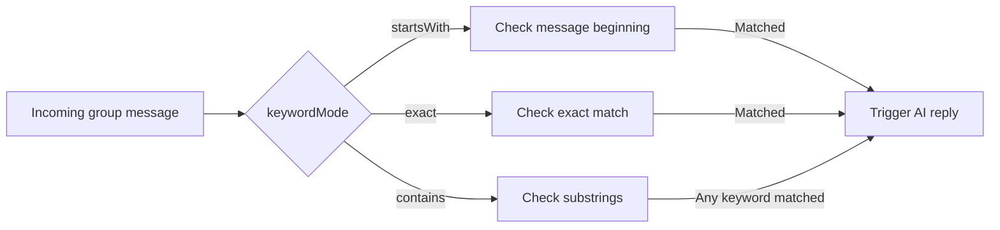
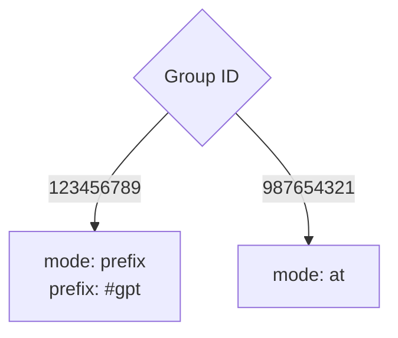

# Trigger Configuration <Badge type="tip" text="Triggers" />

Configure how AI responds to messages.

## Basic Configuration {#basic}

```yaml
trigger:
  private: always         # Private chat trigger
  group: at              # Group chat trigger
  prefix: "#chat"        # Command prefix
```

## Trigger Types {#types}

| Type | Description | Example |
|:-----|:------------|:--------|
| `always` | Always respond | Any message |
| `at` | @mention required | `@bot hello` |
| `prefix` | Prefix required | `#chat hello` |
| `keyword` | Keyword match | Contains "help" |
| `random` | Random chance | 5% probability |
| `none` | Disabled | No response |

## Private Chat {#private}

```yaml
trigger:
  private: always        # Respond to all private messages
```

Options: `always`, `prefix`, `none`

## Group Chat {#group}

```yaml
trigger:
  group: at              # Respond when @mentioned
```

Options: `at`, `prefix`, `keyword`, `random`, `atAll`, `none`

## Multiple Triggers {#multiple}

Enable multiple trigger methods:

```yaml
trigger:
  group:
    - at                 # @mention
    - prefix             # Or prefix
  prefix: "#ai"
```

## Keyword Trigger {#keyword}

```yaml
trigger:
  group: keyword
  keywords:
    - "ai"
    - "机器人"
    - "help"
  keywordMode: contains  # contains, startsWith, exact
```



## Random Trigger {#random}

```yaml
trigger:
  group: random
  randomRate: 0.05       # 5% chance
```

## Per-Group Override {#per-group}

```yaml
groups:
  123456789:
    trigger:
      mode: prefix
      prefix: "#gpt"
  987654321:
    trigger:
      mode: at
```



## Cooldown {#cooldown}

Prevent spam with cooldown:

```yaml
trigger:
  cooldown:
    enabled: true
    duration: 5000       # 5 seconds
    perUser: true        # Per-user cooldown
```

## Web Panel {#web-panel}

Configure triggers in Web Admin Panel:
1. Go to **Groups** tab
2. Select a group
3. Configure trigger settings
4. Save

## Next Steps {#next}

- [Presets](/en/guide/presets) - AI personas
- [Features](./features) - Feature settings
