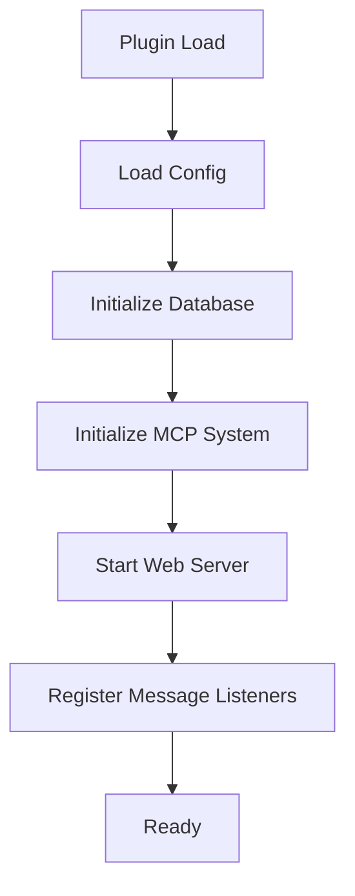
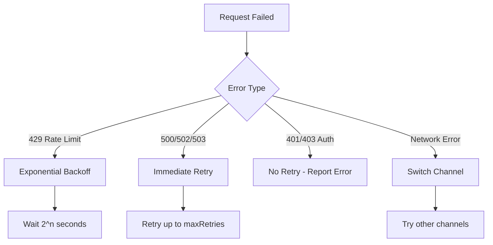

# About ChatAI Plugin <Badge type="info" text="Info" />

Comprehensive information about ChatAI Plugin, repositories, and core mechanisms.

## Repository Information {#repositories}

ChatAI Plugin has two repositories for different user groups:

### Public Version (Recommended)

| Item | Info |
|:-----|:-----|
| **Repository** | [XxxXTeam/chatai-plugin](https://github.com/XxxXTeam/chatai-plugin) |
| **Status** | 🟢 Public |
| **Updates** | Stable releases |
| **Target** | Regular users, production |

```bash
# Install public version
git clone https://github.com/XxxXTeam/chatai-plugin.git ./plugins/chatgpt-plugin
```

### Nightly Build (Beta)

| Item | Info |
|:-----|:-----|
| **Repository** | [XxxXTeam/chatgpt-plugin](https://github.com/XxxXTeam/chatgpt-plugin) |
| **Status** | 🔒 Private |
| **Updates** | Daily builds with latest features |
| **Target** | Developers, testers |

::: warning Note
Nightly builds may contain untested features. Not recommended for production.
:::

#### Apply for Beta Access

1. Visit [https://plugin.openel.top/auth](https://plugin.openel.top/auth)
2. Login with GitHub account
3. Submit application to join beta queue
4. Wait for approval to access private repository

## Plugin Initialization {#initialization}

### Initialization Flow



### First Startup

On first startup, plugin automatically:

1. **Create Config** - Generate default config in `config/`
2. **Initialize Database** - Create SQLite database and tables
3. **Create Data Directories** - `data/presets/`, `data/tools/`, etc.

### Common Initialization Issues

#### better-sqlite3 Build Failed

```bash
# Run in Yunzai root directory
pnpm rebuild better-sqlite3
```

If still fails, install build tools:

::: code-group
```bash [Windows]
npm install -g windows-build-tools
```

```bash [Linux]
sudo apt install build-essential python3
```

```bash [macOS]
xcode-select --install
```
:::

#### Port Occupied

Modify port in `config/config.yaml`:

```yaml
web:
  port: 3001  # Change to another port
```

## Channel Configuration {#channels}

Channels are core configurations for connecting AI models.

### Channel Parameters

| Parameter | Required | Description |
|:----------|:---------|:------------|
| `name` | ✅ | Channel name (unique identifier) |
| `type` | ✅ | Type: `openai`, `claude`, `gemini` |
| `baseUrl` | ✅ | API base URL |
| `apiKey` | ✅ | API key |
| `model` | ✅ | Default model name |
| `enabled` | ❌ | Enable/disable (default: true) |
| `weight` | ❌ | Load balancing weight (default: 1) |
| `maxRetries` | ❌ | Max retries (default: 3) |
| `timeout` | ❌ | Request timeout ms (default: 60000) |

### Channel Types

::: code-group
```yaml [OpenAI Compatible]
channels:
  - name: openai
    type: openai
    baseUrl: https://api.openai.com/v1
    apiKey: sk-xxx
    model: gpt-4o
    
  - name: deepseek
    type: openai  # DeepSeek is OpenAI compatible
    baseUrl: https://api.deepseek.com/v1
    apiKey: sk-xxx
    model: deepseek-chat
```

```yaml [Claude]
channels:
  - name: claude
    type: claude
    apiKey: sk-ant-xxx
    model: claude-3-5-sonnet-20241022
```

```yaml [Gemini]
channels:
  - name: gemini
    type: gemini
    apiKey: xxx
    model: gemini-2.0-flash
```
:::

### Multi-Channel Load Balancing

```yaml
channels:
  - name: openai-1
    type: openai
    baseUrl: https://api.openai.com/v1
    apiKey: sk-xxx-1
    model: gpt-4o
    weight: 2  # Higher weight = higher probability
    
  - name: openai-2
    type: openai
    baseUrl: https://api.openai.com/v1
    apiKey: sk-xxx-2
    model: gpt-4o
    weight: 1
```

## Error Retry Mechanism {#retry}

### Retry Strategy



### Configure Retry Parameters

```yaml
channels:
  - name: openai
    type: openai
    baseUrl: https://api.openai.com/v1
    apiKey: sk-xxx
    model: gpt-4o
    maxRetries: 3        # Max retry count
    retryDelay: 1000     # Initial retry delay (ms)
    timeout: 60000       # Request timeout
```

## Technology Stack {#tech-stack}

| Component | Technology |
|:----------|:-----------|
| Runtime | Node.js 18+ |
| Bot Framework | Yunzai-Bot V3 |
| Database | SQLite (better-sqlite3) |
| Web Framework | Express + Next.js |
| AI Protocol | MCP (Model Context Protocol) |
| Frontend | React, TailwindCSS, Zustand |

## Version Updates {#updates}

### Update Public Version

```bash
cd plugins/chatgpt-plugin
git pull origin main
pnpm install
```

### Check Current Version

```txt
#ai版本
```

## Getting Help {#help}

- **Public Issues**: [XxxXTeam/chatai-plugin/issues](https://github.com/XxxXTeam/chatai-plugin/issues)
- **Beta Access**: [https://plugin.openel.top/auth](https://plugin.openel.top/auth)
- **Documentation**: This site

## License {#license}

MIT License - Free for personal and commercial use.

## Credits {#credits}

Built with ❤️ by the XxxXTeam.

Special thanks to:
- Yunzai-Bot community
- OpenAI, Anthropic, Google for AI APIs
- MCP protocol contributors
