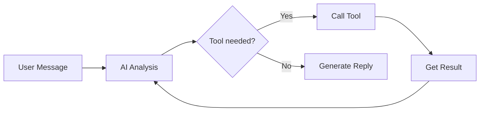

# Agent Mode Guide <Badge type="tip" text="Core Feature" />

Agent mode enables AI to call tools autonomously to complete complex tasks — one of the plugin's core features.

::: info 🤖 What is an Agent?
An Agent means the AI not only answers questions but can **proactively call tools, perform operations, and fetch information**, completing tasks for you like an intelligent assistant.
:::

## What is Agent Mode {#what-is-agent}

In Agent mode, the AI can do more than reply:

- **Call tools**: search, send messages, manage groups, etc.
- **Multi-step reasoning**: break down complex tasks and complete them step by step
- **Fetch information**: proactively query time, weather, user info, etc.
- **Learn from memory**: remember user preferences and personalize replies



## Quick Enable {#quick-enable}

::: code-group
```txt [Method 1: Web Panel]
1. Open the admin panel
2. Go to "Config → MCP/Tools"
3. Turn on "Enable built-in tools"
4. Select the tool categories you need
```

```yaml [Method 2: Config File]
builtinTools:
  enabled: true
  enabledCategories:
    - basic      # Basic tools
    - user       # User tools
    - web        # Web tools
    - group      # Group tools
```
:::

## Tool Categories (22) {#tool-categories}

| Category | Icon | Description | Example Tools |
|:---------|:----:|:------------|:--------------|
| **basic** | 🔧 | Basic utilities | `get_current_time`, `calculate` |
| **user** | 👤 | User info | `get_user_info`, `get_avatar` |
| **group** | 👥 | Group info | `get_group_info`, `get_group_member_list` |
| **message** | 💬 | Message operations | `send_private_message`, `send_group_message`, `get_chat_history` |
| **admin** | 🛡️ | Group admin | `mute_member`, `kick_member` |
| **groupStats** | 📊 | Group stats | Message leaderboards, dragon king, inactive members |
| **file** | 📁 | File operations | Group file upload/download, local file read/write |
| **media** | 🎨 | Media processing | Image parsing, OCR, QR code generation |
| **web** | 🌐 | Web access | `fetch_url`, `website` |
| **search** | 🔍 | Search tools | `web_search`, Wikipedia lookup, translation |
| **utils** | 🔨 | Utility tools | Calculation, encoding conversion, hashing |
| **memory** | 🧠 | Memory management | `save_user_memory`, `search_user_memory` |
| **context** | 📜 | Context management | Conversation context, group chat context |
| **bot** | 🤖 | Bot info | Get bot status, friend list |
| **voice** | 🎙️ | Voice | TTS speech synthesis, speech recognition |
| **extra** | ✨ | Extended tools | Weather, hitokoto, dice, illustrations |
| **shell** | 💻 | System commands | Execute shell commands (⚠️ dangerous) |
| **schedule** | ⏰ | Scheduled tasks | Natural-language scheduled tasks |
| **bltools** | 🎵 | Extended tool set | QQ Music, stickers, Bilibili videos, GitHub |
| **reminder** | 🔔 | Reminders | Relative/absolute time reminders, repeating reminders |
| **imageGen** | 🎨 | Drawing service | Text-to-image, image-to-image, text-to-video |
| **qzone** | ⭐ | QQ Space | Post feeds, like, signature |

## Usage Examples

### Basic Query

```
User: What time is it now?

AI: [calls get_current_time]
    It is now 15:30 on December 15, 2024.
```

### Information Search

```
User: Search for the latest AI news for me

AI: [calls web_search]
    Here is the latest AI news:
    1. OpenAI releases GPT-5...
    2. Google launches a new Gemini...
```

### Complex Task

```
User: Remind me of the meeting tomorrow at 3 PM

AI: [calls set_reminder]
    Done, I have set a reminder for tomorrow 3 PM: meeting.
    You will be notified by private message.
```

### Group Operations

```
User: How many people are in this group?

AI: [calls get_group_info]
    This group currently has 128 members:
    - Owner: 1
    - Admins: 5
    - Regular members: 122
```

## Preset Configuration

Fine-grained control of Agent behavior in presets:

```yaml
# Preset file
name: My Assistant

tools:
  enabled: true
  # Only allow specific tools
  allowedTools:
    - get_current_time
    - get_weather
    - web_search
  # Exclude dangerous tools
  excludedTools:
    - execute_command
  # Whether to allow dangerous operations
  allowDangerous: false
```

## Permission Control

### User Permissions

Users with different permission levels can use different tools:

| Permission Level | Available Tools |
|:-----------------|:----------------|
| Regular user | Basic tools, user tools |
| Group admin | + group tools |
| Master | All tools |

### Dangerous Tools

Some tools are marked as "dangerous" and require special permission:

```yaml
builtinTools:
  allowDangerous: false  # Dangerous tools disabled by default
```

Dangerous tools include:
- `execute_command` - Execute system commands
- `write_file` - Write files
- `set_qq_avatar` - Change the bot avatar (high-impact operation)

## Debug Mode

Enable debug mode to view tool call details:

```bash
#ai调试开启
```

Debug info shows:
- The called tool name
- The passed arguments
- The returned result
- The execution duration

```
[Debug] Tool call: get_weather
[Debug] Arguments: {"city": "Beijing"}
[Debug] Result: {"temp": 15, "condition": "Sunny"}
[Debug] Duration: 1.2s
```

## ChatAgent API

Developers can use Agent features through the ChatAgent class:

```javascript
import { createChatAgent } from './src/services/agent/ChatAgent.js'

// Create an Agent
const agent = await createChatAgent({
  event: e,           // Message event
  enableSkills: true, // Enable skills
  presetId: 'default' // Preset to use
})

// Send a message and get the reply
const result = await agent.chat('Check the weather in Beijing for me')

console.log(result.text)      // AI reply text
console.log(result.toolCalls) // Tool call records
```

### SkillsAgent

Call tools directly:

```javascript
import { SkillsAgent } from './src/services/agent/SkillsAgent.js'

const agent = new SkillsAgent({
  userId: '123456',
  groupId: '789'
})
await agent.init()

// Execute a single tool
const weather = await agent.execute('get_weather', { city: 'Beijing' })

// Execute multiple tools in parallel
const results = await agent.executeParallel([
  { name: 'get_current_time', args: {} },
  { name: 'get_weather', args: { city: 'Beijing' } }
])
```

## Best Practices

### 1. Choose Tools Wisely

```yaml
# ✅ Enable on demand
builtinTools:
  enabledCategories:
    - basic
    - user

# ❌ Enabling everything may cause confusion
builtinTools:
  enabledCategories:
    - all
```

### 2. Preset Isolation

Use different presets for different scenarios:

```yaml
# Support preset - query tools only
name: Support Assistant
tools:
  allowedTools:
    - get_current_time
    - web_search
    - get_user_info

# Admin preset - allows operation tools
name: Admin Assistant
tools:
  allowedTools:
    - get_group_info
    - set_group_name
    - kick_member
```

### 3. Monitor Logs

Review tool call logs regularly:

```bash
#工具日志
```

Or view statistics in the Web panel.

## FAQ

### Q: AI does not call tools?

1. Check whether tools are enabled: `builtinTools.enabled: true`
2. Check whether the tool categories include the required tools
3. Check whether the preset restricts tools

### Q: Tool call fails?

1. Check the debug logs for the error cause
2. Check the permission required by the tool
3. Check the network connection (network tools)

### Q: Tool calls are too slow?

1. Reduce the number of enabled tools
2. Use a faster model
3. Optimize the timeout settings of network tools

## Next Steps

- [Tool Development](/tools/) - Develop custom tools
- [MCP Config](/config/mcp) - Connect external MCP services
- [Preset Management](/guide/presets) - Configure preset tools