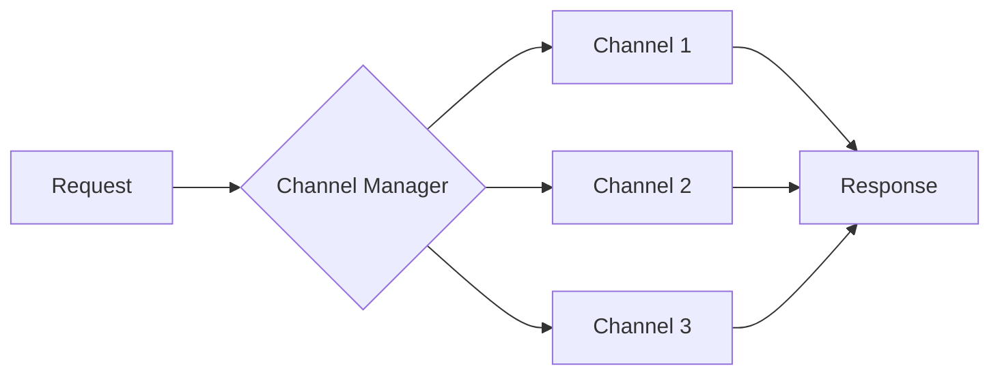

# Multi-Channel Configuration <Badge type="tip" text="Advanced" />

Configure multiple API channels for load balancing and failover.

## Channel Concept {#concept}

A **channel** represents an API endpoint configuration including URL, API key, and model settings.



## Supported Channels {#supported}

| Provider | Base URL | Models |
|:---------|:---------|:-------|
| **OpenAI** | `https://api.openai.com/v1` | gpt-4o, gpt-4o-mini |
| **Claude** | `https://api.anthropic.com` | claude-3.5-sonnet |
| **Gemini** | `https://generativelanguage.googleapis.com` | gemini-pro |
| **DeepSeek** | `https://api.deepseek.com` | deepseek-chat |

## Configuration Example {#config}

```yaml
channels:
  - name: openai-main
    baseUrl: https://api.openai.com/v1
    apiKey: ${OPENAI_API_KEY}
    model: gpt-4o
    priority: 1

  - name: deepseek-backup
    baseUrl: https://api.deepseek.com
    apiKey: ${DEEPSEEK_API_KEY}
    model: deepseek-chat
    priority: 2
```

## Load Balancing {#load-balancing}

| Strategy | Description |
|:---------|:------------|
| **Priority** | Use by priority order |
| **Round Robin** | Rotate between channels |
| **Random** | Random selection |

## Failover {#failover}

::: tip Auto Failover
When a channel fails, automatically switches to next available channel.
:::

```yaml
channelStrategy:
  failover: true
  maxRetries: 3
  retryDelay: 1000
```

## Web Panel {#web-panel}

Manage channels visually in Web Admin Panel:
1. Go to **Channels** tab
2. Click **Add Channel**
3. Fill in configuration
4. Click **Test Connection**
5. Save

## Next Steps {#next}

- [Models](../config/models) - Model configuration
- [Proxy](../config/proxy) - Proxy settings
