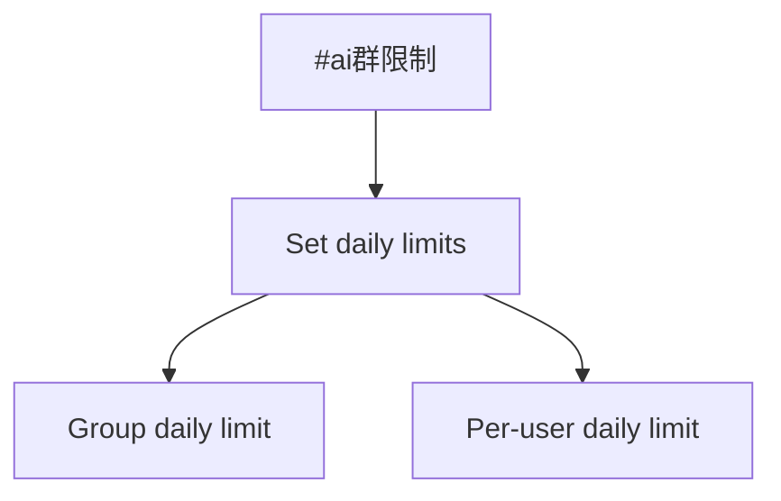
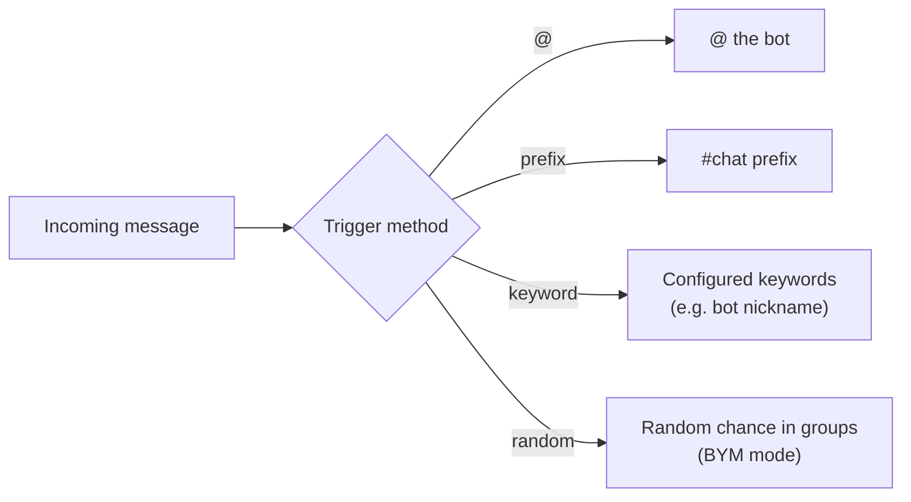
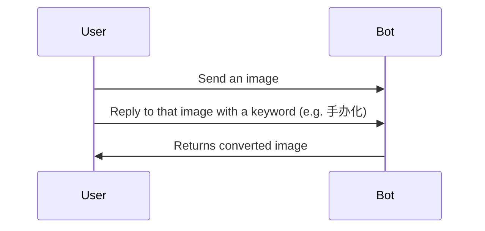

# Command List

ChatAI Plugin provides rich commands to control AI conversations, manage group settings, and execute various features.

::: tip Command Prefix
Default command prefix is `#ai`, configurable in settings. Below, `{prefix}` represents your configured prefix.
:::

## 💬 Conversation Commands

Basic conversation management commands, available to all users.

| Command | Description | Example |
|:--------|:------------|:--------|
| `#结束对话` | End conversation, clear context | `#结束对话` |
| `#新对话` | Same as above, start new conversation | `#新对话` |
| `#清除记忆` | Clear personal memory data | `#清除记忆` |
| `#对话状态` | View current conversation status | `#对话状态` |
| `#我的记忆` | View saved memory list | `#我的记忆` |
| `#总结记忆` | Organize and merge memory entries | `#总结记忆` |
| `#chatdebug` | Toggle chat debug mode | `#chatdebug on` |

## 👥 Group Chat Features

Group chat related feature commands.

| Command | Description | Example |
|:--------|:------------|:--------|
| `#群聊总结` | AI summarizes recent group chat | `#群聊总结` |
| `#今日群聊` | Modern style group summary | `#今日群聊` |
| `#个人画像` | Analyze user profile | `#个人画像` |
| `#画像@xxx` | Analyze specific user's profile | `#画像@user` |
| `#今日词云` | Generate group word cloud | `#今日词云` |
| `#群记忆` | View group shared memory | `#群记忆` |

## 🎨 Image Generation

AI image generation commands, requires a model that supports image generation.

| Command | Description | Example |
|:--------|:------------|:--------|
| `画 <description>` | AI drawing, supports Chinese/English | `画 a cute cat` |
| `手办化` | Convert image to figure style | Reply to image with `手办化` |
| `Q版` | Generate Q-version emoji | Reply to image with `Q版` |
| `动漫化` | Convert image to anime style | Reply to image with `动漫化` |
| `赛博朋克` | Convert to cyberpunk style | Reply to image with `赛博朋克` |
| `油画` | Convert to oil painting style | Reply to image with `油画` |
| `水彩` | Convert to watercolor style | Reply to image with `水彩` |

::: tip Image Style Conversion
Style conversion requires replying to an image, then sending the corresponding keyword.
:::

## 🎮 Galgame

AI-powered Galgame visual novel adventure.

| Command | Description | Example |
|:--------|:------------|:--------|
| `#游戏开始` | Start new Galgame adventure | `#游戏开始` |
| `#游戏继续` | Continue previous game | `#游戏继续` |
| `#游戏结束` | End current game session | `#游戏结束` |
| `#游戏存档` | View game saves | `#游戏存档` |
| `#游戏状态` | View game status | `#游戏状态` |

## 🎭 Persona Settings

Commands to customize AI persona.

| Command | Description | Permission |
|:--------|:------------|:-----------|
| `{prefix}设置人格 <content>` | Set personal persona | All users |
| `{prefix}查看人格` | View current persona | All users |
| `{prefix}清除人格` | Clear personal persona | All users |
| `{prefix}设置群人格 <content>` | Set group persona | Master |
| `{prefix}清除群人格` | Clear group persona | Master |

::: info Persona Priority
Persona priority: **Group User > Group > User Global > Default Preset**
:::

## ⚙️ Group Admin Commands

Group management commands, requires group admin or master permission.

| Command | Description | Permission |
|:--------|:------------|:-----------|
| `#群管理面板` | Get group settings panel | Group Admin |
| `{prefix}群设置` | View group feature status | Group Admin |
| `{prefix}群伪人开启` | Enable group BYM mode | Group Admin |
| `{prefix}群伪人关闭` | Disable group BYM mode | Group Admin |
| `{prefix}群绘图开启` | Enable group drawing | Group Admin |
| `{prefix}群绘图关闭` | Disable group drawing | Group Admin |

## 📡 Group Channel & Limits

Group channel and usage limit configuration.

| Command | Description | Permission |
|:--------|:------------|:-----------|
| `{prefix}群渠道设置` | View group channel config | Group Admin |
| `{prefix}群禁用全局` | Disable global channel | Group Admin |
| `{prefix}群启用全局` | Enable global channel | Group Admin |
| `{prefix}群限制设置` | View usage limits | Group Admin |
| `{prefix}群限制 <group> <user>` | Set daily limits | Group Admin |
| `{prefix}群使用统计` | View today's usage | Group Admin |
| `{prefix}群重置统计` | Reset today's stats | Group Admin |

::: tip Usage Limit Example
`#ai群限制 100 20` sets group daily limit to 100, per-user daily limit to 20.
:::



## 👑 Master Commands

Admin commands only for Bot master.

| Command | Description |
|:--------|:------------|
| `{prefix}管理面板` | Get Web panel (temporary link) |
| `{prefix}管理面板 永久` | Get Web panel (permanent link) |
| `{prefix}状态` | View plugin status |
| `{prefix}调试开启/关闭` | Toggle debug mode |
| `{prefix}伪人开启/关闭` | Toggle global BYM mode |
| `{prefix}设置模型 <name>` | Set default model |
| `{prefix}结束全部对话` | Clear all conversations |

## 🔄 Version Updates

Plugin version management commands.

| Command | Description | Permission |
|:--------|:------------|:-----------|
| `#ai版本` | View version info | All users |
| `#ai检查更新` | Check for updates | Master |
| `#ai更新` | Update plugin | Master |
| `#ai强制更新` | Force update (overwrite local changes) | Master |
| `#ai更新日志` | View commit history | Master |

## 🤖 Trigger Methods

Besides command triggers, these methods also work for AI conversations:



### @ Trigger
Simply @ the bot and send a message to trigger conversation.

### Prefix Trigger
Messages starting with configured prefix (default `#chat`) trigger conversation:
```
#chat hello
```

### Keyword Trigger
Messages containing configured keywords (like bot nickname) trigger conversation.

### Random Trigger
Random chance to reply in group chat (BYM mode).

## 📝 Usage Examples

### Basic Conversation
```
@bot What's the weather like today?
#chat Help me write a poem
```

### AI Drawing
```
画 a corgi wearing sunglasses surfing at the beach
```

### Image Style Conversion



1. Send an image
2. Reply to that image with `手办化`

### Group Summary
```
#群聊总结
#今日词云
```

### Set Persona
```
#ai设置人格 You are a tsundere catgirl who likes to add "meow~" at the end of sentences
```

---

::: tip Get Help
Send `#ai帮助` to view the command help image in Bot.
:::
